In this note I want to share my experience with ripping 3D models from
one of my most favorite Playstation games: **Colony Wars: Red Sun**,
a space dogfighting game.

With no prior reverse engineering experience, I want to document how I approached
the problems, the thought process behind it, and give other people the basic ideas on how things can be done or turn out.

### Premise

What's interesting is that history of this side project goes back to the beginning of **2017**.
I think I was replaying the other game in the series: **Colony Wars: Vengeance** and once again was admiring it's gameplay
and ship designs. I really love **Hex** - the ship you start with, and part of me wondered
if it's possible to rip it's model to use in some game prototypes or whatever.

*I really wanted it*, and this time I've got a vague idea on how I could try extracting the model,
the idea that will also be used later for the initial model rips from **Red Sun**.

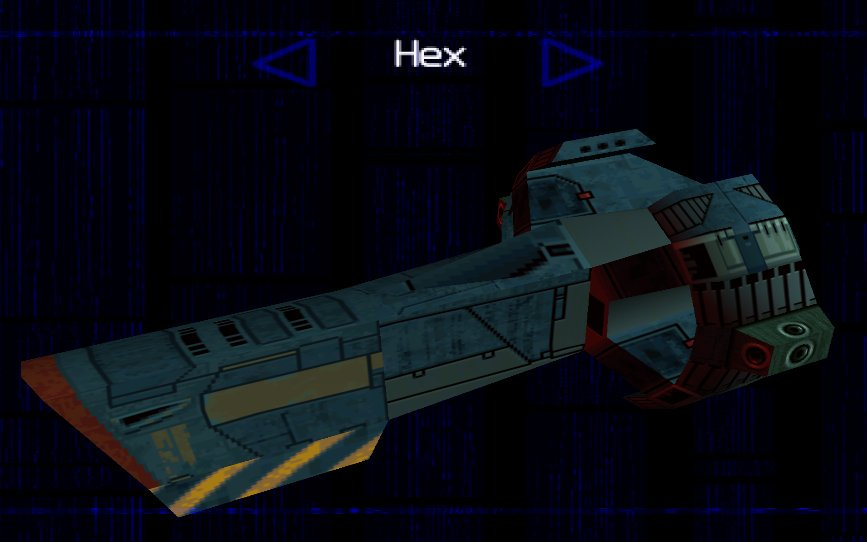

## **Hands-on approach**

**Playstation is infamous when it comes to ripping 3D data.** While most people rely on
automated tools like **Ninja Ripper**, which can extract in-memory data from various games,
you can't do that with Playstation games because model format may vary,
and the end result is basically 2D image. I didn't see anyone easily dumping 3D scenes from Playstation,
which makes me believe there's no step in the rendering pipeline before it all gets flattened.

Due to my programming experience, I had an idea on how certain things could be handled: if there's a ship displayed in the main menu - there must be a variable that defines which ship
is displayed, along with that variable: **pointers to the actual ship data**: be it 3D mesh, textures, text descriptions, whatever.

I decided to try finding these pointers and observe memory with [**Cheat Engine**](https://www.cheatengine.org/) for model data,
which would consist of vertexes and faces to form a 3D mesh. Overwriting this data would allow me to see
how it affects the displayed model and help me understand how it's stored.

I think this **hands-on in-memory approach** is quite similar to what automated rippers use,
the only difference is that we're dealing with unknown model format:
it's not your basic Playstation TMD/PMD/<abbr title="Hierarchical 3D Model">HMD</abbr>.

This is the approach that I've initially used in ripping **HEX** ship from **Colony Wars: Vengeance**.
In **October 2017**, I also tried the exact same thing with **Colony Wars: Red Sun**.

If you want to use **Cheat Engine** to find such pointers, here are a few tips:
* **Playstation has 2MB of RAM**, if you find where's that RAM segment is located in your emulator of choice,
you can restrict memory search only to that area.
* You can find the **beginning of RAM segment** by using **psxFin** or **no$psx** emulators that have debugging tools
and memory preview. Copy plenty of bytes at the beginning of RAM and search for them in **Cheat Engine memory viewer**,
targeted at the emulator of your choice. **Write down that offset** and consider it `0x0` of Playstation RAM.
* **Pointers take 4 bytes and are likely to have a byte-prefix with a value of** `0x80`, for example: `0x800A0548`.
You can filter values that are higher than `0x80000000`. And knowing that RAM is size is 2 MB,
you can also filter values that are less than `0x80200000`.
* Also if you're going to crash your emulator often - look for **automatic process attachment** in **Cheat Engine** settings.

In case of **Red Sun**, by following these tips and switching between ships in ship selection menu,
I reduced search results to three pointers and two distinct addresses.

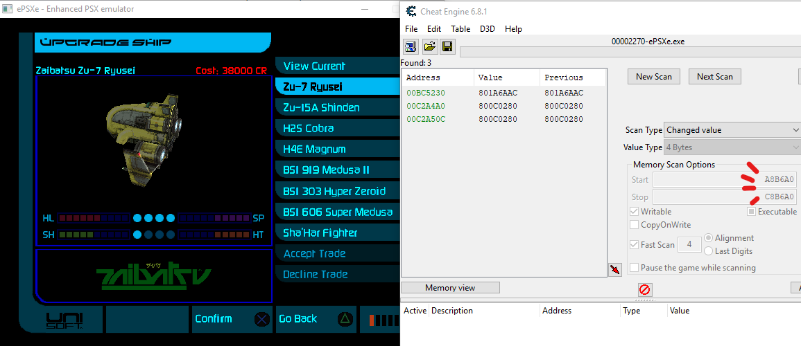

With written down address of Playstation RAM beginning (relative to emulator), I can add one of these pointers to get the potential
location of model. **Obviously the byte with value of `80` must be omitted**.

In my case, the emulator is **ePSXe 1.9.25** and Playstation RAM is located at `0x00A8B6A0`. By adding one of the found
addresses: `0x000DDBD0`, I get:

`0x00A8B6A0 + 0x000DDBD0 = 0x00B69270`

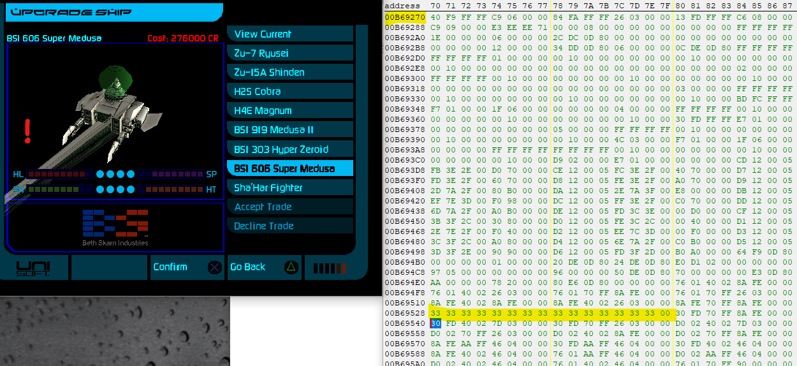

This led me to a memory section with loaded model data. By overwriting random
portions of this memory section, you can see how it affects the displayed ship.

You may expect to deal with pointers alot, and calculating these offsets may be
tiresome. I wonder if Cheat Engine could make it easier for you, otherwise
you can always setup a spreadsheet. I still used Programming mode in Windows calculator
most of the times.

When I was initially ripping **Hex** from **Colony Wars: Vengenace**, I tried to figure out where
the section with vertexes began and where it ended. Looking at raw memory is often
intimidating, but the more you stare at it, the more patterns you eventually find out.
In the screenshot above, below the highlighted line, you can observe two padding `00 00` bytes
which go along with all vertexes. This makes me assume that after I stop seeing these `00 00` bytes
in these columns, the section of vertexes has ended and it's something else.

It was clear that a vertex structure takes 8 bytes, and knowing that a vertex is just a point in 3D space,
that makes me assume that I'm dealing with

```cpp
struct Vertex {
    short x;
    short y;
    short z;
    short pad;
};
```

By dumping bytes related to vertexes, I parsed them with a **Python script** using **struct** module,
the parsed vertexes were then written into [Wavefront OBJ](https://en.wikipedia.org/wiki/Wavefront_.obj_file) file,
which was loaded in **Blender**, resulting in this point cloud:

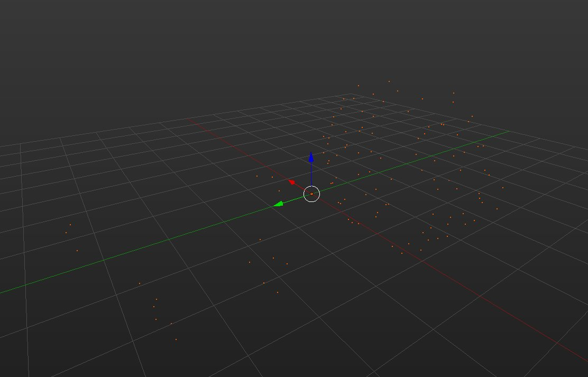

In a similar manner, I figured out how **faces** and **UV mapping** were stored and also parsed and put them into **OBJ file**.
**The only thing left was extracting textures**. During that time I only wanted to extract this particular ship and I was
already tired of staring at Cheat Engine. This led to the approach I would never recommend to anyone: peeking at
**Playstation VRAM** with **[PSX V-Ram](https://www.romhacking.net/utilities/442/)**.

Why I don't recommend it? **This tool is atrocious** - you can only use it by pressing keys specified in **README**,
and if you want to extract a texture from here - **you have to Print Screen the window and crop what you need pixel perfectly**,
and I'm not even talking about finding the correct texture mode and palette.

Nevertheless, I still went through this method, on the screenshot below you may see the packed textures,
**and palettes on the right**, one for each ship's texture. So I had to find correct combinations
of textures and palettes, make tons of screenshots and combine them together to make a proper texture.

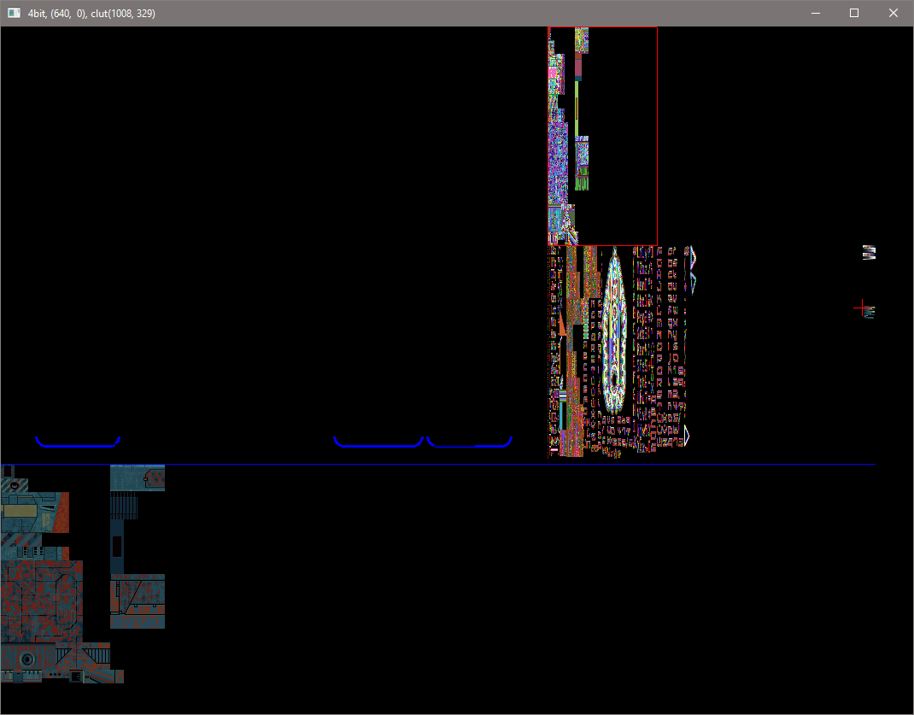

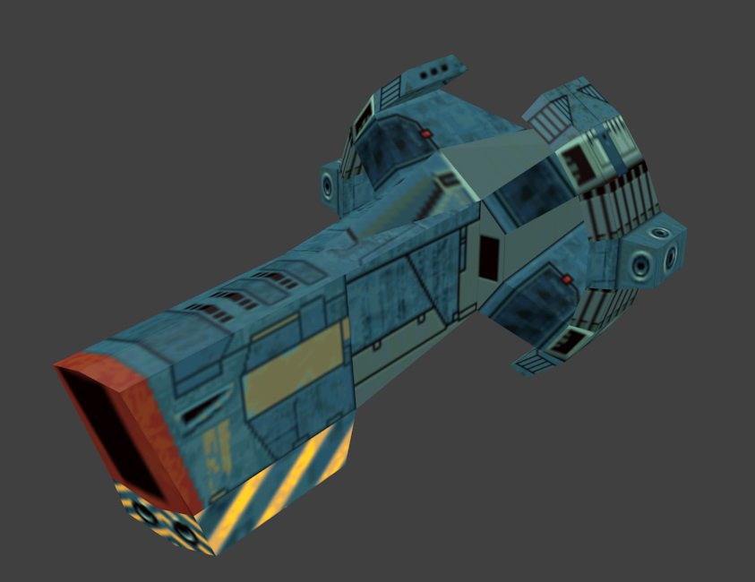

The ship models from **Red Sun** were ripped in **October 2017** in a similar manner, the major
difference was extracting textures directly from **VRAM section** and converting them into **PNG files**.
The models theirselves were also more difficult to grasp, with multiple meshes and offsets relative to each other (more detail on this later).

After extraction of these ships, **I wondered if I could dare to get all models**. It took **1 year and 7 months** before I played
the game again and actually **dared**.

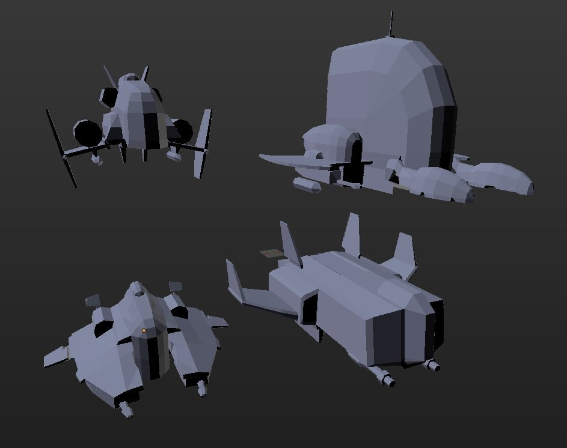

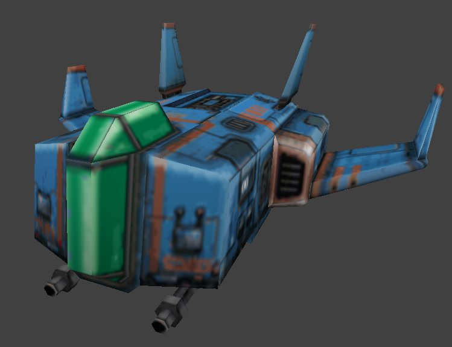

## **Resource extraction**

If I were to extract **all** models, in-memory approach is not feasible anymore, because I would have to launch every mission in the game and also deal with finding a list of pointers to the models. It is also much more difficult to observe model changes when overwriting memory due to dynamic nature of the game. Did I mention the emulator/game may crash often when attempting to do this?

Obviously, the classic way of ripping the file directly was the only option.

We're dealing with **GAME.RSC**, it's the only file that may have models because the others just don't fit. **RSC** extension also hints that it's a **ReSourCe file**.

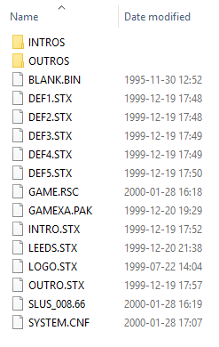

**The Memory Viewer** in **Cheat Engine** is absolutely great, ~~but unfortunately it seems impossible to load a file~~ and you can also use it to view file contents. The option is somewhat hidden in a highlighted menu entry. I really wish I knew it's possible beforehand, because Cheat Engine also has struct dissection tools, several display modes and more. Instead, I was using [**HxD** hex editor](https://mh-nexus.de/en/hxd/). I think I'd still prefer **HxD** for very quick previews and it's tab support.

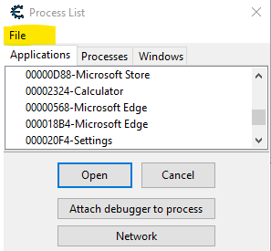

I'm immediately presented with what could be **file names**. Remember to look for patterns and make assumptions: the gap between the beginning of each name is `0x14` bytes, which hints at the fixed structure. If you also consider the fact it's an old Playstation game: the file names are short by design - it's something that filesystem might have required, akin to **DOS** era. Assuming that file names are of fixed length, I also notice something at the end of the selected entry on screenshot. Take note of `A9 00 00 02` on **CREDITSB_TIM**, and then compare it to the ending of previous entry - **CREDITSA_TIM** which has `A8 00 00 02`, while I have no idea what `02` is, the first two bytes have adjacent values that I could interpret as some kind of index.

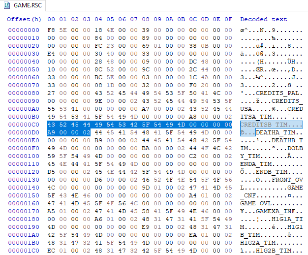

Since I was not using Cheat Engine initially to interpret such structures, I started making a basic **node.js** script. My approach is to map structures to functions that accept **Buffer of file contents** with an **offset to read from**, and return an **object with meaningful info**. The default function arguments are only provided to give **Visual Studio Code** a hint for code completion.

```js
function formatPointer( num = 0 ) {
    return '0x' + num.toString( 16 ).padStart( 8, '0' )
}

function parseDOSName( FILE = Buffer.alloc( 0 ), offset = 0 ) {
    return FILE.slice( offset, offset + 12 ).toString( 'utf8' ).replace( /\u0000/g, '' )
}

function parseFileEntry( FILE = Buffer.alloc( 0 ), offset = 0 ) {
    return {
        offset: formatPointer( offset ),
        name: parseDOSName( FILE, offset ),
        index_maybe: FILE.readInt16LE( offset + 0x10 )
    }
}

// read file with 'fs' and make a loop to use parseFileEntry
```

Example output:
```js
[ { offset: '0x00000084',
    name: 'CREDITS_PAL',
    index_maybe: 158 },
  { offset: '0x00000098',
    name: 'CREDITS_USA',
    index_maybe: 167 },
  { offset: '0x000000ac',
    name: 'CREDITSA_TIM',
    index_maybe: 168 },
```

While scrolling around I've also found more text data, which looked like mission scripts. There were also mission briefings in a same plain text format and more. It was only a matter of correctly mapping one of the file names at the beginning to the actual file contents. For now, I had some potential indexes but not the location of files.

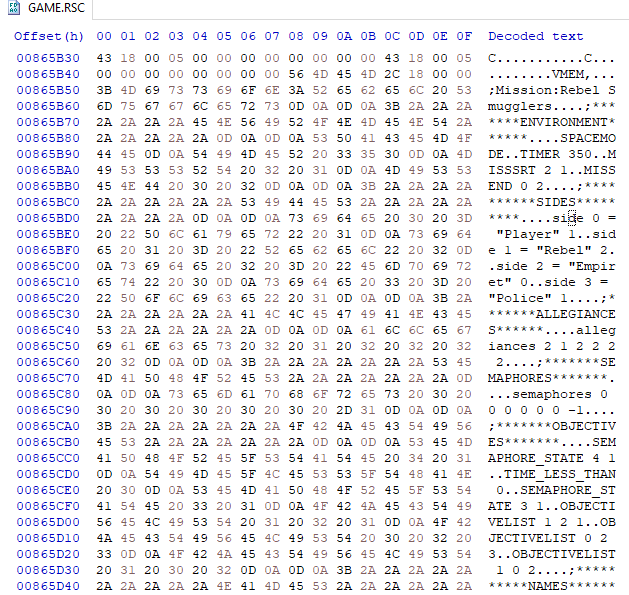

Going back to file names, I notice them being in alphabetical order, but sometimes it starts over again. For me this hints at several directories. For some reason it took me a day or two to atleast try looking for directory entries, which I've found before the file names.

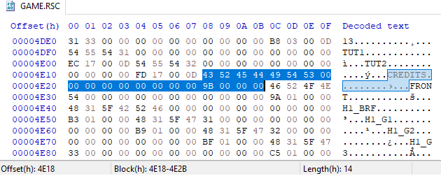

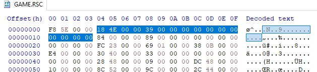

The first 4 bytes of selection above indicate an offset where the file names are located for this directory: `0x4E18`, and the next 4 bytes specify amount of files: `0x39` (57 files). These assumptions can be quickly evaluated by using **Go To** function in your hex editor and then making a selection or moving by offset of file entry structure size multiplied by amount of files.

Another function was made to parse these, notice how it depends on `parseFileEntry`. Such setup allows for composition and I like it alot.

```js
function parseDirectory( FILE = Buffer.alloc( 0 ), offset = 0 ) {
    const directory_ptr = FILE.readInt32LE( offset )
    const file_amount = FILE.readInt32LE( offset + 0x4 )

    const files = [ ... new Array( file_amount ) ]
        .map( ( _, index ) => parseFileEntry( FILE, directory_ptr + index * 0x14 ) )

    return {
        directory_ptr: formatPointer( directory_ptr ),
        file_amount,

        files
    }
}
```

From now on I paid more attention to offsets, amounts and sizes. If you were programming to produce such resource file you'd probably end up parsing these to know what you have to read next. **This made me believe that no one is able to properly reverse engineer anything until they program or deal with something similar theirselves.** When you see a structure, always remember there better be something that describes how to access it.

Funny enough, this approach didn't work with directory entries. They start at an offset of `0x4`, the initial 4 bytes before that: `F8 5E 00 00` turned out to be an offset to a very important **table with file locations**.

Since directory entries are of fixed size, I just observed how many I had manually, turned out there are **16 directories** and some of them are really weird, consisting of nothing but zeroes.

Just how directory is composed of files, I can now compose resource file with directories

```js
function parseResources( FILE = Buffer.alloc( 0 ) ) {
    const file_offsets_ptr = FILE.readInt32LE( 0 )

    const directory_amount = 16

    const directories = [ ...new Array( directory_amount ) ]
        .map( ( _, index ) => parseDirectory( FILE, 0x4 + index * 0x8 ) )

    // return directories and more
```

### **File offset table**

The previously mentioned `F8 5E 00 00` marks the beginning of file table. At the beginning of it I once again have what I've figured out to be an amount value, and then a pair of what perhaps could be **File offset** and then maybe a **File type**?

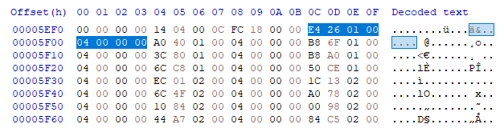

So if one of the previously parsed file entries has an index of `0`, I'd assume it to be at `0x126E4`. By combining the directories with file names and this table, you now know where each file is located, **but there's no size info**.

I didn't find if there's size stored for each file, and attempts to find it wasted plenty of time before I decided to calculate the sizes myself: *maybe that's what the game does anyway*. Size calculation is done in the second `map` loop below, don't mind that the last entry will always have a size of zero, because it really does, **a lot of last entries look like**: `84 04 0F 03 05 00 00 00`, with no progression at all, which still remains a mystery for me.

```js
function parseFileOffsets( FILE = Buffer.alloc( 0 ), offset = 0 ) {
    const file_amount = FILE.readInt32LE( offset )

    return [ ...new Array( file_amount ) ]
        .map( ( _, index ) => ( {
            index,
            offset: FILE.readInt32LE( ( offset + 0x8 * index ) + 0x4 ),
            file_type_maybe: FILE.readInt32LE( ( offset + 0x8 * index ) + 0x8 )
        } ) )
        .map( ( file, index, array ) => {
            const next_file = array[index + 1]

            return {
                ...file,
                size: next_file ? ( next_file.offset - file.offset ) : 0
            }
        } )
}
```

With all of this info I had at this point, I was ready to extract the files. There were no names for directories so I had to name them myself based on directory index.

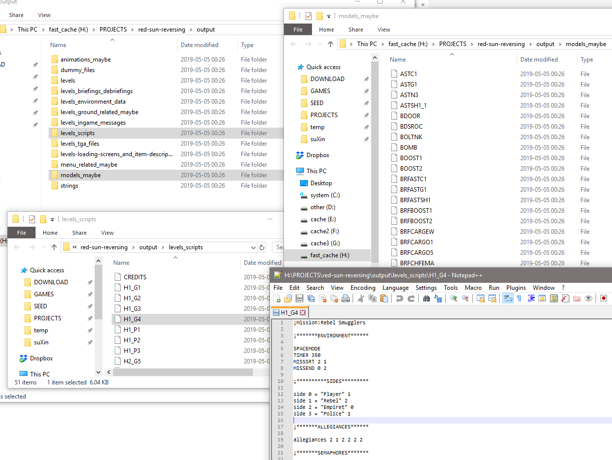

Before moving on to parsing model files, I want to comment on a mystery **dummy files** directory on this screenshot. Like I mentioned, some of the entries in file offset table have a calculated size of zero, and so it happened that some of the named files referred to these zero-sized entries. The file names made me assume that they could be textures, but if they were textures, why there were only 228 of them? Why they don't have **TIM** extension like on some of the other non-dummy files? *Maybe these are packed differently?* But most likely I missed something. I will leave this mystery as it is, I don't care about these files much.

**Textures were the final problem**. The named files only properly referred to the loading screen textures, and if I managed to extract them and apply to parsed models later, how would I know which textures to use? This made me worried, but once again by observing whatever I had so far, I found something weird.

After sorting all named file entries by their file offset table index, I noticed huge gaps among these indexes. It's like there *could be* a directory to refer to some more files, but nothing that I could see explicitly. I decided to follow a file offset for one of the indexes that falls into gap, which presented me with `10 00 00 00` - a header for **TIM** texture format. **It's also worth noting that all these file offsets had value of** `5` **along with it**, which made me assume that `5` could indicate a texture file.

To extract textures, I just filtered the array with file offsets by having a `file_type_maybe` of 5, and extracted these files in a separate directory. Later on, I will realise that despite there being *several* gaps with different file offset indexes, combining all of them together sequentially will still map correctly to the texture indexes that models have.

Why it's so convoluted compared to other files remains a mystery for me. Maybe optimizations from resource packer?

## **Parsing models**

Just like **Resource extraction**, figuring out models relies on assumptions and finding pointers that will lead me in a right way. Despite the fact that I had some scraps and code to extract and parse ship models from Playstation RAM, I decided to approach these model files from scratch and more clear headed, referring to what I previously had only if necessary.

Rather than just describing model format, I want to focus on problems I had and how they were approached.

### **Faces**

Faces connect vertexes together. The main problem with the face structures we're dealing with: **there are both tris and quads, and their structure width my vary**.

Generally, **Face structure** consists of **Header**, **Vertex indexes**, **UV data** and **Texture index**, but there's also something in between, perhaps something that only Playstation would care about when rendering. I'm pretty sure all required information is contained within the header, but I never bothered with decoding it. *Maybe if I converted all headers into binary, I would notice a bit that all quads share? Or more?*

Initially, I only parsed **Vertex indexes** and these go always after the header, but since structure size varies, I still had to calculate the offset for the next face. My approach is dumb: every time I encountered a new face header and got a thrown error, I observe it in the hex editor and then add a new record to the face dictionary, which maps the header to structure size; I also mark if it's quad.

Later on, calculating offsets to data required for textures wasn't too difficult, as fortunately it was always in the same order relative to the structure end. *The old in-memory parser had **UV** and **Texture** offsets marked explicitly and in general is much less elegant*.

**There's a total of 34 face types that I've encountered.**

```js
const faceTypes = {
// ...
    0x0C79: { size: 0x18 },
    0x0CB4: { size: 0x18, quad: true },
    0x0CB8: { size: 0x18 },
    0x0F3C: { size: 0x1E, quad: true },
    0x0F7D: { size: 0x1E, quad: true },
    0x0FBC: { size: 0x1E, quad: true },
// ...
}

function parseFace( FILE = Buffer.alloc( 0 ), offset = 0 ) {
    const type = FILE.readUInt16LE( offset )
    const faceType = faceTypes[type]
    if ( !faceType ) {
        throw new Error( `Unknown facetype: ${formatPointer( type )}\noffset: ${formatPointer( offset )}` )
    }
    const { size, quad } = faceType

    const vertex_amount = quad ? 4 : 3

    return {
        offset: formatPointer( offset ),
        type: formatPointer( type ),

        vertexes: [ ... new Array( vertex_amount ) ]
            .map( ( _, index ) => FILE.readInt16LE( offset + 0x2 * index + 0x2 ) ),

        texture_index: FILE.readInt32LE( offset + size - vertex_amount * 2 - 0x4 ),

        uv: [ ... new Array( vertex_amount ) ]
            .map( ( _, index ) => {
                const uv_start = offset + size - vertex_amount * 2
                return {
                    x: FILE.readUInt8( uv_start + 0x0 + index * 0x2 ),
                    y: FILE.readUInt8( uv_start + 0x1 + index * 0x2 )
                }
            } )
    }
}
```

### **Objects and offsets**

Compared to the only ship that I've ripped from **Colony Wars: Vengeance**, the models in **Red Sun** turned out to be much more complicated because they consist of several parts. I figured it out during in-memory approach by accidentally making a portion of ship disappear, or making it huge like on screenshot below:

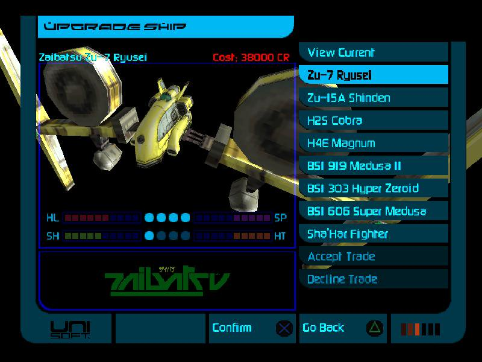

Even if you find where these separate objects are located and extract their mesh - the position offset and other required data doesn't come with it.

**Because it's located in entirely different section at the beginning of the model file**, which I call **Object meta section**.

Every model may consist of several objects, every object can be a child of the other object. **There can be several levels of nesting**. The actual objects and their mesh may not go in sequential order as declared in **object meta section** - not paying attention to that resulted in faulty model exports with incorrect offsets:

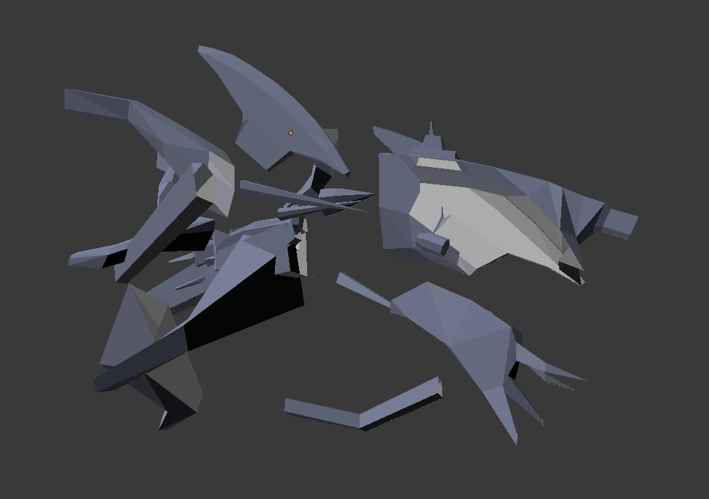

You also have to apply offsets correctly when exporting to **OBJ** file, because of the mentioned several levels of nesting. Just summing the required offsets together did it right.

### **Object rotations**

There's more than just positional offsets: **rotations**, and these took me awhile too because I was way too used to basic **Euler XYZ** system with **Pitch/Yaw/Roll**, when in this case it turned out to be a **rotation matrix**.

What's interesting is that noticing the rotation matrix would take ages for me if I didn't try accidentally doing [some OpenGL tutorials](http://www.opengl-tutorial.org/beginners-tutorials/tutorial-3-matrices/) several days beforehand. 3D graphics often relies on matricies for rendering, and after finally assuming that rotation could be stored this way, I've got this on most of the objects:

```
[
    [ 4096, 0, 0 ],
    [ 0, 4096, 0 ],
    [ 0, 0, 4096 ],
]
```

Which means **no rotation applied**, or **zeroes on Pitch/Yaw/Roll**. The values being `4096` is most likely a Playstation quirk, because it doesn't operate with floating point numbers, so these must be normalized to `1.0f`. To check that I did everything correctly, I was converting matricies to **Euler XYZ** with [Online 3D Rotation Converter](https://www.andre-gaschler.com/rotationconverter/) and rotated exported objects manually in **Blender** to see if it's correct. [This answer also gave me a proper reference of what I had to multiply](https://stackoverflow.com/a/34052492) to calculate a new vertex position with applied rotation.

To be honest I still have no idea on how rotation matrix works and how it's converted to Euler. *Not that I want to understand it*.

```js
// 4096 = 1.0f
function normalizeRotationMatrix(
    rotationMatrix = [ [ 4096, 0, 0 ], [ 0, 4096, 0 ], [ 0, 0, 4096 ] ]
) {
    const result = [
        [ ...rotationMatrix[0] ],
        [ ...rotationMatrix[1] ],
        [ ...rotationMatrix[2] ]
    ]

    for ( const row of result ) {
        for ( let i = 0 ; i < row.length ; i++ ) {
            row[i] = ( row[i] / 4096 )
        }
    }

    return result
}

function rotate(
    coords = { x: 0, y: 0, z: 0 },
    rotationMatrix = [ [ 1, 0, 0 ], [ 0, 1, 0 ], [ 0, 0, 1 ] ]
) {

    const { x, y, z } = coords
    return {
        x: x * rotationMatrix[0][0] + y * rotationMatrix[0][1] + z * rotationMatrix[0][2],
        y: x * rotationMatrix[1][0] + y * rotationMatrix[1][1] + z * rotationMatrix[1][2],
        z: x * rotationMatrix[2][0] + y * rotationMatrix[2][1] + z * rotationMatrix[2][2]
    }
}
```

The resulting **Object meta entry** was parsed like this

```js
function parseObjectMeta( FILE = Buffer.alloc( 0 ), offset = 0 ) {
    const rotation_matrix = [
        [
            FILE.readInt16LE( offset + 0x0C ),
            FILE.readInt16LE( offset + 0x0E ),
            FILE.readInt16LE( offset + 0x10 )
        ],
        [
            FILE.readInt16LE( offset + 0x12 ),
            FILE.readInt16LE( offset + 0x14 ),
            FILE.readInt16LE( offset + 0x16 )
        ],
        [
            FILE.readInt16LE( offset + 0x18 ),
            FILE.readInt16LE( offset + 0x1A ),
            FILE.readInt16LE( offset + 0x1C )
        ],
    ]

    return {
        offset: formatPointer( offset ),
        parent_index: FILE.readInt32LE( offset + 0x0 ),

        rotation_matrix,
        rotation_matrix_normalized: normalizeRotationMatrix( rotation_matrix ),

        x_offset: FILE.readInt32LE( offset + 0x20 ),
        y_offset: FILE.readInt32LE( offset + 0x24 ),
        z_offset: FILE.readInt32LE( offset + 0x28 ),
    }
}
```

### **Object scaling**

So here goes offset, rotation, **but no scale**, which is really weird. Scale is not stored in **Object meta**, but along with object's mesh, and it's not your traditional scale by XYZ, neither it's scale matrix, but **just a single number** to rely on.

If said number is `0` - scale is 1 for all dimensions; value of `1` will result in scale of 2, and value of `2` will turn the scale into 4. I don't know why it's like this, maybe I've missed a proper scale matrix, because if you look back on abnormally large ship screenshot - the increased scale was not applied to all dimensions.

Here's the **final form of Red Sun** with all offsets, rotations and scaling applied correctly:


### **Level of detail**

Another thing that took me awhile to figure is the fact that some models have **Level of Detail (LOD) meshes** included. I stumbled upon them when iterating objects of certain models, only for my parser to crash because the next entry wasn't object, but something else.

This was during the time when I didn't separate **object** and **it's mesh**. Turns out every object has mesh counter so I also relied on that during parsing, but my mistake was combining these mesh into one, which resulted in z-fighting:


I knew what **LODs** were, but once again it took me awhile to realise I was dealing with them. I was too much focused on thinking that it's an actual part of the model because I mistakenly fused it with a high detailed mesh. *I wonder if I would leave it like this if it wasn't for annoying z-fighting.*

### Textures

Figuring out which textures are required for a model was simple. They are specified at the beginning of the file. If you remember the **Resource extraction** section - I've noted that number `5` may indicate that the file is a texture, and such trait is also shared here. The way I've extracted textures from resource file also turned out to be correct: the index specified before number `5` is only related to texture files in an order they are packed.

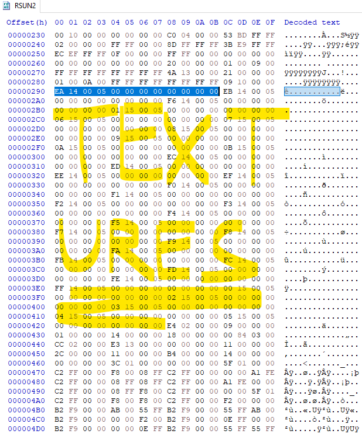

### **Normals?**

In the code of `parseMesh` function below, you may notice that I've included normal related info, but since I'm dealing with simple low-poly Playstation models, and the fact that I could generate normals myself in **Blender** - I decided not to care about them. **Also it wasn't confirmed that these are normals anyway**.

### The final structures code

```js
function parseMesh( FILE = Buffer.alloc( 0 ), offset = 0 ) {
    const size = FILE.readInt32LE( offset )

    const vertex_amount = FILE.readInt32LE( offset + 0xC )
    const vertex_rel_pointer = FILE.readInt32LE( offset + 0x10 )
    const vertex_abs_pointer = offset + vertex_rel_pointer

    const face_amount = FILE.readInt32LE( offset + 0x1C )
    const face_rel_pointer = FILE.readInt32LE( offset + 0x24 )
    const face_abs_pointer = offset + face_rel_pointer

    const faces = []
    let face_offset = face_abs_pointer
    for ( let i = 0 ; i < face_amount ; i++ ) {
        const face = parseFace( FILE, face_offset )

        faces.push( face )
        face_offset += face.size
    }

    return {
        offset: formatPointer( offset ),
        size,

        scale_factor: FILE.readInt8( offset + 0x8 ),

        vertex_amount,
        vertex_offset: {
            rel: formatPointer( vertex_rel_pointer ),
            abs: formatPointer( vertex_abs_pointer )
        },

        normals_amount_maybe: FILE.readInt32LE( offset + 0x14 ),
        normals_offset_maybe: {
            rel: formatPointer( FILE.readInt32LE( offset + 0x18 ) ),
            abs: formatPointer( offset + FILE.readInt32LE( offset + 0x18 ) )
        },

        faces_amount: face_amount,
        faces_offset: {
            rel: formatPointer( face_rel_pointer ),
            abs: formatPointer( face_abs_pointer )
        },

        vertexes: [ ...new Array( vertex_amount ) ]
            .map( ( _, index ) => ( {
                index,
                ...parseVertex( FILE, vertex_abs_pointer + index * 0x8 )
            } ) ),

        faces
    }
}

function parseObject( FILE = Buffer.alloc( 0 ), offset = 0 ) {
    const object_size = FILE.readInt32LE( offset )
    const object_index = FILE.readInt32LE( offset + 0x4 )
    const mesh_amount = FILE.readInt32LE( offset + 0x8 )

    const first_mesh_rel_pointer = FILE.readInt32LE( offset + 0x10 )
    const first_mesh_abs_pointer = offset + first_mesh_rel_pointer

    const meshes = []
    let mesh_offset = first_mesh_abs_pointer
    for ( let i = 0 ; i < mesh_amount ; i++ ) {
        const mesh = parseMesh( FILE, mesh_offset )

        meshes.push( {
            mesh_index: i,
            ...mesh
        } )
        mesh_offset += mesh.size
    }

    return {
        object_index,
        object_offset: formatPointer( offset ),
        object_size,

        mesh_amount,
        first_mesh_pointer: {
            rel: formatPointer( first_mesh_rel_pointer ),
            abs: formatPointer( first_mesh_abs_pointer )
        },

        meshes
    }
}

function parseModel( FILE = Buffer.alloc( 0 ) ) {
    const object_meta_amount = FILE.readInt32LE( 0x34 )

    const texture_amount = FILE.readInt32LE( 0x4C )
    const textures_ptr = FILE.readInt32LE( 0x50 )

    const object_amount = FILE.readInt32LE( 0x54 )
    const objects = []
    let object_offset = FILE.readInt32LE( 0x58 )
    for ( let i = 0 ; i < object_amount ; i++ ) {
        const object = parseObject( FILE, object_offset )

        objects.push( object )
        objects.sort( ( a, b ) => a.object_index < b.object_index ? -1 : 1 )
        object_offset += object.object_size
    }

    return {
        object_meta_amount,
        object_meta: [ ...new Array( object_meta_amount ) ]
            .map( ( _, index ) => {
                return {
                    object_meta_index: index,
                    ...parseObjectMeta( FILE, 0x5C + index * 0x2C )
                }
            } ),

        textures_ptr: formatPointer( textures_ptr ),
        texture_amount,
        texture_ids: [ ...new Array( texture_amount ) ]
            .map( ( _, index ) => {
                return FILE.readInt16LE( textures_ptr + index * 0xC )
            } ),

        object_amount,

        objects
    }
}
```

## **Additional notes**

* I'm not sure what was the coordinate system I was dealing with, but to make the ships appear correctly in **Windows 3D viewer**, I had to flip vertex coordinates that I considered to be **X** and **Y**.
* **Some of the textures are transparent** and Playstation has several modes of rendering transparent textures. Because of the latter, **I can't handle transparency properly until I figure out if there's any info on the model that switches transparency mode.** For now, it's not too difficult to make required PNG textures transparent manually.
* I'm interested in ripping all models from **Colony Wars: Vengeance** and original **Colony Wars** in a similar manner.
* The mission scripts are very interesting because they can be edited, [I already tried changing little bits](https://twitter.com/suxinjke/status/1121110809688641536) and it works. I wonder if it's possible to make some difficult Gauntlet-like mission in space.
* [An old gaming magazine from 2000s](https://archive.org/stream/GDM_August_2000#page/n31/mode/2up) mentions that the team was using **Softimage 3D 3.8**. I also found a [thread about ripping **Silent Hill** content](https://silenthillcommunity.com/viewtopic.php?f=3335&t=438099) that has attempts to read models using this ancient software. *I wonder if this could be applied to **Red Sun** models?*
* There were some models that don't seem to be used anywhere and even an easter egg uncovered, I want to document on this later.

I'm finishing this note rather abruptly, there isn't much point in describing how to convert **TIM textures** or make your own **OBJ files** which is still an important part of ripping process.

## **Links**

* [**RedSunRipper** repository - full code](https://github.com/suXinjke/RedSunRipper)
* [All ripped **Red Sun** models](https://www.dropbox.com/s/qhnmt515sr5ccz8/RedSun_Models.7z?dl=0)
* [**Hex** model on The VG Resource](https://www.models-resource.com/playstation/colonywarsvengeance/model/22861/)
* [**Original Red Sun showcase** on The VG Resource](https://www.vg-resource.com/thread-31861.html)
* [**Red Sun menu** tribute](/red_sun/)
* [My #ColonyWars tweets with some progress and model screenshots](https://twitter.com/search?f=tweets&vertical=default&q=from%3Asuxinjke%20%23ColonyWars&src=unkn)
* [**Reverse Engineering Wipeout** - blog post that also details similar experience](https://phoboslab.org/log/2015/04/reverse-engineering-wipeout-psx)