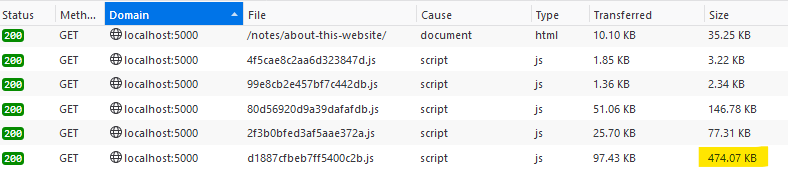
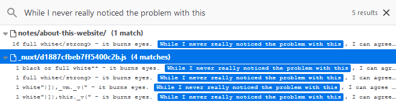
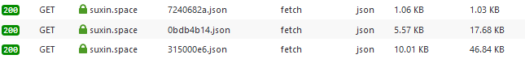

In a [previous note](/notes/about-this-website/) I wrote about my experience on making this personal website and the way I wanted to manage my content. During those days I relied on [**Nuxt**](https://nuxtjs.org/) as a static website generator of choice, but I realised that **it won't scale for me well enough** unless I figure out more hacks on how I should manage my **Markdown files**. I switched to [**Gridsome**](https://gridsome.org/) instead, which *fully* focuses on static generation part, and actually serves me in a better and more straightforward way.

In this note I want to address problems I had with managing Markdown files on **Nuxt**.

## **The bloat**



The resulting bundle I was getting would grow with each note added, and I wouldn't understand why exactly due to my convoluted **Nuxt/Webpack** setup. It's just unacceptable that no matter what page I open, it'd have ***four-five full copies*** of each note. So if you were to open this note on a previous version of my website, you'd get:
* Pre-rendered note as part of it's **HTML**
* Original **Markdown** contents
* **Markdown** transformed to **HTML**
* **Vue template** based on all of this
* **Vue template renderer** based on all of this, because I wanted to make **Vue** components work in my **Markdown** files.



At this point I want to blame my requirements on content management, and believe that **Nuxt** isn't really suited for **Markdown blogging** out of box. In the section [**Problematic dynamic routes and nuxt-link**](/notes/about-this-website#problematic-dynamic-routes-and-nuxt-link) of my previous note, I already considered the solution I've got as *hacky*. Looking back at it, I could ask myself:
* *Why do I have to pre-generate a JSON with a list of notes?*
* *Is putting **require** calls into **computed** even legal?*
* *Is **Nuxt's asyncData** method the only thing that I could rely on for retrieving the content?*

Usually there always should be a sane and straightforward method to do something, and yet I always doubted if I did things correctly in this case. The fact that there are only a few of blogposts describing **Markdown blogging with Nuxt**, which also have similar inane ways of setting it up, once again makes me believe that it's not really suited for it as for now.

* [**Website with blog and portfolio using Vue.js + Nuxt + Markdown**](https://marinaaisa.com/blog/blog-using-vue-nuxt-markdown/) - rely on pre-made array of blogs, and then map it with *imports* and **Markdown loader**. The fact that there's *import* instead of *require* didn't help with the problem of bloat. The `/blog` page here has the same problem I've encountered: **four full copies** of each post that are not even rendered yet.
* [**Including Markdown Content in a Vue or Nuxt SPA**](https://vuejsdevelopers.com/2018/12/31/vue-nuxt-spa-markdown/) - generate a manifest file that contains all blogs, always include it in your application (small bloat), based on current article route - fetch the Markdown, **parse and render it on client**. I guess this article is not aimed at **Nuxt** static websites, but there's still a hint at the end that suggests to move rendering to `asyncData`, which may lead to the same problems I complain about. The article also mentions how to include **Vue components** into Markdown, but I believe the way it's done is hell and also adds one more copy of your full Markdown post.
* [**Markdown Driven Portfolio website with Nuxt.js**](https://medium.com/haiiro-io/markdown-driven-portfolio-website-with-nuxt-js-a8d08ffe2712) - this one is cool because it's written by creator of [**frontmatter-markdown-loader**](https://github.com/hmsk/frontmatter-markdown-loader) which me and people from other articles may rely on. Unfortunately, bloat problems remain. The article mentions making of [Namika's Hamasaki personal website](https://namika.hmsk.co/) and [there's source code of it](https://github.com/haiiro-io/violet). It relies on **Vuex store**, which I'd consider the king of hacks in attempt to collect and provide all required Markdown content beforehand, and yet it still doesn't help with the bloat. No matter what page you load, it includes an impressive **400KB Javascript file** containing all post content.
* [**From Jekyll to NuxtJS for better and faster sites**](https://dev.to/teleyinex/from-jekyll-to-nuxtjs-for-better-and-faster-sites-2i71) - instead of relying on Markdown loaders or parsers on build step, pregenerate all blog posts in single JSON file, which is fetched on all blog related pages. Bloat problem remains.

***All of these*** include some pre-generated file with all posts, and then it's always mapped in a way that leaves this bloat.

While I understand that most people don't have to care much about this issue, because it's not like everyone has 100 blog posts on their website - it doesn't mean this shouldn't be addressed. But I'm mostly frustrated that mobile users may wait for a huge bundle to download, only for 80% of it's content to remain unseen. **We should respect user's bandwidth.**

## **A pathetic attempt to do it right**

Spoilers: **it didn't work out**.

I don't remember how, but I found [**Nuxpress**](https://github.com/galvez/nuxpress) project by [Jonas Galvez](https://twitter.com/anothergalvez). This one stands out because it injects the Markdown content into **Nuxt's context** via [**custom plugin**](https://github.com/galvez/nuxpress/blob/master/plugins/nuxpress.js). I tried to adapt the solution to mine, which resulted in abomination below. It's been about a month since I made this, so I don't remember the exact reasoning behind keeping render functions like that, I guess it's to make **Vue components** work inside Markdown files.

```js
const files = {}

if ( process.server ) {
    const fs = require( 'fs' )
    const md = require( 'markdown-it' )( { html: true } ).use( require( 'markdown-it-highlightjs' ) )
    const fm = require( 'front-matter' )

    const vueCompiler = require( 'vue-template-compiler' )
    const vueCompilerStripWith = require( 'vue-template-es2015-compiler' )

    const note_file_names = fs.readdirSync( './assets/notes' )

    for ( const file_name of note_file_names ) {
        const contents = fs.readFileSync( `./assets/notes/${file_name}`, 'utf8' )
        const parsedContents = fm( contents )
        const route = file_name.replace( /\.md$/, '' )

        const html = md.render( parsedContents.body )

        const rootClass = 'frontmatter-markdown'
        const template = html
            .replace( /<(code\s.+)>/g, '<$1 v-pre>' )
            .replace( /<code>/g, '<code v-pre>' )
        const compiled = vueCompiler.compile( `<div class="${rootClass}">${template}</div>` )
        const render = `return ${vueCompilerStripWith( `function render() { ${compiled.render} }` )}`

        let staticRenderFns = ''
        if ( compiled.staticRenderFns.length > 0 ) {
            staticRenderFns = `return ${vueCompilerStripWith( `[${compiled.staticRenderFns.map( fn => `function () { ${fn} }` ).join( ',' )}]` )}`
        }

        files[route] = {
            link: `/notes/${file_name.replace( /\.md$/, '' )}/`,
            attributes: parsedContents.attributes,
            render,
            staticRenderFns
        }
    }
}

export default async ( { app, env }, inject ) => {
    if ( process.server ) {
        inject( 'parsedFiles', files )
    }
}
```

Anyway, the point is: *I don't believe we should waste time on such setups*. Besides, **plugin solution doesn't work well** because `<nuxt-link>` will stop working with pages that rely on injected context: there's no corresponding info among resulting Javascript files. The context data is only being sent to **HTML of the page** and **inline Javascript** on it to **hydrate the Vue instance**. The solution would be using plain `<a>` hyperlinks instead, but I like the smooth transition between pages.

And yet, when I contacted Jonas about the issue, he mentioned to be working on supporting `<nuxt-link>` properly. The [**nuxt-static-render**](https://github.com/galvez/nuxt-static-render) has been published recently, which apparently would fix the hydration issue. It still feels like a hack though, and it's not that I mind the hydration code too much compared to other bloat.

## **About Gridsome**

[**Gridsome**](https://gridsome.org/) is static site generator that relies on **Vue** for frontend, and plugins that will collect the data from various sources (including Markdown), which allow you to query all of it with [**GraphQL**](https://graphql.org/learn/). It's just [**Gatsby**](https://www.gatsbyjs.org/) but with **Vue** instead of **React** and less mature.

I questioned the need for **GraphQL** at first, I still do to some extent because I have only one source which is Markdown files, but atleast the way it's integrated into this framework solves the bloat problem. Previously on **Nuxt**, the importing would usually include all file content, even if you extract and render a portion of it. With **GraphQL**, you explicitly state what data you retrieve and you can assure it will be the only data presented on requested page. Here's a query I have on my `/notes` page, which specifies all required metadata:

```
<page-query>
query Home {
    allNotes {
        edges {
            node {
                fileInfo {
                    name
                }
                title
                date
                image
                showcase {
                    image
                    imagePos
                }
            }
        }
    }
}
</page-query>
```

There's no actual content or meta description retrieved (for social media and RSS), whatever I want or don't want to display on the actual note page would be a part of related query.

The data for each page seem to be contained in their own JSON files, which are fetched on page transitions. The funny thing is: *this is perhaps something you could also make on your **Nuxt** setup*, but neither me or published articles bothered enough to try doing it. Besides, why waste time trying when it's already decently handled by a plugin and **GraphQL**?



The generated **HTML** files theirselves contain exactly what I expect: **pre-rendered content** and **inline Javascript to hydrate Vue**. It can be somewhat excessive for some content like code snippets, but when you transition to other pages, you still get a smaller **JSON file with one copy of the content** instead.

### **About Vue components in Markdown**

The amount of trouble, the bloat, and hacky nature of making it work on **Nuxt** made me think that putting **Vue components in Markdown is potentially an anti-pattern**. *Shouldn't we focus on plain content in our Markdown files*? In desperate cases for something interactive, I think embedding external **iframes** may still work, otherwise it should be put before or after the Markdown content, as part of the actual page component, which has proper access to any other components. I could also imagine just making entirely separate pages that don't rely on Markdown content too much.

One of the reasons I needed **Vue components** in Markdown files is so I could wrap all images into `<a>` links that would lead to full-sized image. I wouldn't like to type that manually every time because there's a chance I'd forgot to change the link in case of edit.

The solution that works for me right now was to make a small plugin for **remark**. A small function returns another one that will accept the incoming tree of nodes and produce a new one, only wrapping the Markdown image lines with **HTML** I need. I suggest checking out [unified.js.org](https://unified.js.org/create-a-plugin.html) for more info, although docs and examples may seem vague.

```js
// gridsome.config.js
const unistMap = require( 'unist-util-map' )

const addLinksToImages = () => tree => unistMap( tree, node => {
    if ( node.type !== 'image' ) {
        return node
    }

    return {
        type: 'html',
        value: `<a href="${node.url}" target="_blank" rel="noopener">
            
        </a>`
    }
} )

module.exports = {
    ...,
    transformers: {
        remark: {
            externalLinksRel: [ 'noopener' ],
            plugins: [
                '@gridsome/remark-prismjs',
                addLinksToImages
            ]
        }
    }
}
```

Interestingly, there's an [open issue](https://github.com/gridsome/gridsome/issues/39) on **Gridsome** about supporting **Vue components**. So far it's been awhile.