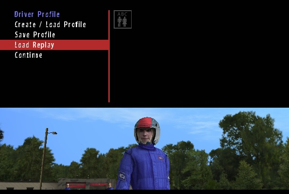
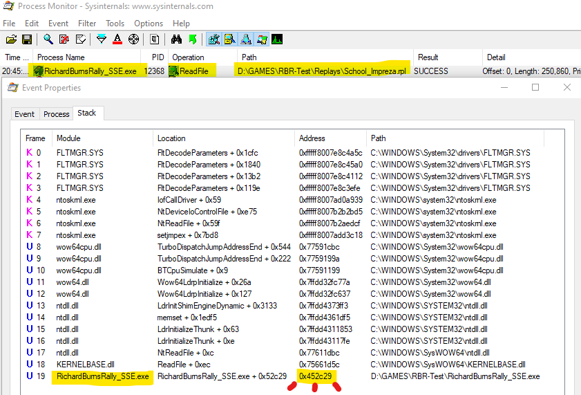
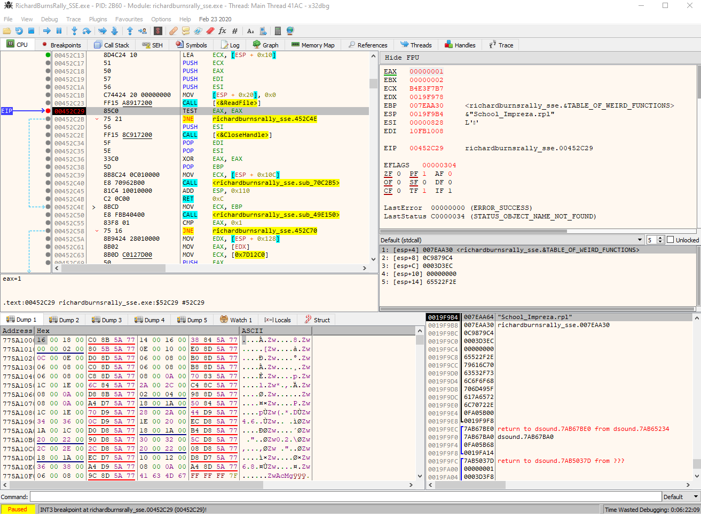
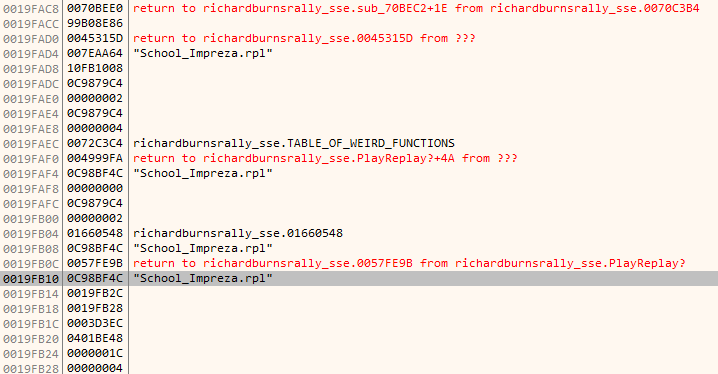
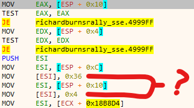

In this note I want to share my experience with calling a function that was not exposed via DLL plugin interface. While it may not look impressive for experienced people, or because you can find other examples online that solve similar problem, I believe it's valuable that I document my experience with approaches, tools used and especially the thought process, which may help other people who learn to reverse engineer or hack.

It's expected you understand programming, C++ and x86 fundamentals for this reading to be any of your interest.

## **Premise**

About a year ago I've got an idea for a **Richard Burns Rally** plugin that would implement **delta timing**: instead of having the time difference only for two checkpoints like in the original game, the plugin would record the time much more often, as if there were much more checkpoints or splits. This would allow for more rapid feedback to understand where you lose or gain time, and why. This feature is present in many modern simracing games and legitimately helped me to improve at ways I control the car.

Since then I still didn't start working on this, one of the reasons was the fact that the plugin would be disappointing for me if I wouldn't be able to compare my time against any replays available on the internet. Technically, it should be possible to take any replay, play it and let the plugin record the splits. There's only one problem: **original plugin interface is barebones and doesn't allow to play replays**, which means you don't have proper control of when you start the replay, meaning you can't easily setup the recording routine.

So this is my problem: **I have to find the function that the game calls to load and begin replay playback**, so I can call it myself any time in my C++ plugin code. I already had reverse engineering experience, [but it was limited to parsing 3D model data](/notes/cw-reverse-engineering-models), this is the first time I had legit game with legit need to use debugger and disassembler, something that is very out of my comfort zone.



## **Breakpoint targeting**

Before I get to the debugging part, I first have to figure out where I want to debug. I will assume that there's some kind of function in the game code that accepts replay file name, and does whatever it has to load the replay. Execution of this function will certainly involve the process of reading the replay file from the directory, meaning that operating system calls will be involved. Since I'm working in **Windows**, my first step is to run [**Process Monitor**](https://docs.microsoft.com/en-us/sysinternals/downloads/procmon) with filter on **RichardBurnsRally_SSE** and **ReadFile** operation.

This leads me to the only operation I've been looking for, and most importantly: the call stack which ends with the in-game memory address where the function was called from: `0x452C29`. *This is where I will setup a breakpoint*.



## **Debugging**

My lack of reverse engineering experience also includes the lack of preferences for tools. In my case, [**IDA Pro**](https://www.hex-rays.com/products/ida/) which everyone may talk about is paid and expensive, [**radare2**](https://github.com/radareorg/radare2) is console based and may need frontend setup, [**OllyDbg**](http://www.ollydbg.de/) is somewhat outdated and hurts for me to look at. [**Cheat Engine**](https://www.cheatengine.org/) has decent debugger but felt clunky to use. This time I stumbled upon [**x64dbg**](https://x64dbg.com/) which looks like glorified **OllyDbg**, and it's what I've been using to solve my problem, and will probably stick to it for now.

If you also decide to try out **x64dbg**, I highly recommend you check out it's **Preferences menu**, in my case I found it convenient to turn off all automatic breakpoints and tweak disassembler output settings. I also want to note that it's also shipped with **x32dbg** executable, targeted at **32-bit applications**, which suits me.

Anyway, I've attached to the **RichardBurnsRally_SSE.exe** process, went to the `0x452C29` address I've noted before and set the breakpoint there. After I attempted to select my replay from in-game menu, the debugger paused the execution right where I expected.



I can certainly see the call to **ReadFile** was just made, like it was also seen in **Process Monitor**. After that I look at the stack on bottom right, which has the mention of replay file name - just what I need! *If I only I knew where it all began.* Checking bottom stack contents from previous function calls reveals, I assume, several **stack frames**. The highlighted replay file name on the screenshot below is the first mention of it at the bottom of stack, therefore I assume that function at the address of `0x4999B0`, which I labeled as **PlayReplay?** on the screenshot, is what I should focus on.

Here goes my first tip when it comes to solving problems like this, and many others will probably tell you the same: **label everything of your interest**, especially if you stumble upon static stuff like constant addresses. Little things may not make any sense right now, but you may encounter them again later on, which will assemble into a bigger picture.



Being familiar with the concept of stack frames, I notice what seems to look like a function with signature of
```cpp
void PlayReplay?( const char *replayName, void *whatever, void *whatever2, size_t replayFileSize )
```

I did notice that 4th argument is replay file size after I tried to load several other replay files. The whatever pointers I marked on 2nd and 3rd arguments turned out to be not really interesting, they point to some memory section and numbers 54 (0x36) and 4 are written there. I didn't figure out what they're for so I will keep thinking *whatever* of them for now.



## **Calling**

Finding out the function location and assuming what it's like wasn't overly difficult. But my attempts at calling it from my controlled DLL plugin code were futile.

Initially, I just made a typedef which represented my assumed function signature:
```cpp
typedef void *function_pointer( const char *, void *, void *, size_t );
```

And attempted to call it like:
```cpp
typedef void (*function_pointer) ( const char *, void *, void *, unsigned int );

function_pointer playReplayMaybe = ( function_pointer ) 0x4999B0;

unsigned int stub1 = 0;
unsigned int stub2 = 0;
size_t replayFileSize = 250860;

playReplayMaybe( "School_Impreza.rpl", &stub1, &stub2, 250860 );
```

Which sadly results in crash. This is where I started to have intrusive thoughts to give up again on reverse engineering, and at the same time I knew I just had to figure out why it happened, after all, ***the debugger can break on exceptions***.

If you scroll up to the pic where I question the weird numbers being written, the last line is where it crashes. For whatever reason, it refers to **ECX** which I didn't see being set anywhere inside this function, I'd probably expect the data in **ECX** to be among function arguments instead. It made no sense for me. I did notice that **ECX** is being set outside before the function call, the value from constant address is copied, *but why **ECX**?* How do I set register value before calling? Write inline assembly? That would be ridiculous.

This is what got me stuck for several days. I was taking breaks from this problem and coming back at it again when I felt like it. Around this time I was also reading portions of [**Practical malware analysis**](https://www.oreilly.com/library/view/practical-malware-analysis/9781593272906/) because it had decent examples of compiled code on which I could focus on while reverse engineering. There's a dedicated C++ section which what the analysed game was developed with, and here's the quote that have made me realise it all:

```
The this pointer is implied in every variable access within a function that
doesn’t specify an object; it is an implied parameter to every object function
call. Within Microsoft-generated assembly code, the this parameter is usually
passed in the ECX register, although sometimes ESI is used instead.
```

So I was probably dealing with a member function call, and it's related to a class instance, pointer of which is specified at **ECX**. This makes sense now, but how exactly am I supposed to call such function? Because it's not like I can easily reconstruct the actual class structure and make it properly point at whatever instance.

Further google helped me to make sense of what are [**calling conventions**](https://en.wikipedia.org/wiki/X86_calling_conventions), I think I saw mentions of these before but didn't really understand their purpose, obviously because I wasn't dealing with them, which is not the case anymore. Here's what I did:

```cpp
typedef void( __thiscall* function_pointer )( void *, const char *, void *, void *, size_t );

function_pointer playReplayMaybe = ( function_pointer ) 0x4999B0;

unsigned int stub1 = 0;
unsigned int stub2 = 0;
size_t replayFileSize = 250860;

void **classInstancePtr = ( void ** ) 0x893634;
playReplayMaybe( *classInstancePtr, "School_Impreza.rpl", &stub1, &stub2, replayFileSize );
// which is basically bigClassInstance->playReplayMaybe( "School_Impreza.rpl", ... )
```

*And it worked just fine.* Now my plugin should be able to render menu with list of replays and play any of them, while also retaining the control over the selection.

There isn't much else I can add besides pointing out that if I didn't read the book or something else with mention of **thiscall**, I'd probably be stuck with this problem for much longer time. I believe this is something that you can't really figure out on your own, this is something **you have to know** to be able to recognize. I can only wonder how many other tricky things and details I will encounter in the future, and have to learn about them.

This is very huge milestone for me, because while simple, it was done on real application for practical purpose.