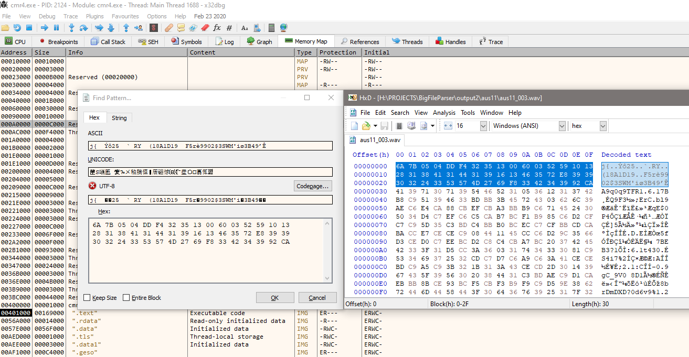

*It's expected you understand programming and x86 fundamentals for this reading to be any of your interest.*

I was recently contacted and asked *if I can open **.big** files*. Whatever they were, one of them was also provided to look at. It turned out to be a resource file that apparently has pacenotes for one of the stages in **Colin McRae Rally 04**.

Due to [previous experience with resource file parsing](https://suxin.space/notes/cw-reverse-engineering-models/), this file seemed easy to understand. It starts with <span style="color: orange;">magic header **BIGF**</span>, <span style="color: green">amount of files</span>, <span style="color: blue">file offset where the files contents are located</span>, some weird **timb** I don't care about, and then the actual list of files.

Each file entry is also simple: <span style="color: orange">file name</span>, <span style="color: green">file size</span>, and <span style="color: blue">it's offset in the file contents section</span>.


I managed to extract one of the **wav files** quickly

***but it didn't play***

Here I was once again thinking if I should just give up here, because I could be dealing with some kind of compression or encryption, something I didn't have experience dealing with. I still had enough drive to atleast try to use [**Audacity's**](https://www.audacityteam.org/) **Import raw data** feature. I tried to import the extracted data as **Signed 8-Bit PCM, 44.1KHz**, which resulted in this **VERY LOUD AUDIO LOWER YOUR VOLUME**:

<div class="audio">
    <audio src="./aus11_001_borked.wav" controls></audio>
</div>


This confirms my concern that it's either compression or encryption, **but the voice can still be heard!** Which made me think it's probably not very difficult to deal with, but that would require me to figure out what the game does with the audio file.

Fortunately, I remembered that I do have a copy of **Colin McRae Rally 04**.

Before setting up the game, I opened the extracted file in [**HxD**](https://mh-nexus.de/en/hxd/) to also notice it doesn't have any [**RIFF WAV** header](https://wiki.fileformat.com/audio/wav/) in it, another sign of compression or encryption.


## **Breakpoint targeting**

Before I could use any tools, I had a problem with the game not supporting windowed mode, which can be easily fixed with [**DxWnd**](https://sourceforge.net/projects/dxwnd/).

The original file was called **aus11.big**, I'm going to assume it's related to the **1st Australian stage**:


I setup the [**Process Monitor**](https://docs.microsoft.com/en-us/sysinternals/downloads/procmon) to only target **cmr4.exe** doing **ReadFile** operations, and then press ENTER in stage select screen, which reveals plenty of calls, including ones to **aus11.big**. What's interesting is that offsets at which file is read, correspond to ones that I've already used when extracting those **WAV files**.


The initial breakpoint will be at `0x515DBB`

## **Debugging**

A little problem was the fact that there are plenty of files that have to be loaded before it'd get to **aus11.big**, but it's not that hard to skip most of the calls and observe the latest ones in **Process Monitor**.

Observing the stack only made me sure that I'm on the right way, **003** corresponds to **003.wav** I saw in the **aus11.big**, and then there's weird reference to source code file about codriver - exactly what I'm dealing with.


While I was observing this, I wasn't sure for a moment what my next step should be, because I'm not really interested in executing step by step to find out where it's being decrypted or something. I quickly thought of a much better way: I'll just try searching memory for the loaded **encrypted** file (I already extracted it from **aus11.big** in encrypted state, and can copy portion of it's header), and set the breakpoint on read of that memory portion. When it's accessed - it's probably for decryption.




The breakpoint did work, after that I tried to let it execute the code and observe the memory changes - it does exactly what I wanted - decodes the file and I can see the **RIFF WAV** header emerge:


The relevant portion of disassembly is presented below:

```
00402526 | B8 20A45600 | MOV     EAX, cmr4.56A420                  |
0040252B | EB 03       | JMP     <cmr4.decoding the file contents> |
0040252D | 8D49 00     | LEA     ECX, [ECX]                        |
00402530 | 8A10        | MOV     DL, [EAX]                         |
00402532 | 8A19        | MOV     BL, [ECX]                         |
00402534 | 32DA        | XOR     BL, DL                            |
00402536 | 40          | INC     EAX                               |
00402537 | 8819        | MOV     [ECX], BL                         |
00402539 | 41          | INC     ECX                               |
0040253A | 4E          | DEC     ESI                               |
0040253B | 74 07       | JE      cmr4.402544                       |
0040253D | 8038 00     | CMP     [EAX], 0x0                        |
00402540 | 75 EE       | JNE     <cmr4.decoding the file contents> |
00402542 | EB E2       | JMP     cmr4.402526                       |
```

<style>
*:hover > .tiny-frog  {
    width: 16px;
    transition: width 1s ease-in-out;
}

.tiny-frog {
    content: url('/frog.svg');
    width: 0;
    margin: -2px 0;
    transition: width 1s ease-in-out;
}
</style>

Based on observation and somewhat intuitively I understood that this code does basic [**XOR deciphering**](https://en.wikipedia.org/wiki/XOR_cipher) with the key located at `0x56A420`. First byte of **WAV file** is **XORed** with corresponding first byte of the **key**, and so on. If there's no more **key contents** left, then **key** is used from the beginning.

While trivial, it's still effective protection from people who can't find the key easily like this. <i class="tiny-frog" title="yes"></i>

## **Decrypting**

I've posted [**all the code and the encryption key**](https://github.com/suXinjke/CMR4BigFileParser) on **GitHub**, but I decided to copy some of the relevant code here too, just to demonstrate the **XORing** and how the **big file header** is parsed.

I've put *Baby's* in the note title just because I consider this whole thing trivial for many people, but it's the first time I managed to pull off something like this and also did it very fast by my standards (in an hour or less to get the decrypted file). Therefore I consider it another proud achievement of mine.

<div class="audio">
    <audio src="./aus11_001.wav" controls></audio>
</div>

```js
/* out of context wav key deciphering */
const { files_offset, files } = parseHeader( big_file )

const wav_file = big_file.slice(
    files_offset + file.offset,
    files_offset + file.offset + file.size
)

if ( wav_key ) {
    for ( let i = 0 ; i < wav_file.length ; i++ ) {
        wav_file[i] = wav_file[i] ^ wav_key[i % wav_key.length]
    }
}
```

```js
function parseHeader( file = Buffer.alloc() ) {
    const magic = file.slice( 0, 4 ).toString('utf8')
    if ( magic !== 'BIGF' ) {
        throw new Error( 'Missing BIGF magic header, not a big file' )
    }
    const file_amount = file.readUInt32LE( 4 )

    return {
        file_amount,
        files_offset: file.readUInt32LE( 8 ),

        files: [ ...new Array( file_amount ) ].map( ( _, index ) => {
            const offset = 0x24 + index * 0x18

            return {
                name: file.slice( offset, offset + 0x10 ).filter( chr => chr !== 0 ).toString(),
                size: file.readUInt32LE( offset + 0x10 ),
                offset: file.readUInt32LE( offset + 0x14 )
            }
        } )
    }
}
```