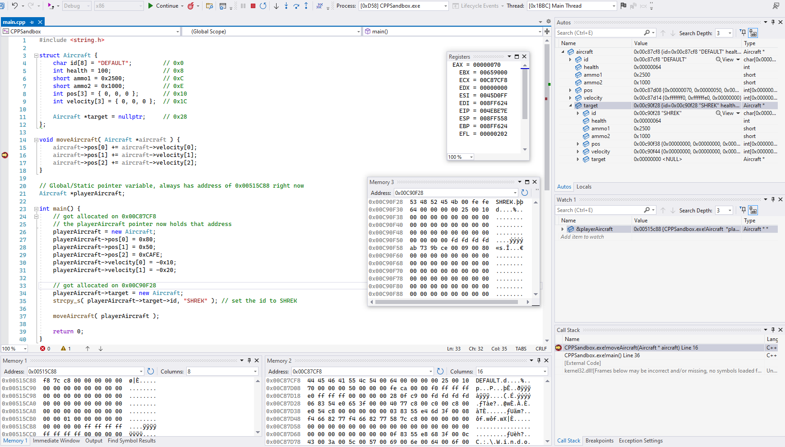
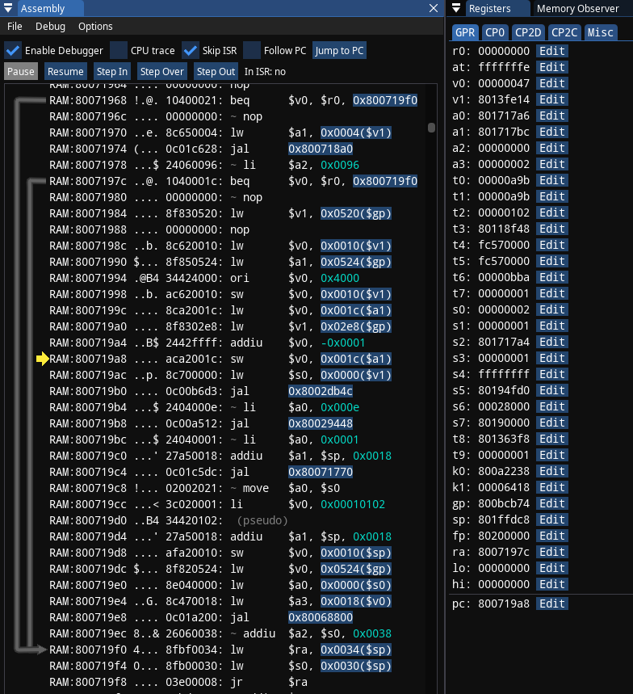
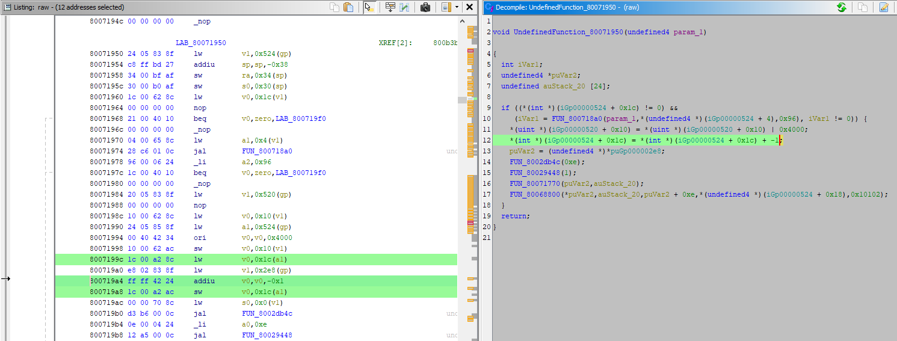
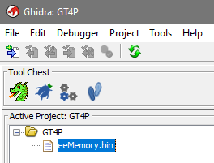
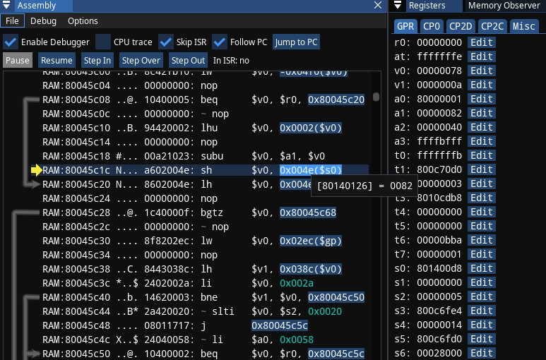
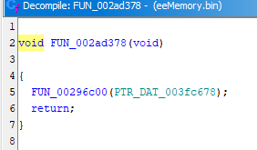

## **Preface**

Developers at [RetroAchievements](https://retroachievements.org/) sometimes have to deal with [Pointers](<https://en.wikipedia.org/wiki/Pointer_(computer_programming)>) - variables that contain addresses to data you'd be interested in while creating achievement logic. Tracking down where pointer originates from is not always easy.

In this blogpost I want to make sense of everything I know when it comes to tracking down pointers, and do it in text and image format. This material is aimed towards RetroAchievement developers, so there might be some references to things only those developers are familiar with, but you may find it valuable too.

In addition to various emulator debuggers, this blogpost also explores using [Ghidra](https://github.com/NationalSecurityAgency/ghidra/) for it's decompiler, which might be interesting to beginners learning such tools and reverse engineering.

```question
What things only RetroAchievements developers are familiar with?

[**RAIntegration**](https://github.com/RetroAchievements/RAIntegration/) - toolkit that integrates with emulators and allows to search RAM for value changes, to bookmark RAM addresses and track values at those addresses, to define achievement logic, upload achievements to server.
* **Memory Inspector** - allows to explore RAM and search for value changes there
* **Code Note** - a comment put on RAM address and uploaded to server, it's available for all RetroAchievements developers to read and edit

[**RATools**](https://github.com/Jamiras/RATools/) - Domain Specific Language and toolkit to automate generation of achievement logic.

[**rcheevos**](https://github.com/RetroAchievements/rcheevos) - portable C library for emulators so these can execute achievement logic.

**RAM digging** - the way community calls the process of searching for required values in RAM and making Code Notes for them. Similar to searching for values in Cheat Engine.
```

If you never programmed before and/or don't have much experience with achievement creation, understand: getting a grasp on this will be difficult - that's natural. This requires perseverance and revisiting the topics you're confused about, combined with seeking and reading/watching different learning material that explains same topics. Also understand there's no guarantee the examples you read about will be similar to the actual work you deal with: most games are unique and the main goal is to cultivate your inner hacker and intuition to make good guesses earlier. The guesses part ain't a joke, as you're going into reverse engineering territory, both *educated* and regular guesses become part of the work.

If you feel like it, check out this video: [Learn Reverse Engineering (for hacking games)](https://www.youtube.com/watch?v=0_Eif2qGK7I) - it gives a short overview of what you will be dealing with, the examples are for PC games though.

## **The path of least resistance**

This section is mostly a reminder on how one could *at least try* dealing with pointers without learning the complex stuff, in RAIntegration:

1. Find the address of the value, write it down, make Save State 1
2. Restart the game, or start at different level - whatever that will make the value appear at different address. Find the address of the value, write it down, make Save State 2
3. Calculate the difference between the addresses. For example: if Save State 1 had value at `0x1717D8` and Save State 2 had value at `0x178CA4`, the difference is `0x178CA4 - 0x1717D8 = 0x74CC`
4. Load Save State 1, make a new search for 32-bit (Aligned) values (my example is PSX so it takes that much)
5. Load Save State 2, then do filter either by Last Value Plus or Last Value Minus, in my case I will have to go by `0x74CC` for Last Value Plus
6. You're likely to get several candidates, one of them might be the pointer you seek, good luck
    * If you had Save State 3 with 3rd address, it could further help to lower amount of candidates. In my case some addresses also flickered and I could get rid of them
    * I also recommend you pick addresses that result in lowest possible offsets

[WilHiteWarrior's video](https://www.youtube.com/watch?v=_gk0vYYlm-E) explains and demonstrates the steps above

The **Pointer Finder** in RAIntegration also streamlines this process:

1. Load Save State 1 - enter previously found address in State 1 and Capture it
2. Load Save State 2 - enter previously found address in State 2 and Capture it
3. I choose to Find 32-bit (aligned) values afterwards, and get similar results. Offsets look big but that's because of 0x80 prefix on the pointers.


There's also another easy way that I often use instead of *finding by difference*, it doesn't require any save states:

1. Find the address of the value, write it down (in my case it's `0x1717D8`)
2. Begin the search of 32-bit (Aligned), then filter down by `Constant <= 0x801717D8`, I have added the 0x80 prefix here because I'm working with PSX
3. Filter down by `Constant >= 0x801710D8`, the constant here has value of 0x700 less than previous one.
4. You get several candidates

Understand the step 3 - I'm merely trying to find a value that holds an address close to `0x801717D8`.

You can tweak the offset to be smaller or bigger. Try smaller offsets if there's too many candidates, and bigger one if you didn't get anything.

These methods work for simple cases: when it's just one static pointer. Once you start getting less trivial cases of pointers that lead to pointers - reverse engineering is preferred, which this blogpost will cover.

## **Learn programming basics and how programs execute**

You may not like this part, but this is the foundation for later. It's essential to understand why things appear the way they are, otherwise you risk being completely clueless and unproductive for all the wrong reasons. Plenty of blogposts and videos that cover reverse engineering and game hacking will also note that programming background is required. **I'm not opposed to you skipping this section**, but only as long as you're aware that you may need to take steps back and learn fundamentals, fill whatever knowledge gaps you realised you have and prevent you from moving forward.

### **Learn C or C++ and debugging your programs**

The general goal here is to get a taste and feel of programming basics. This is important because you will get first hand experience with actually making programs that you deal with when doing *RAM digging* (games are programs too). You will personally define which data to store and how to store it (that includes producing pointers yourself), you will learn how to make reusable functions for your program (tons of which will be encountered during debugging later), you will learn to debug your own program (which will teach you debugger basics that will transfer later). Also by learning programming basics you will find it easier to learn [RATools](https://github.com/Jamiras/RATools/) afterwards if you need it.

It doesn't matter much if you choose C or C++ here. I recommend these because you need to stick to lower level programming: it's less abstract, you have control over memory allocation, there are lots of learning resources for both languages, and because decompilers produce C code specifically. Learning *basics* of C++ is roughly same as learning basics of C, you don't even need to learn all the parts that make C++ infamous.

**Here's the roadmap**, pay attention to numeric links that may contain learning material:

* Pick C or C++, learn to how to set it up
  * My personal choice is Windows + [Visual Studio Community Edition](https://visualstudio.microsoft.com/vs/community/) and C++ which takes relatively a lot of disk space, some examples will involve that setup [[1]](https://www.learncpp.com/cpp-tutorial/installing-an-integrated-development-environment-ide/) [[2]](https://code.visualstudio.com/docs/languages/cpp) [[3]](https://learn.microsoft.com/en-us/cpp/build/vscpp-step-0-installation)
  * For simplicity, stick to making Debug build for x86 (32 bit systems), not x86_64 (64 bit systems)
  * You can choose to get started with any online editor too, but it's unlikely to have debugger support
* Be able to compile and run your first "Hello, World!" program, that's a proof you've got everything set up correctly [[1]](https://www.learncpp.com/cpp-tutorial/compiling-your-first-program/)
* Learn to define local and global variables and what you can do with them. Learn that variables have different data types: integers of various sizes (remember 8-bit, 16-bit, 32-bit in RAIntegration?), strings, floating point numbers
  * Understand that everything you have seen in Memory Inspector, any data at any address can be *interpreted* as those data types
  * Optional: learn bitwise operators and bitmasks if you encountered them when making achievements. If you ever had to make conditions that target Bit0, Bit1 and so on - those likely were part of bitmask. Reminder that this also requires understanding binary [[1]](https://www.programiz.com/c-programming/bitwise-operators) [[2]](https://www.learn-c.org/en/Bitmasks)
* Learn basic control flow: conditional *if statements* and logical operators (AND/OR/NOT)
* Learn loops: *for loop*, *while loop*, *do while loop*
* Learn to define your own functions so the code can be reused
* Learn what variable scope is: how it can be scoped locally to a function, locally to `{}` blocks, or scoped globally

* Learn to define arrays, iterate them using loops
* Learn to define structs (structures)

  * Make array of some struct

* Learn debugger [[1]](https://www.learncpp.com/cpp-tutorial/using-an-integrated-debugger-stepping/) [[2]](https://learn.microsoft.com/en-us/visualstudio/debugger/getting-started-with-the-debugger-cpp)

  * How to run it given your setup
  * What a breakpoint is and how to set it up
  * How to execute your program step by step, how to *step out of function*
  * Learn how to inspect values of your variables, arrays, structs, you can also change values when program execution is paused
  * Notice the presence of call stack, which is useful when you're several functions deep
  * Most of what you learn here will transition to using debuggers in emulators, the major change will be about programming language and code

* Learn that if you haven't been using *malloc* or *new operator* yet - you've been implicitly allocating local variables *on stack segment*, and static/global variables are stored in their own *data segment* [[1]](https://www.javatpoint.com/memory-layout-in-c)
  * Learn that stack size is limited, hence the famous "stack overflow" [[1]](https://stackoverflow.com/questions/1825964/c-c-maximum-stack-size-of-program-on-mainstream-oses)
  * Notice that data segment can be properly defined only during compilation step: that's when it's clear which data is static/global and which isn't
  * Now, the bigger amount of data, like whatever you see moving around in your video games in extremely varied amounts - have to go somewhere else, that segment is called *the heap*
  * This is the moment when you should realise why certain address ranges *feel* stable and some not during achievement development. [Just like in diagram](https://static.javatpoint.com/cpages/images/memory-layout-in-c.png), the lower addresses are code, then static/global variables, then eventually comes the *volatile* heap. It's important to learn having a rough feel for heap segments and which memory region they occupy during achievement development
  * During the program execution, during the function calls, tip of the stack constantly moves around with data being written or read near the tip. Stack Pointer would be pointing at that tip (stack pointer is CPU register, it will be covered later)

```warning
Avoid using addresses close to the tip of the stack during achievement development

Function calls naturally result in local variables being put on stack, the [stack frames](https://en.wikipedia.org/wiki/Call_stack#Structure) accumulate, and sometimes values not so far from the Stack Pointer appear during *RAM digging*. Such stack region should be avoided because of it's volatile nature.

How do you know if you're close to the stack pointer? The only sure way is by using debugger and checking the Stack Pointer CPU register value, which will be covered later. Otherwise you can try opening the memory region, if values there are changing chaotically, if you don't know what most of them represent, if you didn't prove this memory region to be reliable - then it could be on stack.
```

* Now learn *malloc* if you're doing C, or *new operator* if you're doing C++, both of these return *pointers* that lead to the heap
  * Learn how to access or change whatever you allocated via pointer
  * Try specifically allocating a struct that way, because that's what the pointers very often point at, and you encounter them during achievement development
  * Try setting a breakpoint after that struct allocation, observe the struct pointer value - it contains an address, and your development environment likely allows to read that struct contents
  * Try running your program and debugger several times - notice you likely get the pointer to point at different addresses, just like in whatever game you would develop achievements for
  * During debugging, find how to open Memory Inspector-like thing in your editor (Memory View), try to locate the pointer value in there, try to follow the pointer to the struct, compare how data in the struct is presented to you in readable manner vs. how it's actually stored in the memory as seen in Memory View
  * Define a pointer to struct in your struct, allocate it properly, try to change the data via that pointer. This represents "pointer behind pointer" / "double layered pointer" / "nested pointer" situation
  * Optionally learn *free* for C and *delete operator* for C++, that's to deallocate what you've allocated. Seasoned developers will mention smart pointers for C++ and [RAII](https://en.wikipedia.org/wiki/Resource_acquisition_is_initialization) - you don't have to care about that unless you're actually learning to be C++ programmer
* Optional: learn linked lists, especially if you encountered them during achievement development. Code a linked list yourself, make sure you allocate it on the heap [[1]](https://www.programiz.com/dsa/linked-list) [[2]](https://youtu.be/0euvEdPwQnQ?t=1834) [[3]](https://www.learn-c.org/en/Linked_lists)

### **C and C++ learning resources**

Below are various learning resources that I believe are worth getting started with, understand that they don't necessary teach in same order I suggested in the roadmap, and if you go with C++ it may teach things you won't find necessary:

* [**learncpp.com**](https://www.learncpp.com/) - one of the major learning resources I personally had for C++ and it was my favorite. It teaches in way different order compared to roadmap above, and may include plenty of stuff specific to C++ that you won't find necessary. It includes material on [how to setup IDE](https://www.learncpp.com/cpp-tutorial/installing-an-integrated-development-environment-ide/) and [using debugger](https://www.learncpp.com/cpp-tutorial/using-an-integrated-debugger-stepping/)
* [**programiz.com**](https://www.programiz.com/c-programming) - teaches C
* [**C Bootcamp by Paul Gribble**](https://gribblelab.org/teaching/CBootCamp/) - OK alternative/supplement learning material, Linux focused
* [**learn-c.org**](https://www.learn-c.org/) - extremely short and concise, if it's someone's first tutorial - they may need more examples afterwards
* [**CS50**](https://www.youtube.com/playlist?list=PLhQjrBD2T381WAHyx1pq-sBfykqMBI7V4) - Harvard lessons in video format that last for hours, some may prefer that way of learning. Half of it teaches C and more - so that's why I included it

### **Small code and debugger exhibition**

I created a small struct that could represent an entity in a video game, called it an Aircraft and decided it would hold:

* 8 byte string describing what it is (actually up to 7 bytes + 1 byte for null terminator, remember C strings)
* 4 bytes for health, you may say it's excessive amount of bytes, but look how easy it was for me to just specify that `int`, that's how you may have encountered 0/1 values stored in 4 bytes too, people sometimes use `int` for storing boolean values
* 2 bytes for ammo count
* 2 bytes for some other ammo count
* 12 byte array with 4 bytes per element storing position on the map, I used int instead of float for simplicity
* 12 byte array with 4 bytes per element storing velocity vector that would move the position
* 4 byte pointer to another aircraft

Based on those sizes, offsets were put in the trailing comment for each struct member, you may notice it's similar to what you might have seen in Code Notes.

I recommend you open the screenshot below in separate window so you can follow along.



I have put a breakpoint on line 16 and then ran the debugger, now I can go over small details:

* Look at line 21 that defined a global pointer that would hold player's aircraft data. This is something that you'd be hunting for to define good pointer chains for achievements, because address of this pointer itself never changes
  * I can check it's memory address by adding `&playerAircraft` into the Watch window on middle right, which reveals address `0x00515C88`
  * Notice that restarting the program results in same address shown for `&playerAircraft`, which is expected for such global variable. It will likely change only if you recompile the program
  * Notice that I can visit this address in one of the memory windows (Memory 1 on bottom left, similar to Memory Inspector), and the stored 4 bytes at that address represent `0x00C87CF8`. It's stored backwards, in little-endian, which is something you also might have noticed during *RAM digging*. In Visual Studio, those memory windows can be accessed in menu: Debug -> Windows -> Memory
* Now I can follow `0x00C87CF8` in a different memory window (Memory 2) and start comparing what I see there with struct definition and what's shown in the Locals window
  * Notice that values do match the default values of struct and also what I specified on lines 27-31, with the exception of pos[0] which was already modified by line 15
  * Take note of pointer at `0x00C87CF8 + 0x28`, it was attached on line 34. This is pointer to the pointer situation. I can also follow that address: `0x00C90F28` in yet another memory window (Memory 3), and data found there also matches what Locals window show
* <span id="negative-offset-remark">Notice that all offsets for the struct are positive, and regular programmers deal with such structs all the time, all with positive offsets. This is to explain why one shouldn't rely on negative offsets in the achievement code - it's merely something lucky that can work instead of being perfect solution that matches the original program</span>
* If I press Step Over button, line 16 will get executed and debugger stops at line 17, the changes to pos[1] value will be seen in Locals and Memory 2 windows
* If I were to press Step Out button on the toolbar at the top, remainder of moveAircraft function will be executed and debugger will stop at line 37 after executing the function, the changes to aircraft->pos will be seen in Locals and Memory 2 windows
* To practice usage of Step In button on the toolbar at the top, I could put a breakpoint on Line 37, and check what happens when using Step In button compared to Step Over

Here's the original code that you can copy paste if you wish:

```cpp
#include <string.h>

struct Aircraft {
  char id[8] = "DEFAULT";         // 0x0
  int health = 100;               // 0x8
  short ammo1 = 0x2500;           // 0xC
  short ammo2 = 0x1000;           // 0xE
  int pos[3] = { 0, 0, 0 };       // 0x10
  int velocity[3] = { 0, 0, 0 };  // 0x1C

  Aircraft *target = nullptr;     // 0x28
};

void moveAircraft( Aircraft *aircraft ) {
  aircraft->pos[0] += aircraft->velocity[0];
  aircraft->pos[1] += aircraft->velocity[1];
  aircraft->pos[2] += aircraft->velocity[2];
}


Aircraft *playerAircraft;

int main() {


	playerAircraft = new Aircraft;
	playerAircraft->pos[0] = 0x80;
	playerAircraft->pos[1] = 0x50;
	playerAircraft->pos[2] = 0xCAFE;
	playerAircraft->velocity[0] = -0x10;
	playerAircraft->velocity[1] = -0x20;


	playerAircraft->target = new Aircraft;
	strcpy_s( playerAircraft->target->id, "SHREK" ); // set the id to SHREK

	moveAircraft( playerAircraft );

  return 0;
}
```

### **Understand the role of CPU**

Once you get comfortable with coding - you should be more comfortable understanding what goes on lower level, specifically CPU - central processing unit. **I will focus only on necessary parts for debugging:** architectures, disassembly and registers. Other learning resources additionally focus on ALU (Arithmetic Logic Unit), communications via buses, cache, things like pipelining and more - those are all implementation details that are important for CPU itself to function efficiently instead of helping you to understand problems you will be dealing with.

C / C++ is compiled language: if you open the file of your compiled program in Hex Editor, there will be tons of binary guts. Some of these guts are only to provide information about program being executed - those are for Operating System (interested? try [Detect It Easy](https://github.com/horsicq/Detect-It-Easy)), and the other portion of guts is the actual program you wrote and compiled, in form of machine code. This machine code can be read and perfectly executed by CPU *it was compiled for*.

Machine code you can see in Hex Editor is not human readable, but can be made readable by applying disassembler, which will present machine code in [assembly language](https://en.wikipedia.org/wiki/Assembly_language) _for certain CPU architecture_. You need to learn to be comfortable reading and navigating disassembly, which you will deal with while using the debugger. If it makes you feel any better - there was period of time when people primarily coded in assembly instead of C.

I already mentioned that machine code will be executed by CPU *it was compiled for*. Different CPUs can have different architectures, the PC or laptop you're using is likely to be [x86_64](https://en.wikipedia.org/wiki/X86-64), modern smartphones and some laptops: [ARM](https://en.wikipedia.org/wiki/ARM_architecture_family). Different architectures will also make you deal with different instruction sets for assembly, and different sets of registers.

The consoles you're developing achievements for may have rather distinct architectures. This blogpost has examples for Playstation consoles: PSX, PS2 and PSP, which at their core are [MIPS](https://en.wikipedia.org/wiki/MIPS_architecture).

Even if disassembly output is more human-readable, it certainly isn't compared to C, at least until you get used to actually reading it. What could be one line of C++ code may explode into several very trivial lines of assembly language. Countless amount of lines that do very trivial things, such as:

* Read the RAM at specified address, store result in specified CPU register
* Read values in CPU registers, do something like math, write the result into CPU register
* Do some comparisons and begin executing certain code based on the result of comparison (jumps, branching)
* Read the value from specified CPU register and write it to RAM at specified address

Now about CPU registers: you're already familiar with vast amount of RAM that program can read from and write to. CPU registers are also memory, designed specifically for CPU operations, registers are also extremely fast to access and some of them have specific purpose. Set of registers and their names are different given different CPU architectures.

Common registers to expect:

* General purpose registers to hold whatever values. In practice there are conventions that result in specific values be put in specific general purpose registers, like function arguments
* Program Counter (Instruction Pointer) which holds the memory address of next code instruction to be fetched and executed. In practice it shows you which code is currently being executed
* Stack Pointer which holds the memory address of the tip of the stack

### **MIPS**

Here are references and notes regarding MIPS, feel free to revisit the section as you practice:

* [**Cheat Sheet**](https://inst.eecs.berkeley.edu/~cs61c/resources/MIPS_Green_Sheet.pdf) ([mirror1](https://inst.eecs.berkeley.edu/~cs61c/resources/MIPS_Green_Sheet.pdf), [mirror2](https://courses.cs.washington.edu/courses/cse378/09au/MIPS_Green_Sheet.pdf)) - to remind yourself of what instructions do, to remind yourself of register purposes
* [**Wikibooks: MIPS Assembly**](https://en.wikibooks.org/wiki/MIPS_Assembly) - decent and concise additional material on MIPS
* [**Calling Conventions Summary**](https://courses.cs.washington.edu/courses/cse410/09sp/examples/MIPSCallingConventionsSummary.pdf) - gives additional understanding on how register values change between function calls, it's important to understand
* [**Instruction Set Cheat Sheet**](https://www.dsi.unive.it/~gasparetto/materials/MIPS_Instruction_Set.pdf) - explains instructions more in-depth
* [**IDT R30xx Family Software Reference Manual**](https://student.cs.uwaterloo.ca/~cs350/common/r3000-manual.pdf) - very in-depth manual, no need to read all of it. Can focus on register explanations (Chapter 2); deeper explanations of instructions (Chapter 9); and Chapter 10 - C Programming, has an example of how functions are called

#### **Register Purpose Paraphrased**

* **`$v0 - $v1`** return value for the function [[1]](https://stackoverflow.com/questions/19204430/when-do-we-need-v1-in-mips)
* **`$a0 - $a3`** function arguments
* **`$s0 - $s7`** general purpose, expect them to stay same before and after calling the function
  * Preservation is done by called function itself by copying the register values on stack, look into *A Leaf Function With Data and Saved Registers* section of [*Calling Conventions Summary*](https://courses.cs.washington.edu/courses/cse410/09sp/examples/MIPSCallingConventionsSummary.pdf) above for example
* **`$t0 - $t9`** general purpose, do not expect any functions to preserve these
* **`$at`** assembler temporary that's involved in [pseudoinstructions](https://en.wikibooks.org/wiki/MIPS_Assembly/Pseudoinstructions), one can look at it as general purpose register with a specific purpose
* **`$gp`** globals pointer, any instructions referring to it result in stable addresses to global variables that you'd prefer to use in achievement code
* **`$sp`** stack pointer
* **`$ra`** return address, but you usually would look at debugger's callstack instead

#### **Branch Delays**


This is a quirk to be aware of: in screenshot above, both instructions `002FFE2C jr ra` and `002FFE30 sw a0, -0x573C(v0)` will be executed if you were to press Step Into/Over.

You could call this a side effect of classic *fetch-decode-execute-memoryAccess-writeback* [pipeline cycle](https://en.wikipedia.org/wiki/Classic_RISC_pipeline). By the time following the branch (`jr ra`) actually takes place - CPU still has some cycles to *fetch-decode-execute* more instructions below. So compiler put an additional instruction below the `jr` to keep the pipeline efficiency good enough.

Additional explanations: [[1]](https://en.wikipedia.org/wiki/Delay_slot) [[2]](https://stackoverflow.com/questions/15375084/what-is-the-point-of-delay-slots) [[3]](https://stackoverflow.com/questions/59130450/why-did-the-compiler-put-an-instruction-after-the-mips-j-instruction-that-retu)

## **Pointer, PSX game, PCSX-Redux**

The most trivial situation is when there's some static/global pointer variable and you just have to follow it. You don't even need debugger and especially decompiler to track these down. I'm writing this section because it's still a good practice for a newbie before going into tougher cases - an introductory into emulator debugger and Ghidra decompiler usage. You can also validate that your offsets and guesses were correct.

I will be revisiting [Ace Combat 3 Electrosphere NTSC-J release](https://retroachievements.org/game/11308), to revalidate some noted pointer that was used for achievements, specifically the amount of missiles, here's the code note:

```
0xbd098

Pointer [32-bit]
+ 0x00 - Pointer to player's aircraft capabilities. Corrupting this pointer or it's contents can be fun [32-bit]
---+ 0x78 - Amount of Missiles/Bombs aircraft can carry [32-bit]
+ 0x18 - Index of entity missile will track when shot
+ 0x1C - Player's missile count [32-bit]
```

### **Debugger usage**

1. Install [PCSX-Redux](https://github.com/grumpycoders/pcsx-redux) emulator, [Windows x64 builds are here](https://install.appcenter.ms/orgs/grumpycoders/apps/pcsx-redux-win64/distribution_groups/public)
    * This emulator can be confusing compared to what most other people use for regular play, so instructions also include loading and running the game
    * Other choices of PSX emulators with debugger support are [no$psx](https://problemkaputt.de/psx.htm) which I found less intuitive. [pSX 1.13](https://www.emulator-zone.com/doc.php/psx/psx_em.html) also known as psxfin has debugger with terrible UI, [here's forum thread with it's usage](https://www.zophar.net/forums/index.php?threads/tutorial-using-a-debugger-to-figure-out-game-mechanics.13521/). There's [PCSX with Debugger](https://www.romhacking.net/utilities/267/). [Duckstation](https://www.duckstation.org/) has debugger in it, but at the moment of writing it's barebones and not recommended, hope it will become good eventually so you could run it together with RAIntegration
    * For some reason I had latest versions with GLFW integration [crash with this message](./pcsx-debugger/pcsx-redux-error.png), I understand the error but not why it happens. **Running with administrator rights** made it work, some time later running it without admin rights also didn't cause crash, I don't know why. It also still crashes when opening emulator settings without admin rights

2. Launch the emulator, open menu: Configuration -> Emulation

    * Disable Dynarec CPU: it specifically says that faster Dynarec CPU does not play well with debugger
    * Enable Debugger
    * Enable Web Server: this is to be able to dump PSX RAM later for analysis. I really didn't find any other way, otherwise you would need to use Cheat Engine on anything similar that can read and dump any process memory
    * Select actual PSX BIOS file: by default this emulator comes with openbios.bin and I don't know if it's reliable to stick with it
    * Enable Fast boot: I had issues with games loading without it

3. Restart the emulator or select File -> Reboot

    * BIOS and other settings won't be applied without it

4. Open menu: File -> Open Disk Image and navigate to the image file of the game, drag and dropping the file onto emulator window works too

5. Open menu: Emulation -> Start emulation (F5) to start the game

6. Prepare minimal debugging environment
    * All the windows can be opened via Debug -> CPU menu
    * At bare minimum you'll need Assembly, Registers, Breakpoints, Memory Editor and Memory Observer that track value changes in memory the same way RAIntegration can
    * [Here's how I did it](./pcsx-debugger/pcsx-redux-debug-setup.png), windows can be moved and merged together

Now I can start working, I already launched the in-game mission. Suppose I'm already aware that missile counter (32-bit value of 72 or 0x48) is behind a pointer, my goal is to figure out where that pointer originates from by using debugger.

1. Begin targeting for a breakpoint: track down missile count value address in memory, same way as you would in RAIntegration or Cheat Engine:

    * I can do that by using Memory Observer -> Delta-over-time search, first scan for ExactValue of 72 of type Int (32-bit); firing a missile; then doing Next scan for ExactValue of 71. I get two candidates, one of them is very high address that's also close close to stack pointer - you wouldn't use it, this leaves only one candidate at address `0x801717d8`

   

    * Memory Observer has convenient button to follow that address in Memory Editor #1, I press it, so I can edit that value and make sure it's indeed the one that affects my missile count. For example: I set the value to zero and it's indeed reflected in the game
    * **The confirmed target I will be dealing with is located at `0x801717d8`**

   

2. Set a breakpoint that will break when desired value changes, so it will show which code changes that value:
    * That means I want to set a break-on-write breakpoint at `0x801717d8`. Very likely you did not practice such breakpoints when debugging regular C or C++ programs, because when you have your own source code - putting breakpoints at specific code of your own is usually enough. This situation is different: you don't have the original source code and therefore don't even know which code affects the values you're interested in, naturally making you set such a breakpoint on value change
    * **I set a Write breakpoint at `0x801717d8` with the Width of 4**, do prefer to make breakpoint width match the value you're tracking. I know my value takes 32-bit, therefore Width is 4 (bytes)

```question
What about break-on-read breakpoints?

They do exactly what they say. Sometimes you don't have easy way to get into situation that changes the value, but value might be displayed instead, meaning some code will read that value before rendering it. This is when it's worth trying to break-on-read.

It's also worth a try when you just want to investigate different code accessing the value, there might be a chance it's easier to analyze. Break-on-read breakpoints will also be often used to check how pointers are read and accessed.
```


3. Naturally trigger a change of your value in-game: I just shoot the missile one more time. The emulation pauses, *the breakpoint was hit*, I can analyze the code now
    * I may need to click on Jump to PC button if I forgot to tick Follow PC checkbox, reminder that PC stands for Program Counter - the memory address of instruction that CPU will execute

After breakpoint was hit or if you manually Pause the emulation, the Assembly window should look like on screenshot below. Take a note of yellow arrow pointing at *instruction* at `800719a8`. Take a note of register list on the right, including `pc` at the bottom having same value of `800719a8`. Remember that if you ever get lost in all this assembly code, and some other debugger doesn't have Jump to PC button - you can always find your way back by following address stored in `pc` register.

I also have to remind that *code and data* reside together in same 2MB of memory for PSX (remember the [code segment](https://static.javatpoint.com/cpages/images/memory-layout-in-c.png)). Assembly window here is merely interpreting portion of memory as code. In addition to instruction address `800719a8` and mnemonic `sw`, there's machine code included: `aca2001c` (in big endian), and you can see [exactly same machine code in Memory Editor](./pcsx-debugger/pcsx-machine-code.png).

**Now finally to explaining the instruction:** `800719a8: sw $v0, 0x001c($a1)`, which means: store word (4 bytes for 32-bit MIPS!) from `v0` register into an address specified by `a1` register + offset by `0x1c`

The `v0` register on top right shows value of `0x46` (70) - lesser amount of missiles indeed; `a1` register shows the address of `0x801717bc`

* `0x801717bc + 0x1c = 0x801717d8` which matches the same address I previously set the break-on-write breakpoint for



So everything is correct and makes sense here. I'm already highly confident that `a1` register contains the pointer, and `0x1c` is an offset to that pointer, there's only one question left: **where did value in `a1` come from?**

To figure that out, I have to read the code that precedes the one I broke into, I have to ask a question: *where is the most recent instruction that affected `a1`?* In this case the instruction is close, at `80071990: lw $a1, 0x0524($gp)`, which means: load word (4 bytes) from address specified at `gp` register + offset by `0x0524` into register `a1`

The `gp` register shows value of `0x800bcb74`. To get an offset against `gp` register of all things means that my search ends here. `0x800bcb74 + 0x0524 = 0x800bd098`, if I follow that address in Memory Editor, I notice it indeed contains the same value I saw before on `a1` register: `0x801717bc`.


I have to stress: there's no point looking beyond after I noticed I got the address via `gp` register. This register is expected to point at data segment which contains global variables, if it's global - it's also static, therefore can be used in achievement development:

```
AddAddress 24-bit 0xbd098
Mem        16-bit 0x1c     .. conditions ..
```

### **Decompiler usage**

1. During the in-game moment you wish to analyze while PCSX-Redux emulator is running, with Web Server on port 8080 enabled, dump the 2MB of PSX RAM by visiting: http://localhost:8080/api/v1/cpu/ram/raw

```question
Why analyze RAM dump instead of original executable?

Complex PSX games sometimes rely on concept of *overlays* - code that's loaded/swapped at runtime to work around limited 2MB of RAM. If you analyze original executable only - you risk missing the code that was loaded during the exact moment you care about.

And yet I got an impression that **ghidra_psx_ldr** extension that's mentioned below works better with original executables. It's still possible to map overlays for analysis - but that's additional potentially unnecessary work for research-and-forget situations like tracking pointers for achievement development. You'd prefer to stick to original executable if you want to analyze entire game thoroughly.
```

2. [Install Ghidra](#installing-ghidra)
3. Install [ghidra_psx_ldr](https://github.com/lab313ru/ghidra_psx_ldr/releases) extension, see [Installing Ghidra Extensions](#installing-ghidra-extensions) if needed
4. Run Ghidra, create new Project: File -> New Project, Non-Shared project, specify project name and dedicated directory for the project, then Finish. The project you've created is now active
5. Import the PSX memory dump you got previously: File -> Import File, or just drag and drop the file on Project window
    * Format: Raw Binary
    * Language: PSX - this one is available if you installed ghidra_psx_ldr extension
    * **Important!** Click **Options...** and change the Base Address from `00000000` to `80000000` so it matches the addresses you saw in PCSX debugger. If you don't do this - it may worsen the analysis later


6. Import summary will be shown, close it. With imported file selected, double click it, or click on the Dragon icon to open CodeBrowser:


7. You will be prompted to analyze the file: click Yes. If you missed this dialog, you can revisit menu in the CodeBrowser: Analysis -> Auto Analyze
8. Default analyzer options should be good enough, I heard the recommendation to additionally enable **Aggressive Instruction Finder (Prototype)** despite the warnings it gives. Click Analyze, you should notice the process going at bottom right of the CodeBrowser. After it's done, I got several warnings I can ignore:
    * I actually tried to analyze without the Aggressive option - in that case it didn't outline the function I wanted. So this confirms the option is worth checking


If you remember the Debugger example: the code that was writing to missile count was located at `0x800719a8`, I want to look into the decompilation of code at that address, let's get to it:

1. In CodeBrowser, open menu: Navigation -> Go To... (G), then enter address to visit: `0x800719a8`


2. Same disassembly you've seen in emulator will be shown on the left, decompiled code will be shown on the right:
    * I can start just by clicking the `800719a8` instruction in disassembly, which highlights line 12 in the decompiler
    * In turn, selecting text of the whole line 12 in decompiler highlights relevant instructions in disassembly
    * The line 8 in decompiler has scary looking but valid C code of `*(int *)(iGp00000524 + 0x1c)`. It can be read as: given specific value `iGp00000524 + 0x1c`, interpret it as pointer and dereference it, dereferencing on the left of `=` implies writing to calculated address, dereferencing on the right of `=` implies reading from calculated address
    * `iGp00000524` is how Ghidra paraphrased the `0x0524($gp)` previously seen in the debugger, the disassembly also shows it as `DAT_00000524(gp)`
    * So given this line of decompiled code, you'd still have to revisit the debugger in emulator anyway and check the value of `gp` register to figure out the original pointer address and get the same job done



```warning
Decompiled function is grayed out, let's fix it

Unfortunately Ghidra failed to perfectly analyze this function, though what it did analyze was enough to track down the pointer.

When function is grayed out like that - it means it's not fully defined, maybe it doesn't even include the entire code from disassembly. To fix that - one has to revisit the PCSX debugger and figure out where the function begins.

Official Ghidra docs also explain this, in any Ghidra window open menu: Help -> Contents, and look into Ghidra Functionality -> Decompiler -> Decompiler Window -> Undefined Functions, here's the most important quote:

> *The current address, as indicated by the cursor in the Listing for instance, is generally not the entry point of the invented function, but the current address will be contained somewhere in the body.*

After setting the break-on-execute breakpoint in PCSX debugger on address `0x800719a8` (which can also be done by double clicking to the left of the instruction), which was the instruction that deducted missile count, my goal is: *I'm currently inside the function, I need to figure out which function called the function I'm currently in*.

Normally, just pressing Step Out button would be enough to figure that out - unfortunately the bottom of the callstack on the picture shows that Step Out will make me land on `0x8007197c` which clearly belongs to the same function I'm currently in. The callstack window marks it as heuristic and it originated after the `jal` call at `0x80071974`, for some reason it stayed like that afterwards and I guess you can consider it as misleading heuristic.


Recognizing that, I click on address `0x80072104` instead, which is right above `0x8007197c` in the callstack, which brings me to code below:


This is rather unfortunate situation, the `jalr` instruction, which you can treat as function call, does not lead to hardcoded address, but follows what's stored in `v0` register: `0x80071950`. Such indirect function call is what I presume what made Ghidra fail to analyze the function properly, it also implies that I might be dealing with function pointers. Later on, in case of PS2 and PSP - one may even suspect virtual function calls (results of object oriented programming in C++).

> *In fact, I later figured out it's indeed function pointers and they lead to code for firing different weapons, like bombs or different kinds of missiles.*

I already set the breakpoint on the screenshot, if I fire the missile again - fortunately that's the only time the breakpoint activates, meaning the following code is still relevant. In the worst case that you could encounter - this breakpoint would activate at different times and `jalr` would lead to different functions, meaning you'd need to pay attention that you land on code that was relevant to original breakpoint at `0x800719a8`.

Pressing Step In while arrow is pointing at `jalr` will actually move the arrow one instruction down instead of going straight to the specified address. Read on [Branch Delays](#branch-delays) if you're confused about this. Pressing Step In again will follow to `0x80071950`


This looks fine, the disabled original breakpoint isn't too far down below. I can go back to Ghidra now. Turns out it recognized the start of function correctly because the address in the function name `UndefinedFunction_80071950` matches the one seen in debugger. What has to be done now is to instruct Ghidra decompiler that this is actually a function, which is done by Right Clicking -> Create function (F).


The function got a defined name of `FUN_80071950` and is not grayed out anymore, meaning it can be edited, even though there's no need for that in this case.
```

```question
Is it possible to let Ghidra know gp register value?

This is possible to do and will make `iGp` labels more readable. **This requires that function is properly defined and not greyed out** - an issue that's explained in the Warning section above.

For this example, all that's needed is to Right Click at the start of the function in disassembly: `80071950` -> Set Register Values (CTRL+R). `gp` register value is then set to be exact same as it was seen in debugger: `800bcb74`.


Decompiled code has changed, focus on yellow painted parts of the screenshot. The pointer got stored in `puVar2` as readable `PTR_PTR_DAT_800db098` - the address of that match what was seen in the debugger. The usage of `puVar2` later on has exact same offsets as before. Note that disassembly on the left says `assuming gp = 0x800bcb74`. I'm not sure why the `assume gp = <UNKNOWN>` happened below though, despite it not affecting the decompiler output.


You should have noted that you can set other register values too, feel free to do so if that makes sense and those values would lead to global variables. Anything to make decompilation more readable can help to finish the job faster.
```

## **Pointer x2, PS2 game, PCSX2**

Pointers to pointers is when it becomes less trivial to deal with. This is when your understanding of foundations is tested, because you have to be conscious about what you see and where to look next.

I'm dealing with PS2 now, it's still MIPS, but now with 64-bit and floating-point support. The instruction set is broader, but overall disassembly experience shouldn't be worse than PSX. Because of 64-bit support, register values can hold large amount of data, but in practice you will look at bottom quarter part of the register.


Let's look into [Gran Turismo 4: Prologue](https://retroachievements.org/game/19283), one of the code notes allows to track player's current position during the race (it's part of HUD). That value ended up useful for checking if player won the race. This value is only one pointer deeper compared to PSX example:

```
0x9c1a9c

Pointer [32-bit]

+ 0x404
++ 0x268 - Displayed position in race [32-bit]
++ 0x364 - Read only total time in msec [32-bit]

+ 0x3804 (Non-zero pointer in arcade race)
++ 0x0 - Set to 1 when race is finished, proceeds to show results [32-bit]
```


### **Debugger Usage**

1. Install [PCSX2](https://pcsx2.net/downloads) emulator, **make sure it's Nightly build**
    * You also must have PS2 BIOS dump to make the emulator work
    * I will not describe initial setup steps as those are straightforward, the first launch will guide you through these
    * Run the game to make sure it works
2. When game is running, you can open menu: Debug -> Open Debugger
    * I also recommend you visit menu: Settings -> Interface and look into picking a Theme that allows for good contrast when reading disassembly, the default Native theme puts black text on blue background for me, which is unreadable. Hopefully this will be improved in next versions. I personally picked Ruby (Black/Red) theme

The PCSX2 debugger has Memory Search in it which is enough for the examples, but you may prefer to setup [RAIntegration](#using-pcsx2-with-raintegration) or [Cheat Engine](#using-pcsx2-with-cheat-engine).

1. Begin targeting for a breakpoint: track down displayed player's position value address in memory:
    * I start at position 6th, first scan is by value Equals 6, of type 4 Bytes (32 bits), overtaking anyone to change my position to 5th, then doing Filter Search for value Equals 5. Doing the same for position 4th leaves me with only two candidates
    * If I try to edit the value at `0x01FCE1F8` while game is paused, by using the Memory tab below - it reflects the value change on HUD, trying to edit the other candidate nearby at `0x1FCE1FC` does nothing
    * **The confirmed target I will be dealing with is located at `0x01FCE1F8`**


2. Create the break-on-read breakpoint for this address:
    * Right Click the candidate in Memory Search or the value in the Memory tab will allow to Copy Address of it
    * Go to the Breakpoints tab below, in the empty list of breakpoints, Right click -> New
    * Set a break-on-read breakpoint of size 4 for copied address `1FCE1F8`


3. Immediately the debugger should break because that value is rendered every frame. If I repeatedly press on *Run* button at top left of the window - it will break me into three different code instructions:

```
00307360 lwc1 f03, 0x18(s1)
...
0030749C lwc1 f00, 0x18(s1)
...
003074DC lw v0, 0x18(s1)
```

I will focus on analyzing `003074DC lw v0, 0x18(s1)` instruction instead of `0030749C lwc1 f00, 0x18(s1)` I was getting on other breaks. The latter is storing the value in floating point register `f00` (which can be seen on FPR Registers tab). Here I prefer to look into code that loads what's clearly an integer value into common `v0` register

```warning
The story below will have bad ending

But I think it's important to demonstrate the thought process behind the failure, that it's okay to fail and get stuck, so don't consider the reading below a waste of time.
```

So the arrow points at instruction: `003074DC lw v0, 0x18(s1)`, which means: load word (8 bytes for 64-bit MIPS!) from address specified by `s1` register + offset by `0x18` into register `v0`

The `s1` register contains the address `0x1FCE1E0` during that moment, *note it*. The question is now: **where did value in `s1` come from?**

This isn't easy to answer this time: this debugger lacks highlighting selected registers in instructions, and as I scroll up - I do not easily notice anything writing into `s1` register, here goes my thought process:

* I remind myself that `s1` register is [preserved across function calls](#register-purpose-paraphrased) and that means it was set inside this function, I just didn't notice where that happens yet and how
* Instead of checking lots of code above to find how `s1` is set, I try to Step Out of function
* After Steping Out, I notice that `s1` does not contain `0x1FCE1E0` value anymore, but `s2` now has it
* Because `0x1FCE1E0` is within `s2` now, I don't care about what happened in function I was previously at, `s2` belongs to function I'm currently at, the question is now: **where did value in `s2` come from?**


I try to scroll up to see if anything writes into `s2` - and notice `00304100 addiu s2, s1, 0x250` instruction, which means: calculate a sum of value in `s1` register and constant value of `0x250`, then store it in `s2` register. I set a break-on-execute breakpoint on that instruction to look into value of `s1` register during that moment (I have to press *Run* button to make that breakpoint activate on next frame rendered).


Indeed `s2 = s1 + 0x250 = 0x1FCDF90 + 0x250 = 0x1FCE1E0`. So `0x250` is an offset to what might be a pointer stored in `s1`. It's also worth to remember the previously found `003074DC lw v0, 0x18(s1)` instruction, with `s1` being `0x1FCE1E0`. `0x250 + 0x18 = 0x268` matches the total offset specified in code note.

Next question: **where did value of `s1` and `0x1FCDF90` come from?** Scrolling up and looking for `s1` wasn't productive. I try to Step Out of function again.


What's above me is `jalr v1` which is unfortunate (I'm worried that it might be called with different addresses from `v1`), and none of the registers have value of `0x1FCDF90` anymore. It doesn't hurt to try to double click the `jalr` instruction to set break-on-execute breakpoint, disable all other breakpoints (they have checkbox for that in the list), and press Run at the top right of Debugger to see what happens.


Fortunately, when that breakpoint activates, the register values are always the same. What's also interesting is that value of `0x1FCDF90` I'm hunting for appears in `a2` register. Registers of `a` group are function arguments, meaning I don't have to Step into that function - the `a2` register value is passed to called function. Instead, I need to seek what wrote that value into `a2` register beforehand.


There is an instruction `0x002F9D7C lw a2, 0x404(s0)`, if I put break-on-execute breakpoint on that and check what happens to `a2` register - it's indeed getting the desired value `0x1FCDF90`, the `0x404(s0)` indicates this value comes from address `0x1FCA750 + 0x404`, next question: **where did value of `s0` and `0x1FCA750` come from?**

When I break on that instruction, it shows that `a0` also has same value, meaning it was an argument for the function I'm currently in, I should Step Out of function.

And frankly, later on ***I just gave up***, the breakpoints kept piling up as I kept Stepping Out while origins of where `0x1FCA750` came from still were not clear. `jalr v1` instructions kept coming up and started to get called with different values of `v1`, it felt like there was no end to climbing out of this rabbit hole.

**The point is**: sometimes you get stuck, and it's completely ok. Those moments either need revisiting later - maybe you missed something or was not stubborn enough, or you would try a different strategy. Instead of trying decompiler right now, there's a different approach worth looking into.

You also should notice that the whole process is just answering the questions like *why was this register set that way*, or *where did this value originate from*. Answering those questions naturally make you move upwards in terms of called functions (call stack).

#### Combine debugger efforts with constant search of found pointers

What I totally could do is that when I found value of `0x1FCDF90` - I would go to Memory Search and search for this value by Constant, this is what I get:


That's only one candidate, and I'm absolutely sure there would be some code that would be reading this pointer, and before that code can read this pointer - it would have to get or calculate the address of `0x1FCAB54` somehow.

So what I do now is to set a break-on-read breakpoint of size 4 at address `0x1FCAB54`, then see what happens.

I land on different instructions, including the previously mentioned `0x002F9D7C lw a2, 0x404(s0)`, what's stored in `s0` here is likely a pointer and it's value is `0x1FCA750`. ***I can repeat the process*** and search for `0x1FCA750` in memory:


That's a lot of candidates, and among them is `0x009C1A9C`, which matches the code note.

```question
Why not pick that 0x005ACB70 in the lower address range?

Funny enough, that's what I did when I initially worked on this achievement set, and I picked that address because it seemed good enough and *it was in lower address range*. It was like that until I started to write this blogpost.

What I didn't do, was to put a break-on-read breakpoint at `0x005ACB70` and notice that I land at instructions like these, and that `sp` register, the stack pointer has extremely close value of `0x005ACB40`


It's quite amazing how in practice, the achievements still worked, but it's important to prove it to you that this was not a reliable solution, [that warning was not a joke](#avoid-using-addresses-close-to-the-tip-of-the-stack-during-achievement-development).

With break-on-read breakpoint set at `0x005ACB70` and the game paused, look at how value changes at that address as I keep pressing *Run* button, at the top left of the Memory view:


So the desired pointer value is not always there. Even if this happens between the moments when achievement logic is actually checked - this is still technically unreliable, I may never know for sure if there won't be some edge case that causes non-pointer value to be present during the check, it doesn't matter anyway, because rule is: *you do not put addresses near stack pointer tip into your achievement logic*.

Several achievements about finishing the race in the 1st place previously relied on that `0x005ACB70` address, and I swear that [during one of the races](https://retroachievements.org/achievement/251985) - achievement did not unlock despite me coming 1st. Who knows, maybe this was related all along.
```

Just because I'm aware that this matches the original code note doesn't mean I should stop right here. If I just start using this address in achievement logic - I risk getting into issue highlighted in question above. So I will put a break-on-read breakpoint on `0x009C1A9C` and see what code it leads to. It's also worth checking if there are more pointers behind that address - those may act as backup in case if shorter pointer chain is not reliable enough. It also serves as additional research practice anyway.


The previously found `0x009C1A9C` is offset by `0x3C` to `0x009C1A60` as specified by `v0` register. Not pictured: `sp` register value right now is: `0x005B3A20`, which is far enough, so it's safe to continue research. I will do memory search by constant of `0x009C1A60` now:


`0x004FA8C4` looks promising, it's *relatively* far from previously seen stack pointer value too. Once again I'd like to know where that `0x004FA8C4` address originates from, so I will need a breakpoint on it.

This time however, setting break-on-read breakpoint was not enough, it just never hit for me. So I also made it break-on-write too, and it hit when starting or exiting the race:


I'm sure this is the origin of pointer chain. `lui v0, 0x0050` means to load upper immediate [value] of 0x0050 into `v0` register, with lower part of the value being zeroes, this resulted in value of `0x00500000` being loaded into `v0` as you can see on screenshot above.

There's [Branch Delay](#branch-delays): the instruction `sw a0, -0x573C(v0)` below `jr ra` will also be executed. It will read the value by negative offset of `-0x573C` to address stored in `v0` which is `0x00500000`, and store the value in `a0` register.

`0x00500000 - 0x573C = 0x004FA8C4` which is what I previously seen in Memory Search.

```question
Aren't we supposed to avoid negative offsets, how come it's negative here?

The [negative offset remark](#negative-offset-remark) was about *structures of data* from programmer's point of view. What's seen here got nothing to do with that. What *compiler* did and what code it produced ain't exactly for us to argue with, and it just so happened that it was convenient enough to put what seems like global variables below `0x00500000`, which *naturally* results in such offsets.

You may wonder: if compiler knows better, why not have single instruction that would store the exact address into register? Answer lies within the fact that all MIPS instructions are 32-bit (4 bytes) long. The value `0x004FA8C4` itself needs at least *three* bytes, so it just won't fit.

So the compiler is smart enough to calculate the final address with two instructions (ignore `jr ra`), and those two fit. Here's the screenshot from Ghidra disassembly, look into machine code on the left:


```

The research ends here, because this address of `0x004FA8C4` originated from basically a constant value of `0x00500000`. This situation is quite similar to reading from `gp` pointer that was seen in PSX example.

I could've used `0x004FA8C4` address in achievement code, but in practice I noticed that starting the pointer chain from `0x009C1A9C` was enough. So the final achievement code would look like:

```
AddAddress 32-bit 0x9c1a9c
AddAddress 32-bit 0x404
Mem        32-bit 0x268     .. conditions ..
```

The decompiler example is not provided for this one, I didn't find it as interesting compared to the next case.

## **Pointer x4, PS2 game, PCSX2**

Let's look into a bigger pointer chain in regular [Gran Turismo 4](https://retroachievements.org/game/20580). I'm interested to know where the last lap time is stored, it's needed for time trial achievements. Here's the excerpt from code note:

```
0x621cb4

Pointer [32-bit]

+ 0x00 - Amount of laps to complete [32-bit]

+ 0x60 - Pointer [32-bit]
++ 0x08 - Pointer [32-bit]
+++ 0x00 - Pointer to player's in-game data, lookup next 4 bytes for AI cars [32-bit]
++++ 0x18 - Pointer [32-bit]
+++++ 0x56A - Car is controlled by AI [8-bit]
+++++ 0x56B - Car is controlled by AI during rolling start (?) [8-bit]
++++ 0x20 - Car ID [32-bit]
++++ 0x38 - Car Color ID [8-bit]
++++ 0x1AC - Lap time array index where the lap time will be written, in other words - amount of laps passed [32-bit]
++++ 0x11DC - Last Lap time in msec [32-bit]
```


### **Debugger usage**

Assume I already tracked down the value for that displayed last lap time. I choose to put a break-on-write breakpoint for it and make a save state right before finish line so it will be easy to hit:


It shows an `0x40` offset to pointer stored in `s1`, next question: where did value of `0x1BE2CFC` in `s1` come from? Looking several instructions above, there's: `003B6A40 addiu s1, s0, 0x119C`. It relies on register value of `s0` so it's worth answering the question of where value of `s0` came from, too, which is right above: `003B6A38 daddu s0, a0, zero`.

So by setting a break-on-execute breakpoint at instruction `003B6A38` and crossing the finish line again, I see that register `a0` has value of `0x1BE1B60`, it will be copied to `s0` register. Then value of `0x1BE1B60 + 0x119C` will be set to `s1` register. What you should take note of, is that the pointer worth dealing with is not `0x1BE2CFC`, but `0x1BE1B60`, and entire offset for achievement code will be `0x119C + 0x40 = 0x11DC`, which matches the code note.


Next question: where did `0x1BE1B60` passed in `a0` originate from? This time instead of just Stepping Out, I can open Active Call Stack tab and click on PC address of the second row - that's where I will land if I were to Step Out.


After visiting `0x003C0D10` instruction, I can see the `a0` register being set right before `003C0D08 jal 0x003B6A30`: `003C0D04 lw a0, 0x0(v0)`. I'd ask myself where did value of `v0` come from, look at more code above, and there's quite a lot happening, I cross the finish line again with breakpoint set at `003C0CD4`:

```
                             ; a0 is 0x1BE11D0, v0 is 0
003C0CD4 daddu s0,a0,zero    ; s0 = a0 = 0x1BE11D0
...
003C0CF4 lw a0,0x60(s0)      ; a0 = [0x1BE11D0 + 0x60] = 0xAC4510
003C0CF8 addiu s0,s0,0x928   ; s0 = 0x1BE11D0 + 0x928 = 0x1BE1AF8
003C0CFC lw v1,0x8(a0)       ; v1 = [0xAC4510 + 0x8] = 0xAC4534
003C0D00 addu v0,v0,v1       ; v0 = 0 + 0xAC4534 = 0xAC4534
003C0D04 lw a0,0x0(v0)       ; a0 = [0xAC4534] = 0x1BE1B60
003C0D08 jal 0x003B6A30
```

Values wrapped in `[ ... ]` are implied to be dereferenced (you follow the resulting address).

That's a huge treat, now by looking closely at where values originate from, entire chain for this snippet looks like this:

`[0x1BE11D0 + 0x60] -> [0xAC4510 + 0x8] -> [0xAC4534 + 0x0] -> 0x1BE1B60`

So this results in 0x60, 0x8 and 0x0 offsets respectively, and additional offset of `0x119C` previously found.

Next question: where did `0x1BE11D0` value passed in `a0` originate from? Not gonna lie: it stopped being easy to figure the disassembly in above function calls, and the call stack in general looked so big that I decided to give up, and [Memory Search](#combine-debugger-efforts-with-constant-search-of-found-pointers) the `0x1BE1B60` instead:


The `0x621CB4` that was mentioned in original code note is already here, good, but let's validate it. I managed to break-on-write on that address when I exited the race, and landed on this code:


The research ends here: `0x621CB4` originated from a constant value of `0x00620000` and `0x1CB4` added to it (mind the [Branch Delay](#branch-delays) at `003DEC48`), which then leads to previously found pointer `0x1BE11D0`.

The final achievement code would look like:

```
AddAddress 32-bit 0x621CB4
AddAddress 32-bit 0x60
AddAddress 32-bit 0x08
AddAddress 32-bit 0x0
Mem        32-bit 0x11DC     .. conditions ..
```

### **Decompiler usage**

This section assumes you've seen the [PSX example](#decompiler-usage) and are comfortable navigating Ghidra CodeBrowser.

1. During the in-game moment you wish to analyze while PCSX2 emulator is running, dump the 32MB of PS2 RAM [from save states](#dumping-pcsx2-memory-with-save-states) or by [using Cheat Engine](#dumping-pcsx2-memory-with-cheat-engine)
    * The memory dump is preferred for same reasons [as described here](#why-analyze-ram-dump-instead-of-original-executable)

2. [Install Ghidra](#installing-ghidra)
3. Install [ghidra-emotionengine-reloaded](https://github.com/chaoticgd/ghidra-emotionengine-reloaded/releases) extension, see [Installing Ghidra Extensions](#installing-ghidra-extensions) if needed
4. Run Ghidra, create new Project: File -> New Project, Non-Shared project, specify project name and dedicated directory for the project, then Finish. The project you've created is now active
5. Import the PS2 memory dump you got previously: File -> Import File, or just drag and drop the file on Project window
    * Format: Raw Binary
    * Language: r5900 - this one is available if you installed ghidra-emotionengine-reloaded extension


6. Import summary will be shown, close it. With imported file selected, double click it, or click on the Dragon icon to open CodeBrowser:



7. You will be prompted to analyze the file: click Yes. If you missed this dialog, you can revisit menu in the CodeBrowser: Analysis -> Auto Analyze

8. Default analyzer options should be good enough. Compared to PSX example, I wouldn't tick **Aggressive Instruction Finder (Prototype)** just because it takes awhile for it to work, and it could be ran afterwards if needed anyway. Click Analyze, you should notice the process going at bottom right of the CodeBrowser, wait until it's done.


Now instead of reading disassembly ourselves, let's see how Ghidra decompiled it instead by visiting previously seen instruction at `0x003B6A38`:


It calculated the total offset of `0x11DC` correctly while also matching it against `param_1`, which does match the `a0` register value of `0x1BE1B60` [(remember?)](./pcsx2-debugger-2/pcsx2-debugging-1a.png).

It presented the offset as `&DAT_000011dc` which doesn't make much sense. I guess Ghidra doesn't know better when you try to apply an offset to a regular `int param_1`. It's possible to make the decompiler output more readable: Right Click the function name -> Edit Function Signature:


In the dialog that now opened, the function header is editable. The `a0` register value that corresponds to `param_1` was `0x1BE1B60`, which is clearly a pointer. So I could just specify param_1 as pointer to... something, so I set it to `char *param_1` instead of `int param_1` [(explanation for using char *)](https://stackoverflow.com/a/52699313)


This resulted in more sensible decompiler output, it also replaced some register names in disassembly with param names:


```question
Can we be more specific?

If I assume that 0x11DC is an offset to some structure, I can create partial definition of that structure in Ghidra and specify it instead of `char *`. This will give name to the offset in the decompiler output. It's not overly useful for achievement development because you'd mostly care about offsets, but it's worth mentioning this functionality for people learning Ghidra.

By default, there's Data Type Manager window located on bottom left of CodeBrowser. If you don't have it, you can bring it up by opening menu: Window -> Data Type Manager.

Since the created structure belongs to analyzed file, Right Click on eeMemory.bin -> New -> Structure


In the dialog that now opened, in lower part of it I give the structure a random name `SomeStuff`. Next, a new field has to be added by clicking that `+` button on the toolbar, same can be achieved by Right Clicking the field list -> Insert Undefined byte.

An actual undefined byte will appear as a row in the table, I can double click on it's DataType and specify `char[0x11DC]`, which will convert it into `char[4572]`. This is data I don't know and neither care about, I only want to define data that comes `0x1DDC` bytes after, so I add one more undefined byte after and give it a type of `int` and name `lastLapTime`.

Press on the disk icon near `+` to save the changes, which is same as Right Clicking the field list -> Apply Edits.


Now I can revisit the function header and specify created struct as a type, see how it affected the decompiler output:


```

I also decided to rename this function to something like `deep_1_003b6a30`. If I'm doing one-off throwaway research for achievement development, I could just mark relevant functions with some name and the number near it would be like reverse depth. The higher the number is - the more functions it takes to get to the function call it was originated from. All functions found by Ghidra, including the ones you've renamed, can be located in Symbol Tree, which is on the left by default (and can be brought up again via menu: Window -> Symbol Tree).


Just like in Debugger, next step is checking what called this function, and it's time to look into XREF - cross references. Ghidra allows you to find all calls to current function, or if there's some global/static variable - you could check all code that references it.

For this marked `deep_1` function it's easy to check it's start of disassembly: there's lone `XREF[1]: FUN_003c0cc8:003c0d08(c)` which is highlighted in screenshot below. Double clicking it will make you land on `deep_1` call, and it's indeed [the exactly same one](./pcsx2-debugger-2/pcsx2-debugging-2.png) that was seen in Debugger section.


Alternatively, you can Right Click on most things in both Decompiler and Disassembly, to select References - Find References to *whatever*. This shows a dialog with same lone call.


After following the call, I immediately renamed the function into `deep_2_003c0cc8`:


The previously seen `0x11DC` offset depended on `param_1` passed to `deep_1`, and here it's stored in `pcVar1` on line 9. The C code that calculates value of `pcVar1` is hard to read because of nested dereferences, but you can recognize the previously seen offsets too. It's possible to make more readable if I write it like this:

```
pcVar1 = *(char **)(
    param_2 * 4 + *(int *)(
        *(int *)(
            param_1 + 0x60
        ) + 8
    ));
```

You have to read it starting from `param_1 + 0x60` and then head outwards. The presence of `char **` and multiplication of `param_2 * 4` implies dealing with an array, but original case seen in Debugger usage had `param_2` being 0.

This leaves only `param_1` being interesting enough, and you'd have to traverse function calls from above to figure out where it originated from, similar as when it was done in Debugger.

Unfortunately, just like in Debugger - it quickly becomes tough to figure out in Ghidra too. So if you were reading decompiler output instead of disassembly - you could do same decision to do the memory search on found pointer.

```question
And yet, how bad is it if you go deeper?


`deep_2_003c0cc8` has only one XREF to function I called `deep_3_0035e550`. The `param_1` to `deep_2` came from `iVar1` which came from `param_1` of `deep_3`, if I check XREFs to `deep_3`:


The `deep_3` has 6 XREFs, which one to look into? You'd have to revisit the Debugger and check the callstack:


`003F5C04` points at the instruction after the function call, and it's close to `003f5bfc`. Clicking that one shows the function at `003f5b80`:


Once again it's just a passthrough of `param_2`, so you'd try to check XREFs for this function, only to find that there's none. If you're to follow the call stack in the Debugger to figure out what called `deep_4_003f5b80`, you'll find out that it's an indirect `jalr v1` call:


And here's how it looks in Decompiler (green part):


`(code) **` implies dealing with function pointer. It's not pictured, but `piVar14` is actually just `param_2`. What's seen here could some giant structure passed that has function pointer on it. It's not a big deal that we don't see exact function called, all that matters is noticing the first param passed: `fVar16`, it's not pictured: but `fVar16` depends on calculations that also depend `param_1`, so you could choose to continue traversing the call stack upwards and try to find origins of the pointer passed through the params.

It took me 14 (!) functions to go through to find this:


A constant of `0x3c888888` that will be twisted and offset in many different ways as it's passed to the highlighted function. I didn't bother to write a chain of calculations that's been done with it, therefore I'm not 100% positively sure that I'm correct with my finding. And overall: original Memory Search method of finding the pointer then validating it was much more practical compared to this rabbit hole that also may result in longer pointer chain. Pick your battles!
```

**The point is**: for casual achievement development Ghidra is mostly gonna be an additional tool in your arsenal, merely to help reading disassembly and systemize your findings. It's still most efficient to follow path of least resistance: research as much as you can before you hit a wall, then proceed to memory search the pointer value and see if that's enough.

As a bonus, here's how Ghidra displays that small function [that was seen before](./pcsx2-debugger-2/pcsx2-debugging-4.png), and if you wish - you could check all XREFs of that `PTR_DAT`:


## **Pointer, PSP game, PPSSPP**

The example for PSP will be simple, it's merely to explore the workflow and note some differences.

PSP CPU is [Allegrex](https://www.psdevwiki.com/psp/Allegrex), based on R4000 which is still 32-bit MIPS. Compared to CPUs of PSX and PS2, more registers can be used for function arguments, to quote the wiki page:

> *Arguments are passed through following registers: `$a0, $a1, $a2, $a3, $t0, $t1, $t2, $t3`, then on the stack*

It's also important to note quite annoying [memory mapping](https://www.psdevwiki.com/psp/Tachyon#Memory_mapping), with 24MB of user memory you'd care about being mapped at `0x08800000`, which for RAIntegration and rcheevos will actually be at `0x0`. Here's another example: what RetroAchievement developers consider `0xACAAFE` would be located at `0x092CAAFE` from PSP and emulator's point of view.


For this example I'm revisiting [Wipeout Pure](https://retroachievements.org/game/3224), fellow developer of this achievement set once asked for help tracking down the pointer, and it ended up an easy job with debugger used. Here's the code note:

```
0xb17798

pointer [32-bit]
+ 0x21C4 - zones cleared [16-bit]
+ 0x21C6 - perfect zones cleared [16-bit]
+ 0x21C8 - laps cleared [16-bit]
+ 0x21CA - perfect laps cleared [16-bit]
+ 0x21D0 - score [32-bit signed]
```


### **Debugger usage**

Install [PPSSPP](https://www.ppsspp.org/download/) emulator and run your game to make sure it works. Emulator works out of box very well and doesn't require much of additional setup.

The real problem is lack of Memory Search that PCSX-Redux and PCSX2 have, and at the moment of writing this blogpost - PPSSPP does not support RAIntegration either. This leaves you with using **Cheat Engine** for tracking down values in memory and targeting for a breakpoint.

When game is running, you can open menu: Debug -> Copy PSP memory base address, *note it*. In my case it was `00000234c3360000`

With Cheat Engine attached to `PPSSPPWindows64.exe`, search the values you want **starting from**: `BaseAddress + 8800000` **stopping at**: `BaseAddress + 8800000 + 1800000`

For me the value at `0x234CC8F2BA0` was the one I needed, afterwards I have to subtract the previously noted base address from it: `0x234CC8F2BA0 - 00000234c3360000 = 0x9592BA0`. **The confirmed target I will be dealing with is located at `0x9592BA0`**


Now in PPSSPP I can open menu: Debug -> Disassembly (CTRL+D).

* Click on Breakpoints tab at the bottom, in the empty list of breakpoints: Right click -> Add New
* Set a break-on-write breakpoint of size 4 for noted address: `0x9592BA0`
* The score increases when game is unpaused in Zone mode, so unpause the game - breakpoint should activate


Immediately the `0881C7F8 sw a1, 0x21D0(a0)` instruction indicates the `0x21D0` offset to pointer stored at `a0`: `0x095909D0`, the offset matches the original code note. Originally when I helped with this, I didn't bother researching where that pointer originated from via code, and went to Memory search for `0x095909D0` instead:


I give the first candidate a try, if you subtract previously found base address, it becomes: `0x234CBE77798 - 00000234c3360000 = 0x8B17798`, which matches the original code note if you get rid of the prefix.

Just like in previous examples, it wouldn't hurt to validate this pointer using Debugger, so I put the break-on-read breakpoint of size 4 at `0x8B17798` and see what happens:


It sets constant value of `0x8B10000` to register `a0`, then reads the value at offset of `0x7798`, which is same if you read straight from constant address of `0x8B17798`. The `sp` register also shows address that's very far away from this one, so this is a good and safe finding. The final achievement code would look like:

```
AddAddress 32-bit 0xB17798   &  0x1ffffff      // the bitwise AND is to get rid of prefix
Mem        32-bit 0x21D0     .. conditions ..
```

### **Decompiler usage**

This section assumes you've seen the [PSX example](#decompiler-usage) and are comfortable navigating Ghidra CodeBrowser.

1. During the in-game moment you with to analyze while PPSSPP emulator is running, dump the 24MB of PSP RAM by opening menu: Debug -> Memory View (CTRL+M), then Right click on any value -> Dump...
    * Location has to be set at RAM, correct Start and Size values are set for you automatically
    * Include jit checks and replacement option must be off
    * The memory dump is preferred for same reasons [as described here](#why-analyze-ram-dump-instead-of-original-executable)


2. [Install Ghidra](#installing-ghidra)
3. Install [ghidra-allegrex](https://github.com/kotcrab/ghidra-allegrex/releases), see [Installing Ghidra Extensions](#installing-ghidra-extensions) if needed
4. Run Ghidra, create new Project: File -> New Project, Non-Shared project, specify project name and dedicated directory for the project, then Finish. The project you've created is now active
5. Import the PSP memory dump you got previously: File -> Import File, or just drag and drop the file on Project window
    * Format: Raw Binary
    * Language: Allegrex - this one is available if you installed ghidra-allegrex extension
    * **Important!** Click **Options...** and change the Base Address from `00000000` to `08800000` so it matches the start of User memory region. If you don't do this - it will screw with the analysis later


6. Import summary will be shown, close it. With imported file selected, double click it, or click on the Dragon icon to open CodeBrowser:


7. You will be prompted to analyze the file: click Yes. If you missed this dialog, you can revisit menu in the CodeBrowser: Analysis -> Auto Analyze

8. Default analyzer options should be good enough. Compared to PSX example, I wouldn't tick **Aggressive Instruction Finder (Prototype)** just because it takes awhile for it to work, and it could be ran afterwards if needed anyway. Click Analyze, you should notice the process going at bottom right of the CodeBrowser, wait until it's done.


Now the previously seen code can be revisited in Decompiler:


There isn't much of interest here besides trying to follow XREFs to see what calls this function, which don't reveal anything resembling the original code note. If I take a note of Call Stack (Stack frames tab) in PPSSPP debugger, I can notice the odd ones at the bottom:


Following the code at `0x08893284` reveals recursive calls and presence of `while (true)` loop, line 11 apparently also can lead to calling same shown function recursively. Point is, it's fortunate I could get away with Memory Searching the pointer value during the original job, because just reading the disassembly by following the code upwards would only lead to this loop and figuring out how it started in the first place, which is more tough. The point of this section was more to show how to setup Ghidra specifically for PPSSPP.


### **Decompiler + Debugger usage**

The [README for ghidra-allegrex](https://github.com/kotcrab/ghidra-allegrex/tree/master#ppsspp-debugger-integration) mentions support for Ghidra Debugger. This one is quite a killer, because you can disassemble and decompile contents of PSP RAM while also matching it against original EBOOT.PBP

Ghidra Debugger will also allow you to set break points, step through and over instructions just like in PPSSPP, all thanks to PPSSPP communicating with Ghidra Debugger via WebSocket connection.

1. In PPSSPP, open Settings -> Tools -> Developer tools

    * Enable Dump decrypted EBOOT.BIN on game boot
    * Enable Allow remote debugger

2. Run the game, the decrypted EBOOT.BIN appeared for me at: `C:\Users\%your_username%\Documents\PPSSPP\PSP\SYSTEM\DUMP`


    * Rename `UCUS98612_WO_Game.BIN` to `WO_Game`, this is because ghidra-allegrex README says: *you must make sure the binary file name in Ghidra matches exactly the module name from PPSSPP*
    * Alternatively you can rename the imported file in Ghidra project window

3. Assuming Ghidra and ghidra-allegrex extension are already installed, and project is already created, import the `WO_Game`: File -> Import File, or just drag and drop the file on Project window
    * Format: PSP Executable (ELF)
    * Language: Allegrex - all of these are set automatically if you installed ghidra-allegrex extension
    * Program Name: make sure it's `WO_Game` in case you imported the file that doesn't have exactly that name
    * **Important!** Click **Options...** and change the Image Base from `0000000` to `8804000` so it matches the start of User memory region. If you don't do this - it will screw with the analysis later. Also note this is specifically `8804000` and not `8800000`, because you're analyzing the original executable file instead of whole PSP RAM dump, it's loaded exactly into `8804000`


4. Click on Bug icon which will open the Debugger
5. Look around the debugger and seek Debugger targets window, if you accidentally close it, it can be brought back by following menu: Window -> Debugger -> Debugger Targets
    * Click on a connection icon at top right of Debugger targets window, then select PPSSPP WebSocket debugger (beta). This has to be done while game is running


6. If everything was done correctly, in Dynamic window you should be able to navigate to memory contents and read disassembly the same way you'd do it in PPSSPP. On screenshot below, I navigated to `0x0881c7e4` and pressed D to disassemble the code there, compare it to [output provided by PPSSPP](./ppsspp-debugger/ppsspp-debugger-1.png)


7. If you had decrypted EBOOT.BIN imported to project with correct name (`WO_Game`), eventually you may be suggested to analyze it: click Yes. If this didn't happen - see the next step
8. If Debugger's window title doesn't mention WO_Game loaded, in the Objects window: click on Process -> Modules, then double click WO_Game. If done right, `WO_Game` will be seen in Debugger's window title, and you may be suggested to analyze the file: click Yes. If you missed this dialog, you can revisit menu in the Debugger: Analysis -> Auto Analyze

9. Default analyzer options should be good enough. Compared to PSX example, I wouldn't tick **Aggressive Instruction Finder (Prototype)** just because it takes awhile for it to work, and it could be ran afterwards if needed anyway. Click Analyze, you should notice the process going at bottom right of the CodeBrowser, wait until it's done.


After analysis is finished, you can proceed to using debugger as you would in PPSSPP. You may need to bring out more windows like Memory viewer (open menu: Window -> Debugger -> New Memory View), rearrange and move existing windows, remove the ones you don't need.

For now, let's set same kind of breakpoint that was done in PPSSPP previously: break-on-write of size 4 at `0x09592BA0`
* Click on Memory view, then press G so you can enter the address to Go to: `0x9592BA0`
* Right click on value at that address: Set Breakpoint -> WRITE
* All data will be prefilled except for Length, which should be 4


Just like before, unpausing the game and letting the score increase will make breakpoint activate. You'll have access to both disassembly of memory and original executable, with decompiled code that was already shown before. The buttons to step through the instructions can be found on toolbar above, just like in previously seen debuggers.


## **Pointer to array of pointers, PSX game, PCSX-Redux**

Games often have multiple instances of something: multiple enemies, multiple competitors, multiple score tables. Multiple of anything can be stored inside arrays which you should be familiar with from programming basics.

Let's continue from [Ace Combat 3 example](#pointer-psx-game-pcsx-redux) and try to find out where health value of some aircraft originates from. On screenshot below I pursue some craft, I want to know how to get it's health value and be able to do it for all the other aircraft during the mission.


### **Debugger usage**

I will not go into detail of tracking down the health value using Memory Observer. The value for that specific aircraft on screenshot above is 16-bit signed integer located at `0x80140126`, here's the code I landed on after setting a break-on-write breakpoint at that address and attempting to damage the aircraft:



The health is stored at `0x4e` offset to `0x801400d8`. Instead of skimming through too much code above to spot what exactly set that address in `s0` register, I just search for original pointer in memory:


I get two candidates: `0x8013fe28` and `0x80142ea4`. If I follow `0x8013fe28` address in Memory Editor, I see many pointers grouped together and can immediately assume they're part of an array - they all look similar with each 4th byte being `0x80` and you can also notice how the addresses increase if you read them left to right. Wish I could prove where the array begins using the code, for that I will set a break-on-read breakpoint for found pointer at address `0x8013fe28`, this is the code I landed on:


Relevant code was fortunate to be grouped together: `0x8013fe28` comes straight from `t1` register, which depends on values from registers of `t0` and `a2`. Looking at `t0` - it originates from `gp` register, therefore search ends here. `gp` register value is not pictured, it's `0x800bcb74`.

`0x800bcb74 + 0x02e8 = 0x800bce5c` and this address points to the start of the array at `0x8013fe14`. It's important to mention that instruction I originally broke to at `0x8003813c` is actually part of loop, unfortunately this debugger doesn't make it obvious that some code below can jump back to same instruction. If I put a break-on-execute breakpoint on that instruction instead of break-on-read and keep pressing *Resume*, I can notice that `a2` register keeps increasing by 4 with every break and eventually starting over, implying iteration and therefore implying dealing with arrays. Do be aware of such moments so you can come up with correct conclusions.

### **Decompiler usage**

Now checking the same first instruction that I broke into in Ghidra drops me inside middle of a rather big function:


To make it more easy to find all usages of `puVar5`, I can highlight it by Right Clicking -> Secondary Highlight -> Set Highlight. There's also regular Highlights but they disappear if you click anywhere else after.


I have already set `gp` register value to `0x800bcb74`, here's the screenshots of top and bottom of the function:


* Scrolling up reveals `PTR_PTR_DAT_800bce5c` right away, which has pointer to array of pointers [as it was seen](./pcsx-debugger-2/pcsx-debugger-2.jpg) in previous Debugger usage section
* The function starts with the `do {` block and has correspondent `} while (true)` at the bottom
* Loop stops once `iVar7` reaches the value of `0x40`, given the `if (0x3f < iVar7)` condition. `iVar7` starts at value of 2 (line 15) and only increases by 1 (line 188)
* Take note of `iVar9` - it's increased by 4 on line 189 and it's added to the pointer held at `PTR_PTR_DAT_800bce5c` on line 19, that naturally makes `puVar5` hold each array element that was [seen there](./pcsx-debugger-2/pcsx-memory-search-1a.jpg)
* No doubt anymore, this code iterates array, start of which is held by `PTR_PTR_DAT_800bce5c`. Ideally this decompiler would present it as *for loop*, maybe it's possible to give enough hints to Ghidra to achieve such output, maybe it's less trivial than I think

So given all that, just by decompiling one function you'd piece everything together and start using the `0xbce5c` in the achievement code. Fortunately the way this game works, each array element holds data about exactly same aircraft during the specific mission, so achievement code is allowed to pick very specific array elements.

## **Linked list, PS2 game, PCSX2**

I'm not going to explain Linked List data structure, it was suggested you'd learn it on your own in Programming basics section, [here's a reminder](https://www.programiz.com/dsa/linked-list) if you need it. You should be aware while the core idea of linked list stays the same, the contents of each node may be vastly different between the games. Sometimes linked list elements can include pointer to previous element, or be circular - the final element will hold pointer to the first element of the list.

This section will explore how linked list may get recognized in Debugger, then decompiled code traversing it will be explored.

For all achievement sets I developed for RetroAchievements, I personally never encountered linked lists, yet other people do sometimes and they tend to hold really weird stuff in them that doesn't necessary make much sense. For example I've looked into [Tony Hawk's Underground 2](https://retroachievements.org/game/19804), there are achievements that need to track *Goal completion*, and state for those goals is stored in linked list of all things. One of the achievements needs to be able to access all goal data to check if they are all completed.

```question
Is there a rationale behind such linked lists beyond fast element insert and removal?

I don't know why Goals are stored like that. The instincts cynically tell me developers not caring and just picking the option. Then thinking about it again - maybe developers needed a dynamic container that's not `std::vector`, which potential growth would lead to reallocations and that's not desirable given limited amount of PS2 RAM? This also allows to combat memory fragmentation because new list elements could just fill free memory holes, instead of entire array potentially having no space left for reallocation, which may sound good. You could also hold the pointer to linked list element and not be worried that it becomes invalid, because there would be no potential reallocations compared to `std::vector` if it decides to grow.

I'm not familiar with game and I'd expect there to be same amount of Goals per level, which still leaves me with the feeling that linked list was unnecessary.

Overall I wish some veteran developer would answer this by remembering their practices.
```


### **Debugger usage**

Let's assume I'm on Goal no. 3 *Grind the rail*, and I already found out where relevant completion flags are in memory -  at `0x016d8d60`. Normally I'd probably do a break-on-write breakpoint and complete the goal, but break-on-read results in better demonstration:


Sometimes you're lucky and PCSX2 Debugger can identify and highlight individual functions, which happened here. There's an `0x70` offset to `0x16D8CF0`, let's not bother checking the code and just memory search that address:


While the `0xB9665C` and `0xB96660` addresses look promising because they're both much lower and `sp` register is `01FFF970`, if I were to try them out while different goals are active - they would hold a different address. Turns out they hold a pointer to current goal, but the achievement code would have to check the state of *all goals*, so those two candidates are useless. If you scan Memory with your own eyes in region around `0xB9665C` - it's not like there's an array or anything like that either.

This leaves `0x16D8DF4` for investigation. There's no point checking `0x16D8CF4` because it's only 4 bytes after originally found `0x16D8CF0`, remember the `0x70` offset? I can assume the structure is at least 0x70 bytes long, no point checking the pointer that leads to itself.

I try setting break-on-read breakpoint for `0x016D8DF4`, which leads to this code:


There's [Branch Delay](#branch-delays) and `0x4` offset to `0x16D8DF0`, let's memory search that address:


The `0xB96644` didn't previously appear, but if you were to try it out for achievement logic right now, you'd find you can't rely on it. This leaves only a candidate of `0x016D8CD8`, I try setting break-on-read breakpoint for that address:


`0x8` offset to `0x016D8CD0`, memory searching that address reveals:


Which looks very similar to past result, and if I set a break-on-read breakpoint for `0x016D8BB8`, I will land on exactly same code as shown above - which is good evidence to suspect a linked list. Think about it: same code, same offsets, but pointer values in register change - the code you'd write for traversing linked list would give similar impressions, the only difference is I'm traversing backwards.

It's worth setting break-on-execute breakpoint on that instruction I landed on and notice that value at `v0` keeps increasing by 1 each time I press *Run*, with pointer value also increasing, implying iteration. Considering there was no array found previously, it's also evidence for linked lists.

And yet linked list has to originate somewhere. I can choose to keep traversing pointers backwards, and given that I only decided to research all this starting from Goal 3, I'm lucky to get only to one candidate soon:


This address matches the one that was in the code note and used for achievements. Traditionally I validated these in previous examples, but it turned out to be tough for this one, I will try to validate it using Decompiler later.

So the address to first node of Linked list is held at `0xB99663C`. If you wish to go to next node - you need to check an offset of `0x8` of node you're currently at and follow the pointer. You'd be doing that until you arrive to node representing the Goal you're interested in. Once that's done - it's about following previously found `0x4` and `0x70` offsets:

```
AddAddress 32-bit 0xb9663c
AddAddress 32-bit 0x8
AddAddress 32-bit 0x8
AddAddress 32-bit 0x4
Mem        Bit2   0x70      .. conditions ..
```

### **Decompiler usage**

This section assumes you've seen previous example of [using Ghidra with PCSX2](#decompiler-usage-1). The RAM from Debugger section above was already dumped and analyzed in new Ghidra project. Let's research starting from [initially seen code](./pcsx2-debugger-3/pcsx2-debugging-1.png):


Ghidra did not analyze this at all, not a problem. Disassembling that address and then defining a Function emits code that matches disassembly seen in Debugger:


Same previously seen `0x70` offset. Unfortunately there are no XREFs to this function so I'd have to revisit debugger to figure out what calls this function, but for some reason unknown to me, debugger doesn't show anything in the call stack, meaning I have to either check `ra` register value (return address), or keep pressing *Step Over* until I reach `jr ra` instruction. If it gets tedious to press Step Over many times in PCSX2 debugger, you can Right Click `jr ra` instruction -> Run to Cursor. All good debuggers have such functionality.

I find out that instruction at `0x2a94e8` called the function shown above. Here's the decompiler output near that call:


There's `while (true)` present (line 14), and this loop ends only when some counter named `local_30` gets big enough (lines 17 and 35), implying there's iteration involved. If you look good enough at line 20 with indirect call to previously shown function, the function argument depends on `iVar1` which is actually `iVar2` one line above and `iVar2` comes from `FUN_002b07f0` [portions of which](./pcsx2-debugger-3/pcsx2-debugging-3.png) have already been seen, let's check how those portions got decompiled:


Another loop, this time it's *do while*.

Line 25 is crucial here - pointer at `param1 + 0x10` is followed, and what's located `0x8` bytes after is written to `param1 + 0x10` itself, and it just keeps happening because of *do while* loop. You should figure the resemblance to how you could write code for iterating linked list, because you'd have some pointer variable storing a node you're currently at.

If you were to revisit debugger, you could notice that `param_1 + 0x10` results in `0xB96644` - value of which was seen in Memory Search previously and was discarded as unreliable, you can now see why: it acts as intermediate variable for *traversing* linked list nodes.

So the `0x70` was seen in the decompiled code for `FUN_002b2528`, the `0x4` offset can be seen on line 16 of `FUN_002a94a8` - which becomes part of `iVar4` which is `param_1` for `FUN_002b07f0`. The `0x8` offsets for traversing linked list are at Line 25 of `FUN_002b07f0`. The only question is to figure where `param_1` for `FUN_002a94a8` originates from and I mentioned I'd try to figure that out using Ghidra.

There are many XREFs for `FUN_002a94a8` so I have to revisit debugger and check what called that function, which happened to be `FUN_002ad830`:





Quite simple, there's pointer stored at `0x3fc678`, it has value of `0xB96020`. Offset of `0x39c` to that address leads to `0xB96020 + 0x39c = 0xB963BC`. That address holds another pointer, and it leads to `0xB96630`, which is very close to what achievement code have been using as a base.

## **Appendix**

### **Installing Ghidra**

Ghidra can aid you in decompiling and reverse engineering efforts when just using debugger and reading disassembly is not enough.

[Ghidra's README itself has installation steps](https://github.com/NationalSecurityAgency/ghidra#install). At the moment of writing this post, the latest version of Ghidra is 11.0, **but you have to be aware that certain extension releases may not be compatible**, so pay attention to version numbers when downloading an extension release.

[There's also bigger installation guide available](https://htmlpreview.github.io/?https://github.com/NationalSecurityAgency/ghidra/blob/Ghidra_10.4_build/GhidraDocs/InstallationGuide.html) (linked for version 10.4).

I will paraphrase installation steps:

1. Install [JDK 17 64-bit](https://adoptium.net/temurin/releases/)
    * **Exactly version 17**. Ghidra docs say: *Ghidra requires Java 17 JDK to run. A newer version of Java may be acceptable but has not been fully tested.*
    * I also noted that the link leads to Eclipse Temurin which I never heard of. It says it's *"open source Java SE build based upon OpenJDK"*, which shouldn't be a big deal, but I was previously used to installing [JDK from Oracle website](https://www.oracle.com/java/technologies/javase/jdk17-archive-downloads.html)


2. [Download Ghidra release with version of your choice](https://github.com/NationalSecurityAgency/ghidra/releases), I will be using [10.4](https://github.com/NationalSecurityAgency/ghidra/releases/download/Ghidra_10.4_build/ghidra_10.4_PUBLIC_20230928.zip), extract it to some directory. On Windows traditionally it's recommended to not have whitespace in your directory paths and to avoid extracting to System directories and Program Files

3. You can now launch Ghidra via `ghidraRun.bat`, check that it works

### **Installing Ghidra Extensions**

1. Run Ghidra, then in project selection window that appears: File -> Install Extensions
2. Click on the + button on top right corner: Add extension
3. Select the zip file with the extension
4. Have the extension ticked, close the Extensions window, restart Ghidra

[Paraphrased in official docs](https://htmlpreview.github.io/?https://github.com/NationalSecurityAgency/ghidra/blob/Ghidra_10.4_build/GhidraDocs/InstallationGuide.html#Extensions)


### **Using PCSX2 with RAIntegration**

Drop **RA_Integration.dll** into PCSX2 directory so you can use it to track down values, alternatively [you can use Cheat Engine](#using-pcsx2-with-cheat-engine)

* Unfortunately there's no direct easy way to get RAIntegration, you either get it as part of [RALibRetro](https://retroachievements.org/bin/RALibretro-x64.zip), or in RetroAchievements Discord server if you're a developer
* The PCSX2 has to be run with `-raintegration` command line parameter. On Windows it's easiest done by creating a shortcut and editing it:


* You will be prompted to login after launching PCSX2, RAIntegration can be accessed through menu: Tools -> RAIntegration

### **Using PCSX2 with Cheat Engine**

Cheat Engine can be used as alternate way to search for values in memory and change or freeze those values. It's Memory Viewer is also quite nice.

One of the mistakes people do with Cheat Engine is searching entire PCSX2 process memory instead of the dedicated region that holds 32 MB of PS2 RAM, so that will be taken care of.

After attaching to PCSX2 process, all you have to do is specify `[EEMem]` and `[EEMem]+2000000` as Memory Region Start and Stop, then do your memory searches as usual. `[EEMem]` will dereference a pointer that leads to start of PS2 Memory Region, `2000000` represent 32MB written in hexadecimal. You can actually check where that pointer leads by specifying `EEMem` as 8 Bytes address in the table below, the pointer happens to contain address of `0x00007FF710000000`. Such amount of zeroes at the end makes it easy to read and copy the found addresses without any translation.

The screenshot already includes same two values that were mentioned in [GT4 Prologue example](#chained-pointer-ps2-game-pcsx2-case-1), notice how trailing 7 digits of those addresses match the original findings.

```question
Where did EEMem thing come from?

If you open `pcsx2-qt.exe` using [Detect It Easy](https://github.com/horsicq/Detect-It-Easy) and check the Exports, you'll find the **EEMem** in there.

So all Cheat Engine does is looking up that export and following it to reach the memory region to deal with.

I don't know how much wit one needs to attempt to check Export list, I personally found out about this by other person sharing this "secret".


```


### **Dumping PCSX2 memory with save states**

32 MB of PS2 RAM are part of PCSX2 save states, and those save states are actually just archive files, so the goal would be to extract them. Problem is, by default PCSX2 uses zstd compression and there's chance that your archiving software does not support it.

I highly suggest you setup [7Zip-ZS](https://github.com/mcmilk/7-Zip-zstd/releases) - it's usual 7Zip but with zstd support built-in.

You can open the `.p2s` afterwards. I have to do it by right clicking the file: 7-Zip ZS -> Open Archive, or by opening the file from within 7-Zip ZS File Manager.

The file you need to extract is `eeMemory.bin`.


**Alternatively**, you can open `inis/PCSX2.ini` in your PCSX2 installation directory, and edit:

`SavestateZstdCompression = false`

This will allow to open the `.p2s` with most of the regular archiving software, but at the cost of savestates being made much slower.

### **Dumping PCSX2 memory with Cheat Engine**

With Cheat Engine attached to `pcsx2-qt.exe`, open the Memory View, then go to menu: File -> Save Memory Region

Specify **From:** `[EEMem]`, **To:** `[EEMem]+2000000`, then Add that as memory region to save. **Make sure *Don't include Cheat Engine header in file* is checked.**

Clicking the Save file will open the file save dialog, name and save the file where you'd like it.

If you're interested about EEMem thing, check [Where did EEMem thing come from?](#where-did-eemem-thing-come-from)


### **Additional resources**

[**Finding pointers and offsets - SlyWiki**](https://slymods.info/wiki/Guide:Finding_pointers_and_offsets) - extremely concise version of methods described here, including [Memory Searching the found pointers](#combine-debugger-efforts-with-constant-search-of-found-pointers), has oldschool PCSX2

[**Exploring Tokimeki Memorial, a reverse-engineering project**](https://tetracorp.github.io/tokimeki-memorial/) - see Analysis methods section

[**PS2 game hacking & reverse engineering**](https://www.youtube.com/watch?v=gG5N53aNikk) - funky video, also goes over PS2 MIPS specifics

[**ee.jpg**](https://commons.wikimedia.org/wiki/File:Emotion_Engine_%26_Graphics_Synthesizer_%287583178660%29.jpg) - taken from WikiMedia for a thumbnail, by Dilshan Jayakody

*Would appreciate if you can suggest to add more resources here, in english*