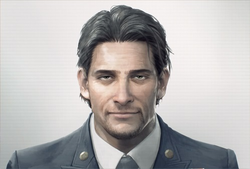
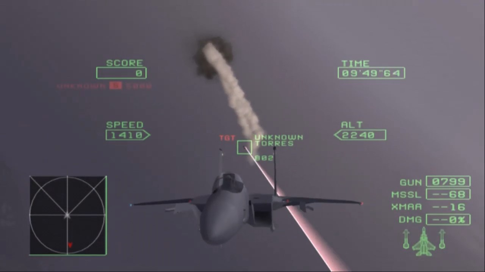
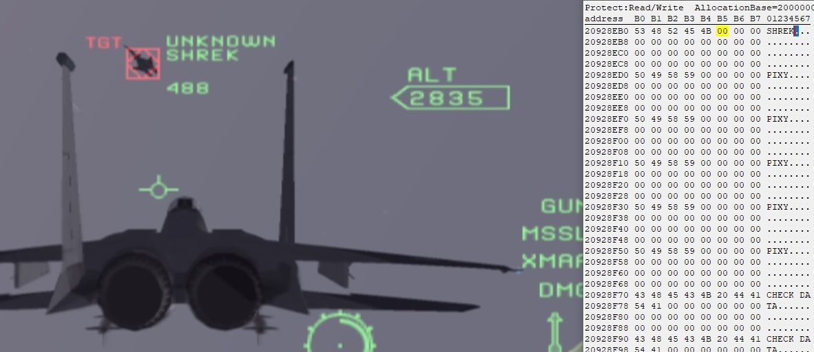
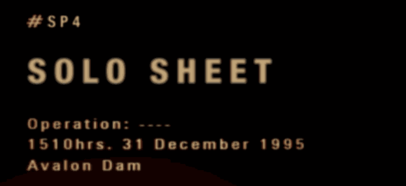
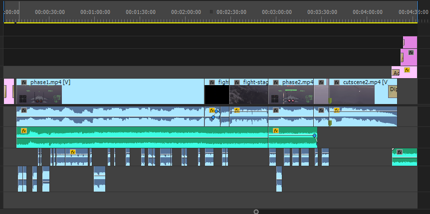

**Disclaimer**: spoilers to **Ace Combat Zero** and **Ace Combat 7 DLC** are to be expected because the [whole shitpost](https://www.youtube.com/watch?v=l4ORTB0yEUU) is based around these.

## **Inspiration**

It's just this this old video of Donkey and Shrek fighting

`youtube:https://www.youtube.com/watch?v=hfV8dMStkBU`

***Don't you see?*** Anyone playing the **Ace Combat 7 DLC missions** will appreciate *the most evil character in Ace Combat series*. I think it's only natural that I wanted to put **Torres** into **Morgan** and make something like this. I *imagined* his voicelines to fit the game rather well, and was pleased to see them actually do so. Since we're merging elements of **Ace Combat 7** into **Ace Combat Zero**, I also decided to bring [some music from there](https://www.youtube.com/watch?v=_1Vb-ymHFPg) which also ended up well and doesn't make the original battle less engaging.

But it wasn't as easy as you might think, so I decided to do this write-up.

## **Mixing nightmare**

*You see, making funny videos is about working with source material*, but in this case I didn't want to waste time ripping all the available voice files and also looking for required ones among them. The most dumb straightforward **way of ripping** was chosen - **directly from audio/video**.

This is something I could easily do with music back in the days when I didn't have good internet to find ripped music from some favorite niche game, I guess it can still happen today if nobody has ripped it before.

The way it's done is usually easy - you turn down the volume for everything but the sounds you need, in case of **Ace Combat footage** we need:
* Audio/video of gameplay
* AWACS' voicelines
* Torres' voicelines

Once again, getting all these wasn't easy as you may think.

## **Getting rid of Zero**

**The first problem** is the **BGM Volume** setting. You'd expect that lowering it would get rid of all music, **but it also removes all sounds from cutscenes**, there's a warning message in sound menu that implied this.

*I had to find a way to prevent music from playing even with **BGM volume** at 12.*

Despite volume being applied like that, I was pretty sure that audio track and sound/voice tracks are separate, because it's clear there are no cuts in the music when cutscene starts.

With **Cheat Engine** ready, my first thought was to find a value with current music position, maybe it was increasing along with all timers and freezing it would magically pause the music, but I only found generic timers including the in-game one at upper right corner. Only after this failure I had a second thought that music stream wouldn't be dependant on position value, the latter being just something you'd only observe, not modify.

Shortly after I noticed that **music doesn't immediately kick in**, which led me to assume that there must be some timer that may activate the music after it goes past certain value. By resetting the level and freezing portions of possibly related values I did manage to find a particular one that stopped **Zero** for good

***but only for the phase one***

After the first cutscene ends, the music comes back, the previously freezed timer doesn't do anything here.

I had several thoughts on why it'd be like that:
* There's a similar but different instance of timer for this case - but either I didn't find it, or the delay is so small that freezing the timer doesn't really help.
* The game is programmed in a way that it explicitly starts the music after cutscene ends, meaning there's no value to freeze like before.
* The game is programmed in a way I don't have a clue about, only reverse engineering would help.

Since music starts immediately there was no point in trying to find some kind of timer, and yet I didn't want to waste my own time by trying to literally replace the music with a blank or maybe prevent some kind of MusicStreamStart function from running.

*The solution I've got came by pure accident.*

**It's often useful to see the memory changes around whatever you already found.** In this case, I observed what was being changed between a cutscene and gameplay, cherry-picked the changed memory portions and tried to freeze or tamper with them.

**One particular value**, which I have no idea what actually does, **allowed me to skip the entire second phase of battle**. In the video below, I freeze said magic value during the cutscene and skip it to get back to gameplay, only to be taken back to the same exact cutscene I tried to skip, at this point I unfreeze the value and try to skip the cutscene again, which has the exact same issue but now we're taken back to ending cutscene.

The video below also has bonus portion where I try to set garbage value, which results in weird behaviour: control is taken from the player and there's a bunch of friendly blimps on the radar.

`youtube:https://www.youtube.com/watch?v=z961NbRDK_Y`

If we skip the battle like this, original music doesn't have enough time to fully kick in, meaning we don't really hear it. **Problem solved by accident.**

I still want to believe there's some variable that controls the music volume in these cutscenes, because during the last cutscene - music fades out and there are no cuts.

## **Minor issues**

**The second problem** is the fact that even if we get rid of music in cutscenes - **there are still baked Pixy's voicelines that overlap with sounds**. This led me to **stretching the background noise and cutting a portion of Pixy flying** (I didn't have meaningful Torres' voicelines for this anyway), it's not really noticeable due to other sounds and you not having the original cutscene alongside.

**Third problem** are Torres' voicelines. [Original voiceline files](https://www.youtube.com/watch?v=_0K6_3DH1pQ&t=2100s) don't have radio filter applied on them, and I didn't want to imitate one by myself. So I decided to get these in a similar manner as with **Ace Combat Zero** - by playing the game only with voices on and recording them. The actual problem here is that **required voicelines can overlap with the others**, like in case of Torres' excuse for his batshit insane plan - this can be overlapped by voicelines from other pilots around you. **I managed to get a clear recording of Torres by avoiding interacting with other pilots or mission objectives.** To get all voicelines I wanted, I had to do several takes in which different voicelines were overlapped, by splicing these takes I could piece together the original speech.

## **IFF**

Here's something you can easily do with **Cheat Engine** to make funny pictures. Search **Pixy** as a string and you'll get plenty of them, now you can literally change these to whatever meaningful text you want. It's very simple to do, but let's admit that without this the video wouldn't be as funny or immersive.

## **Splash screen**

The splash screens for missions are apparently just pictures, because you can't rename it's contents like you could with Pixy, meaning I had to edit the image.

**The resulting splash screen is quite simple but satisfying photoshop.** My first step was to take a portion from any original splash and put it into [WhatTheFont](https://www.myfonts.com/WhatTheFont/), which can recognize fonts from images - this gave me a hint on which fonts I could use. After finding a font that suits and adjusting it's size, spacing and color, it still didn't look good at all until I applied blur effect. The picture below says it all.

If one were to nitpick, you can notice very slight gradient on the original text from left to right. I decided not to worry about it because most people won't notice.

## **Subtitles?**

The subtitles of **Ace Combat** are quite iconic, but I decided against them so they wouldn't distract from action too much. And yet without any pictures I want to mention on how I tried to approach them if they were done.

There's a very good subtitle editor called [**Aegisub**](http://www.aegisub.org/) which allows to do these rapidly, and I mean it. Compared to popular video editors: either I don't know how to do it, or doing subtitles in them would be really tiresome and also prone to styling errors. In **Aegisub** you can focus on actual text and style it with presets. I'd do a preset for **AWACS'** and **Torres'** voicelines, and also a preset for cutscene subtitles. You can then export subtitles in most of the popular formats.

The problem is that importing subtitles, especially if they're styled, in video editor of your choice might be troublesome, but I'd ignore that by rather taking **ffmpeg** and [hard baking subtitles in the video](https://trac.ffmpeg.org/wiki/HowToBurnSubtitlesIntoVideo). Make sure you also google on how to preserve audio and not lose any video quality you already had, as this requires to re-encode the original video.

## **Piecing it all together**

With all source material ready, it's only a matter of cutting and moving things around, but there are still several issues that could be addressed:
* Bad gradient issue on skies - this is due to not having enough colors, either we need more of them or noise has to be applied. Unfortunately applied noise would be really noticeable, maybe it could be fixed with emulator settings?
* Bad squarish border that covers mini-nuke explosions, obviously blame the emulator.
* I didn't record in **1080p** with higher bitrate because I was lazy to change my settings.
* Little stuttering here and there.
* Would like to get rid of final cutscene music so **Ace Combat 7** music would be here instead.
* I was impatient and didn't wait for final **Ace Combat 7 DLC** mission to release so we could get more Torres' voicelines.
* Using original Torres' voicelines? We still need all of them extracted and a proper filter to achieve radio effect.

While this small project is not really complex, at least it's something I finally had some passion to work on after several months. Doing this write-up is no exception, as I didn't write anything since the last summer.  I think by reading this, some people could get a thing or two they could find useful for their own projects, *tell me if you do!*

`youtube:https://www.youtube.com/watch?v=l4ORTB0yEUU`