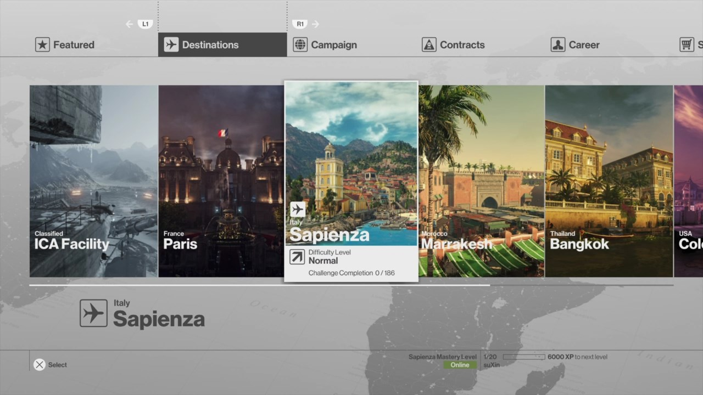
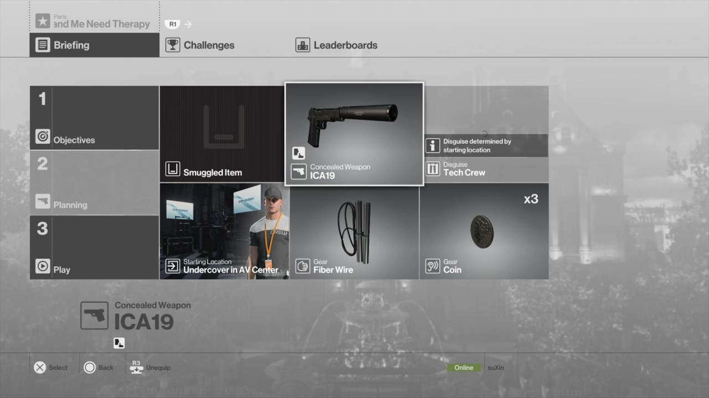
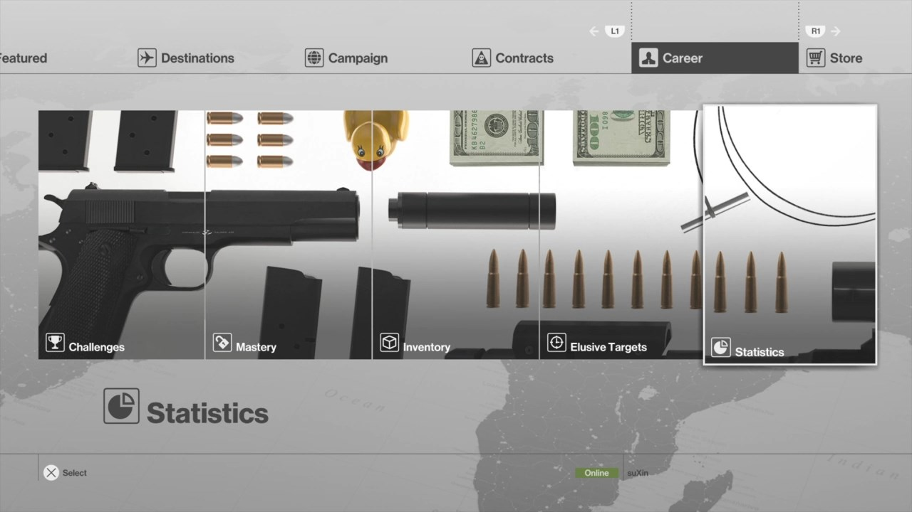
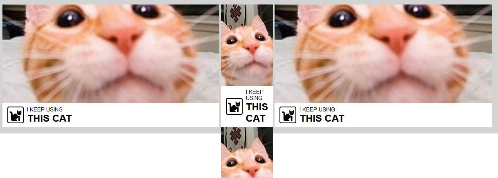
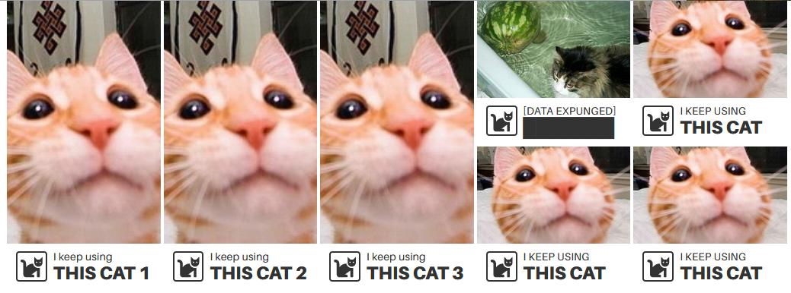

It seems like most of the creators who respect theirselves have a personal website.
This makes sense - your website acts as a central point to learn about you and what you do.
Making my own one seemed inevitable, but I didn't expect it'd happen this soon.

I had doubts if I should make it right now: perhaps I don't have enough things to showoff, it also seemed to be a waste of time,
but like most of my other projects, it happened spontaneously.

## **The original inspiration**

Weirdly enough, I consider playing **Hitman** the first thing that led to creation of this website: **I loved it's menus**.
While today you can't impress anyone by using tiles, the way they were arranged and presented felt very straightforward and on-point.
Somehow they made me think that the game has a lot to offer: *what's this? and what is that?* I keep occasionally checking these menus over and over again even after I moved onto **Hitman 2**.







I was job hunting during this period, and I realised that despite understanding how fancy HTML / CSS work, I had nothing to prove it: my past projects were more focused on ***do*** rather than ***see***, the latter dominating every website which is supposed to present you, your projects or business.
Compared to these, my approach to design always seemed bland, and I don't even care minimalism, it just always felt right to go that way.

To prove myself that I'm also capable of doing fancy stuff, **I decided to recreate a portion from Hitman menu**.

<div class="tweet-embed">
    <blockquote class="twitter-tweet"><p lang="en" dir="ltr">I really like how that <a href="https://twitter.com/hashtag/hitman?src=hash&amp;ref_src=twsrc%5Etfw">#hitman</a> menu idea turned out, here&#39;s destinations carousel, <a href="https://twitter.com/hashtag/css?src=hash&amp;ref_src=twsrc%5Etfw">#css</a> only <a href="https://t.co/B91LJQXMgw">pic.twitter.com/B91LJQXMgw</a></p>&mdash; suXin (@suxinjke) <a href="https://twitter.com/suxinjke/status/1113794219657834496?ref_src=twsrc%5Etfw">April 4, 2019</a></blockquote>
</div>

It's not very faithful but does have the *feel*. I didn't really expand on it afterwards: [I've got myself a much better exercise later instead](/red_sun/). Still, whatever that was done had a future impact on what you see here.

## **Domain motivational kick**

If I were to make a website, *what about domain name?* Staying on **suxinjke.github.io** was fine but doesn't follow the rule of cool. I decided to check the availability of **suxin** and was met with a hot very cheap one year deal for **suxin.space**. I liked this one instantly, I wanted to buy it *and do something with it*. While **space** domain extension could be considered novel by today's standards and maybe less credible because of that, I didn't care because **it's simple, it's easy to remember, it reflects the website purpose perfectly** and a couple of my projects are related to a **space game**.

Just like that, my desire to acquire the domain name naturally led me to the decision of making a personal website.

## **Focusing on *why* and *how***

Now I'm here with some design inspiration and domain name at bay. With all intrusive thoughts mentioned at the beginning, I had to put them aside and outline what do I want to show, and why:

### Why
* I *do actually* have enough to showoff, this website included
* It's not a waste of time, it's still a good practice
* I can practice my writing with these notes
* What I do *may be interesting* for some people
* The experiences I note *may be valuable* for some people
* Whatever I put here can always be reflected upon later
* Whatever I put here implies I care about what I do and *perhaps seem passionate* about it

### How

While I knew what I wanted to show and *how* is already dictated by **Hitman menu inspiration**, I had to convince myself why it was the right way. This made me check plenty of similar websites and portfolios.

I think they are often overdesigned, sometimes downright pretentious. **I absolutely despise any website that would [scrolljack](https://medium.com/@paonecreative_87456/scrolljacking-the-usability-nightmare-2a5bbb4273d0)**. It seems that some of these are focused on showing off the design skills that would be more valuable on any (video) advertisement rather than website, which should be **focused on delivering information as quick and easy as possible**. I do believe in **show don't tell** rule, but I often feel the focus is set on showing unrelated things to distract and *impress you with that alone*.

Frustrated with some of the designs encountered, I decided I want to keep straightforward approach that suits me while retaining some of personal style, which can be only seen in my choice of colors below and making the whole thing act smooth. The front page is just a ton of grouped tiles that are supposed to make you ask the same question as I did in Hitman menus: *what's this and what is that?* In that case you just click and it shows or redirects you to relevant info. And the most important thing: **it's only one click and potential scrolling away**, which suits the straightforward approach.

## **Fonts**

Since I'm using **Hitman** as my inspiration I'm also in love with **Helvetica** like fonts.
Despite it's wide usage., I like these because they make everything look *professional*. I'm not sure what exact font is used in Hitman [but whatever they used in 2016](http://videogameinterfaces.com/ui/io-interactive/hitman/tag:level%20selection) does suit the *professional attitude* of **Agent 47**.


The problem is: **Helvetica** isn't free, you have to buy it, and default alternatives like **Arial** suck.

This led me to questioning if I could find a free alternative, most of the stuff people have suggested on internet doesn't have that Helvetica feel I'm looking for, but I did find two fonts worth it.

### Neue Montreal

Made by [The Pangram Pangram Foundry](https://pangrampangram.com), this font hits the exact spot for me, I'd use it here if not for one problem: ***It's not free*** as it may seem. The website says it's free for personal use, but attempt to get free font pack via email only got me **Light** and **Bold** variants, which is obviously not sufficient and I don't even need **Light**.


### Aileron

This one is made by [TipoType](https://tipotype.com/), while some of the letters seem more thin and off, I still get the **Helvetica** professional feel from it. And this font is ***truly free for personal use***. What you're reading right now on this website is powered by **Aileron**.


## **Colors**

I'm no professional designer, and yet I understand the importance of picking the right colors. I didn't want to have a huge palette to manage, so I ended up with five colors which seems to be a standard. Some people get away even with four or three colors.

One of the rules I've heard often: **never go full black or full white** - it burns eyes. While I never really noticed the problem with this, I can agree adding/removing some shade of gray makes it more comfortable to read, *it makes text feel more warm?*

It didn't take me long to pick the actual colors - these represent **European Robin** bird that I've been putting on myself since **2012**.

<style>
.colors {
    height: 200px;
    display: flex;
    margin: 0 auto;
}
.colors .colors__column {
    flex: 1;
    min-width: 0;
    padding-bottom: 0.5rem;
    display: flex;
    justify-content: center;
    align-items: flex-end;
}
</style>
<div class="colors">
    <div class="colors__column" style="background-color: #333333; color: #f3f3f3">#333333</div>
    <div class="colors__column" style="background-color: #e0e0e0;">#e0e0e0</div>
    <div class="colors__column" style="background-color: #f3f3f3;">#f3f3f3</div>
    <div class="colors__column" style="background-color: #FF8F02;">#ff8f02</div>
    <div class="colors__column" style="background-color: #816949; color: #f3f3f3">#816949</div>
</div>

## **Content management**

The last technical problem I had to deal with is managing content on this website, I had next requirements:
* **Must be static** since it's hosted on **Github Pages**
* When writing descriptions and notes, I want to **focus on content rather than presentation**
* Being able to present same content in a different way
* List of notes, RSS and stuff like that must be generated automatically
* All of this while also being easy to develop with hot-reloading, SCSS and whatever

Because I've been recently using [Vue](https://vuejs.org/) - the most straightforward framework I've ever worked with, I wanted to keep it as a base. This led me to pick [Nuxt](https://nuxtjs.org/) as static website generator.
* It does most of what I want out of box
* It generates routes based on your directory structure
    * And if it doesn't - it's still possible to generate what you need
* Plenty of community-driven modules and plugins to do routine like Meta tags, Markdown and RSS

I've been also considering [Vuepress](https://vuepress.vuejs.org/) but I failed to setup it properly last time, and it felt like I will have less control with it compared to Nuxt.

I started out with prototyping as usual, mostly interested in making a basic layout for ***items***, which feature something and either link somewhere or show additional info. Sometimes I want these to rotate between several images and headers.

While I had those above requirements in mind, I hesitated with actually meeting those regarding content management. I'd rather get something online quickly and fix it later instead of doing it the right way.

```html
<section class="item-section">
    <div class="item-section__header">
        <HeaderText icon="user" header="ABOUT" />
    </div>
    <div class="item-collection item-section__item-collection">
        <Item image="/robin_1.jpg" style="flex: 3">
            <template v-slot:modal_description>
                ...description
            </template>
            <HeaderText icon="user" header="suXin" header_secondary="GENERALIST DEVELOPER"/>
        </Item>
        <Item image="/twitter.png" href="https://twitter.com/suxinjke">
            <HeaderText icon="at" header="TWITTER" header_secondary="CONTACT"/>
        </Item>
        <div class="item-collection__section" >
            <Item background_position="0% 0%" image="/code.png" href="/notes/test">
                <HeaderText icon="file-code" header="GITHUB" header_secondary="PROJECTS"/>
            </Item>
            <SlideShow>
                <Item image="https://i.ytimg.com/vi/THA0e61Abc4/hqdefault.jpg" href="https://www.youtube.com/watch?v=THA0e61Abc4">
                    <HeaderText icon="video" header="YOUTUBE" header_secondary="VIDEOS"/>
                </Item>
                <Item image="https://i.ytimg.com/vi/gxt2cd9rjT4/hqdefault.jpg" href="https://www.youtube.com/watch?v=gxt2cd9rjT4">
                    <HeaderText icon="video" header="YOUTUBE" header_secondary="VIDEOS"/>
                </Item>
            </SlideShow>
        </div>
    </div>
</section>
```

**This one sucks.** Especially the `<SlideShow>` component that switches between included children elements.
Now imagine a case when I have a very long description and I would like to slideshow my images, this will require me to duplicate that giant `Item` only with a different image.
Several days later I'd also encounter a typo that I'd forget to fix in one of those duplicated elements.
Several months later I'd like to make another page where I'd put these items too, and I'd have to duplicate descriptions and everything else again. **This was unacceptable.** I had to do things correctly straight from the beginning.

And I'm not even talking about forgetting **mobile first design**, whatever I had at that point was completely unusable on my small Blackberry screen, all because I was very focused getting the bare minimum.

Frustrated, I decided to start over from scratch with whatever design scraps already made. I remembered the approach of making reusable components that **should not** depend on parents when it comes to layout. It's the parent elements that should be responsible for modifying these components.

I was moving towards declaring my **items** as Markdown documents. Solely using Markdown is not enough, there must be some **meta info** that could be used when generating a list of pages, or be able to sort them by date, or pass that meta info to meta tags.

**Front matter** provides exactly that, it has **YAML meta section** that can be parsed into **JSON**, and a **regular Markdown section**. By following my own schema, I can make whatever components that will consume and render this differently.
```
---
title: DELTA SHAKEDOWN
subtitle: IDEA
icon: stopwatch
image: /img/stopwatch.jpg
---
...description...
```

Some **items** don't have descriptions and may focus on slideshow presentation. I decided to move slideshow logic to `Item` component instead. This component also has a logic that gets an element from `showcase` and overrides default values with the showcase element contents. In the example below I could also override `subtitle`, `icon` and `link` too if I need it.
```
---
title: YOUTUBE
subtitle: VIDEOS
icon: video
showcase:
    -   image: https://i.ytimg.com/vi/THA0e61Abc4/hqdefault.jpg
        link: https://www.youtube.com/watch?v=THA0e61Abc4
    -   image: https://i.ytimg.com/vi/gxt2cd9rjT4/hqdefault.jpg
        link: https://www.youtube.com/watch?v=gxt2cd9rjT4
---
```

Right now, the previously convoluted section is mostly focused on layout. `Item` became `ItemClickable` here and accepts the name of Markdown document which gets resolved and parsed internally.

```html
<section class="home__section">
    <HeaderText class="section-header" icon="user" header="ABOUT" />
    <div class="collection">
        <ItemClickable class="collection__item collection__item_expanded" name="suxin"/>
        <div class="collection__item collection collection_sub">
            <ItemClickable class="collection__item" name="suxin-twitter"/>
            <ItemClickable class="collection__item" name="suxin-email"/>
        </div>
        <div class="collection__item collection collection_sub">
            <ItemClickable class="collection__item" name="suxin-github" />
            <ItemClickable class="collection__item" name="suxin-youtube"/>
        </div>
    </div>
</section>
```

### Problematic dynamic routes and nuxt-link

What I love about **Nuxt** is the fact that it automatically maps your directories and files in **pages** directory to routes.
But there's no such luxury when it comes to my case where I only want to focus on making markdown files.

Of course I could make page files instead, but it doesn't meet my requirement of being able to present one markdown file in several ways, and it's also less pleasant to work with in **VS Code**, the latter having neat Markdown preview and highlighting.

**Nuxt** does server rendering first before all routing and whatever management goes to the client.
While on server, I'm available to use `require` function, which automatically uses one of the webpack loaders to parse the **Front Matter Markdown** file for me. I can both render parsed file and provide meta information to the component.

When I'm fetching a certain note, it's easy to render it because route name matches the file name, but it's not that easy when I want to [automatically list all my notes](/notes/).

The problem can be narrowed down to: *where do I get a list of pages from?* I could certainly get it by fetching directory contents with **fs**, just like I did in the **nuxt config**, but it only works reliably on the first server render. If you go to this page via **nuxt-link**, which is preferred, the data won't be fetched again because you have no access to the directory on the client.

**A hacky solution was found**: before setting up the dev environment or generating files, a **notes.json** file is generated in **Nuxt's before build hook**, this file is then fetched in the **Note list** page, and all of the files are then parsed the same way as before and then rendered.

I don't like this solution, but it doesn't really matter right now. After all, I'm only dealing with a simple static website.

```js
// nuxt.config.js
const note_file_names = fs.readdirSync( './assets/notes' )
const note_routes = note_file_names.map( file => `/notes/${file.replace( /\.md$/, '' )}` )

// ...
    hooks: {
        build: {
            before() {
                // Make a json file with a list of notes, that will be used later for rendering
                fs.writeFileSync( './static/notes.json', JSON.stringify( note_file_names ) )
            }
        }
    },

    generate: {
        routes: function( callback ) {
            callback( null, note_routes )
        }
    },
// ...

// /pages/notes/_note.vue
// ...
computed: {
    parsedPage: function() {
        const routeName = this.$nuxt.$route.params.note
        return require( `@/assets/notes/${routeName}.md` )
    }
// ...

// /pages/notes/index.vue
// ...
export default {
    asyncData: ( ctx ) => {
        // Can't use fs here, grab the list of notes from json file
        const page_list = require( '@/static/notes.json' )

        const pages = page_list.map( file => {
            const note = require( `@/assets/notes/${file}` )
            return {
                /* Whatever meta info I need */
            }
        } )

        // These can be rendered now
        return { pages }
    }
// ...
```

There's one problem left with rendering **Markdown** note: **relative links** are not considered **nuxt-link**.

## **What**

So far I was focusing on how I came to making this website and some technical challenges I've encountered. *What's next?*

**I don't know**, and I love it, I don't want to restrict myself:
* I can share my experience here, both positive and negative
* I can make a review of something I love or give someone a tribute
* I can make something interactive and it'd be just one of the tiles and pages here

All of this on entirely different topics, it doesn't have to stay 100% technical.

### Bonus weird early layout tests



