This note is the sequel to [Reverse engineering Colony Wars Red Sun models](/notes/cw-reverse-engineering-models).
After I finished my work with **Red Sun**, I knew I will eventually get to the previous game in the series:
**Colony Wars Vengeance**, which is arguably my most favorite in the series.

I expected the process to be easier compared to **Red Sun** because I already had the experience, and because the
structure of game resources theirselves would probably be more simple. My expectations turned out to be true,
most of the work took about a week or less at moderate pace.

I will mostly focus on differences compared to **Red Sun** rather than how I approached the problem, the latter was mostly covered in the [previous note](/notes/cw-reverse-engineering-models).

## **Resource extraction**

Once again we're dealing with **GAME.RSC** file, which includes all the **resources**
used in the game: mission data, models, player's ship stats, ground terrain data, demo data and other things.

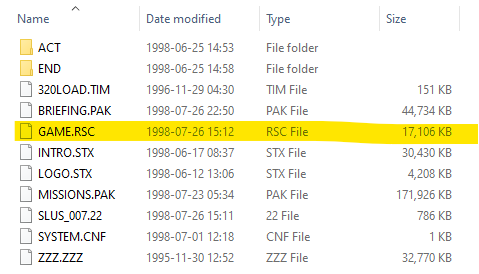

Opening the file in [**HxD** hex editor](https://mh-nexus.de/en/hxd/) immediately shows the list of pairs,
consisting of <span style="color: blue;">file name</span> and <span style="color: green;">it's location in the **GAME.RSC**</span>. The 4 bytes at the beginning turned out to be the <span style="color: orange;">amount of files</span>.

Compared to **Red Sun**, there are no directories whatsoever, [making the extraction of files trivial](https://github.com/suXinjke/VengeanceRipper/blob/master/game_rsc_extract.js).
File sizes are still not included, so I have to calculate them myself based on file offsets, *I wonder if it also happens at runtime when game is loading?*

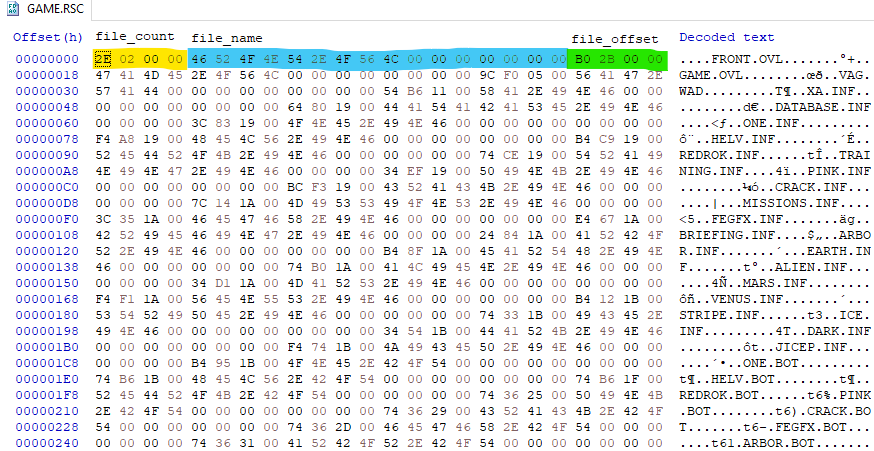

Here's a rundown on extracted files:
* **BND** files - 3D model files that I'm focusing on, what **BND** stands for - remains a mystery.
* **BOT**, **TOP** and related **INF** files seem to be related to ground missions, some of it must be terrain data.
* **CW**, **MSG**, **TXT** and weird **TIM** file (it's not a TIM texture) related to missions: mission script, subtitles and objectives respectively.
* Several **TGA** files resembling nebulas.
* **Demo files** that play if you stay in main menu for awhile.
* **CNF** configuration files, it's possible to affect the game and player ships by editing them, [as seen in this video](https://twitter.com/suxinjke/status/1214122727012999170)
* **OVL** files which, besides plenty of strings, seem to include alot of binary data, part of me assumed it could be additional code.
* Credits file
* **LATEST~1.TXT** detailing small changelog
* **VAG.WAD** - probably a resource file with sounds
* Several files that seem to be leftovers from original **Colony Wars**

## **Model conversion**

Let's focus on **BND** models that were extracted, I was mostly curious how different the format will be compared to what I had in **Red Sun**.

After opening the file, I immediately notice that it begins with something resembling sections. The fact there's **TMDS** label right at the beginning is very promising, as **TMD** is the 3D model format some of Playstation games have.

Further analysis has shown that all **BND models** start with **BODY** label and 4 bytes resembling the size of all other sections together, afterwards it's just a list of **label that represents section name**, the **size of the section** and the actual **section data** itself. On the screenshot below, I highlighted several **section names** I've encountered. To convert the models, I only needed **TMDS** and **TIMS**: models and textures respectively, **TIM** being another very common Playstation texture format. It's very convenient that textures were baked into the model itself, compared to **Red Sun** having the textures in their own files.

Some other notable sections were:
* **VRAM**: most likely maps the textures to Playstation VRAM
* **SPLT**: I assume these can be related to splitting the model in pieces when it gets destroyed in-game
* **NFRG**: portions of model after it gets destroyed in-game
* **GLOW**: maybe related to faces that are supposed to *glow* when ship is thrusting forward
* **COLL**: collision data?
* **DOCK**: model portion that specifies where minor ships dock/spawn?
* **LITE**: ???
* **GRID**: ???

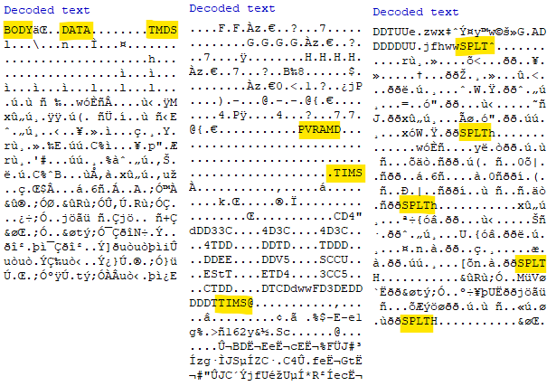

Therefore it's basically a resource file within another resource file, I have to parse several **TMDS** and **TIMS**, the latter was already done in **Red Sun** and worked alright here, but **TMDS** are quite different compared to whatever model format that was in **Red Sun**.

### **Composition and Level of Detail problems**

**Red Sun** models were composed of what I decided to call *objects* - model parts with a positional offset and other properties. Each object could have several meshes, all of them being just different **Level of Detail (LOD)** meshes, having a proper **Red sun model** was to compose these all together correctly.

Here with **Vengeance** models, there's no concept of object anymore, just several meshes instead. No positional offsets either which is convenient (vertexes are already offsetted), no bullshit with weird size multipliers from **Red Sun** too. **Composing Vengeance model is a breeze** except for one moment: ***there's no data on LOD in the model whatsoever***.

It means it's difficult to automate splitting of **LOD mesh**, which may lead to models looking weird because all of the mesh were combined into one. I wonder where the data is, it could easily be hardcoded somewhere else, or be a part of different file, but I didn't have many ideas of where to start looking.

And yet I still wondered if I could automate the splitting, I tried doing that with some kind of heuristics - see where mesh overlap and therefore assume they're **LOD**, but my attempts proved futile, every new edge case I tried to cover broke other models.

I could probably attempt to figure out where **LOD info** is stored if I had better reverse engineering skills. The ship models in-game change their models as you get further from them - that's how you'd expect **LOD** to work, I believed I could find some variable or pointer to the current **LOD**. While I did find some data in-memory that seemingly represented **current LOD state**, freezing it to some arbitrary value for confirmation didn't work, so I decided to give up.

Because there's not too many models and it's obvious for human which mesh are related to which **LOD**, I decided to manually write a [helper file](https://github.com/suXinjke/VengeanceRipper/blob/master/lods.js) to do the job, a portion of this file below:

```js
// This file specifies how to combine model pieces into OBJ files
// Pieces are separated by ',' while files are separated by ';'

// Secondary pieces consist of LODs
module.exports = {
    // ...
    FEDIABLO: '0;1;2',
    FEHEX: '0;1;2',
    // ...
    LMINER: '0,1,2,3,4;5,6,7,8,9',
    LMOTH: '0,1,2,3,4,5,7,8,9,10,11,12,13;14,15,2,3,4,5,7,8,9,10,11,12,13',
    LPLANT: '0,1,2,3,4;5,6,7,8,9',
    LRESRCH: '0,1,2,3,4;5,6,7,8,9',
    // ...
```

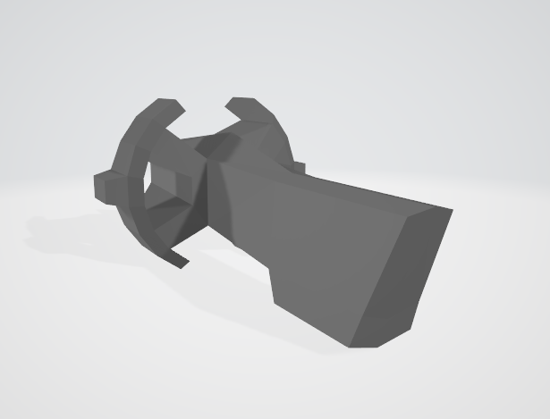


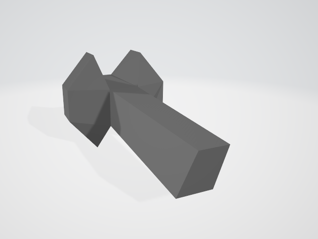


### **Faces**

Faces connect vertexes together, faces can have three or four vertexes, making them tris and quads respectively. For **Playstation** there are apparently many ways of rendering them, which proved to be a problem in **Red Sun**, where I had to differentiate between **34 face types** that could be arranged in any order.

**Vengeance** had it easier for me. Every **TMD** portion of the model had what I called *face section*, with index of the section determining the type of the face. From every section I've got the info on <span style="color: orange;">amount of faces</span> and the <span style="color: green;">location of the first face in the file</span>.


Interestingly, we can note that section 0 and 1 have the same offset as section 2. You may also notice some two other offsets afterwards, I never really encountered anything meaningful in sections past 3.

Here's a highlight of one of the faces from the **section 3**, and **meta table** for each **face section**, in which I described all required info:


```js
const face_section_meta = {
    0: { vertex_amount: 3, uv_start: 0x0C, texture_ptr: 0x0A, size: 0x14 },
    1: { vertex_amount: 4, uv_start: 0x10, texture_ptr: 0x0E, size: 0x18 },
    2: { vertex_amount: 3, uv_start: 0x10, texture_ptr: 0x0E, size: 0x18 },
    3: { vertex_amount: 4, uv_start: 0x14, texture_ptr: 0x12, size: 0x20 }
}
```
I don't really care about other info in the faces, which might be related to normals or shading.

Frankly there isn't much interesting left to say. One particular problem I encountered, but quickly resolved is how I should've specified order of vertexes for faces. If you do it in the exact same order as specified in the face, the **OBJ** model will be broken as shown below, I found out that swapping first and second vertexes fixes it.

```js
// I don't know why I have to do this, but otherwise it just becomes a swiss cheese
const vertexes = [
    face.vertexes[1],
    face.vertexes[0],
    ...face.vertexes.slice( 2 )
]
```

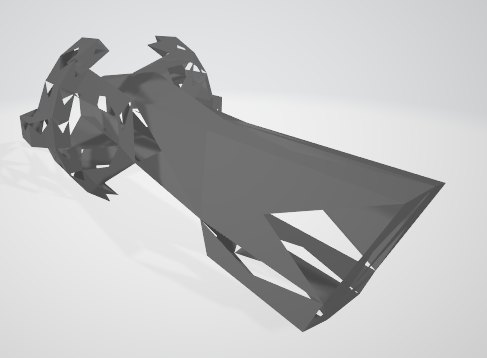

And here's some more pictures that demonstrate initial failed attempts to parse the model:


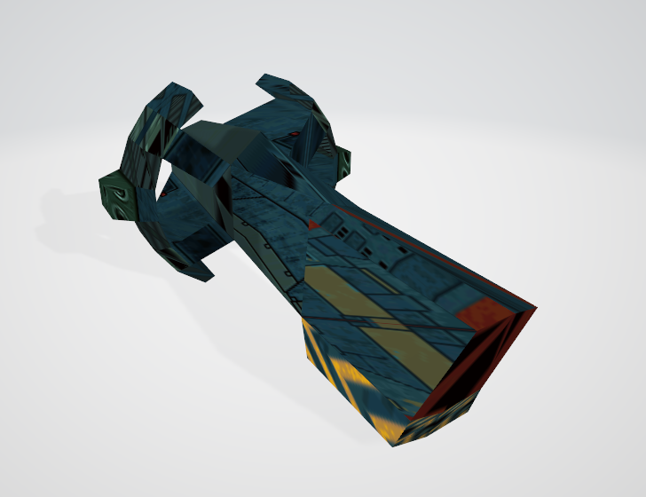

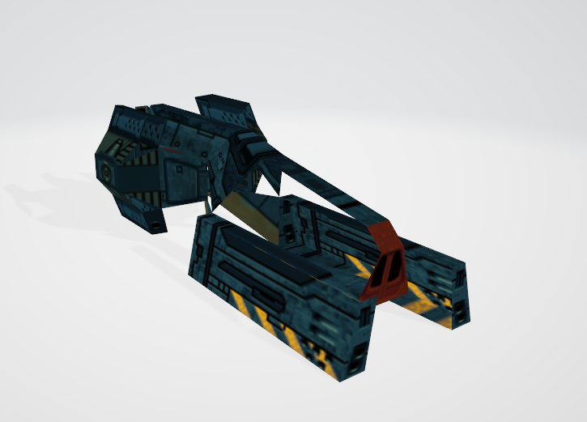

### **Bonus 3D printed legacy**

Around some time before **Red Sun** models were ripped, I was contacted by [**SoxF0x**](https://twitter.com/SoxF0x/) who mentioned taking the first ever rip of **Hex** ship, 3D printing the model, printing the textures and combining it all together into very solid looking real-life figurine.

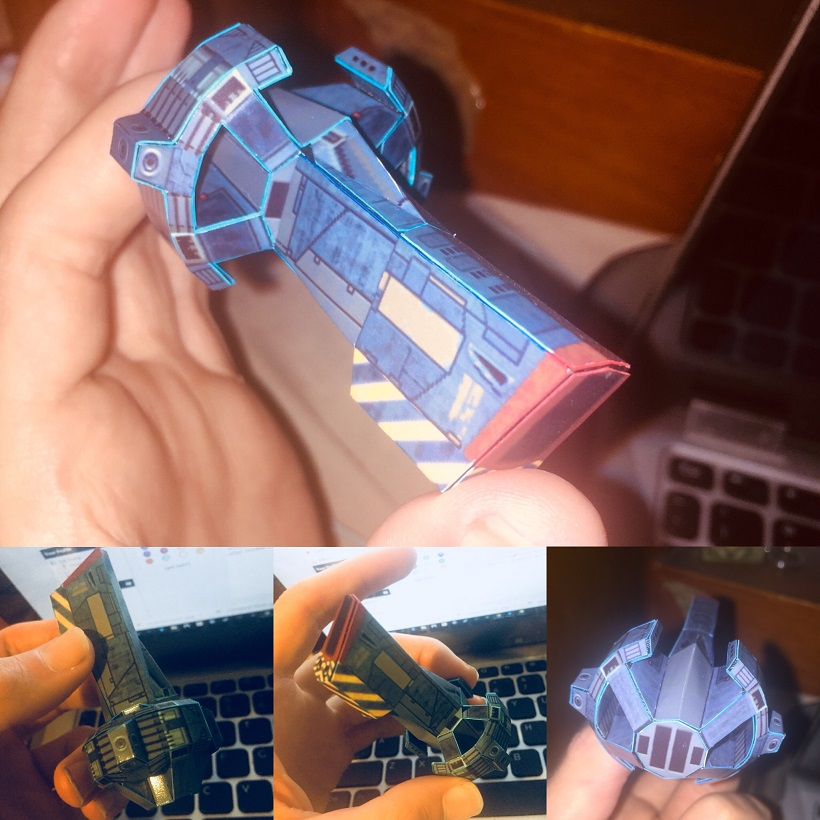

I was very impressed and got excited because I was already working on other **Red Sun** models and wondered if I could also see them printed. As our conversation on models and printing went on, I sent an initial batch of **Red Sun rips**, which resulted in these a half-year later:

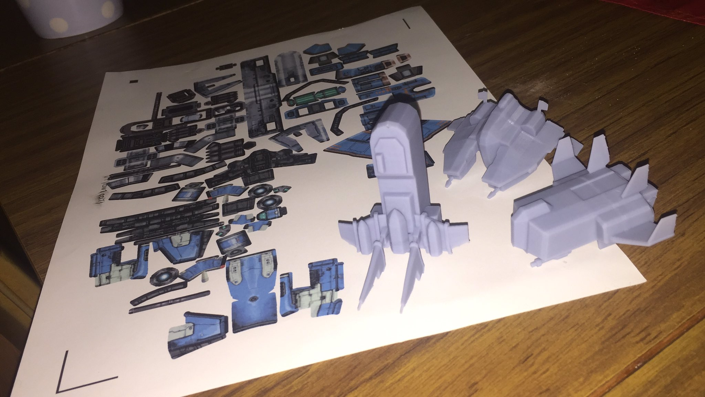

<div class="video">
    <video src="/img/cw-vengeance-reverse-engineering-models/cw-print-3.mp4" controls></video>
</div>

After finishing the **Vengeance** batch and sharing it with **SoxF0x**, I considered requesting several prints myself. Surprisingly, they were relatively cheap to make, so I've chosen 8 ships, which have arrived quite fast. While figurines have some rough edges on textures, the build feels sturdy and they look great from distance, great job! *I still wonder how painful it was to apply textures.*

So far I consider these as an unexpected reward for effort, and then as a way for few fans to express their love for **Colony Wars** series, these must be one-of-a-kind right now. I also wonder if the models could serve as a good reference for remakes or reimagined designs.

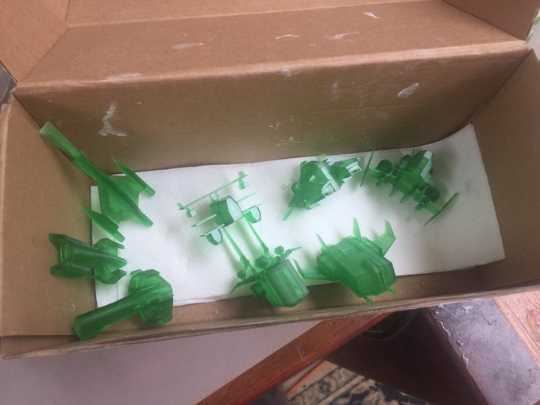

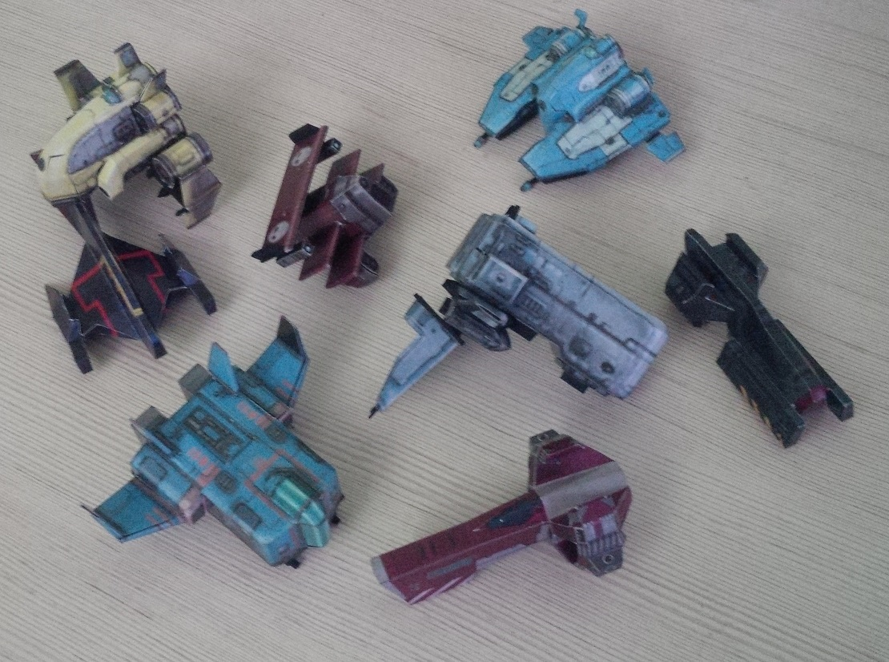

There's still one game left: the original **Colony Wars**, I did look into it quickly, both **GAME.RSC** and **models** are quite similar but not enough that I could easily rip them in the same manner as I did with **Vengeance**. I will get to it when I feel like it, and do a similar writeup on differences.

### **Links**

* [**VengeanceRipper** repository - full code](https://github.com/suXinjke/VengeanceRipper)
* [**Initial batch of ripped Vengeance models**](https://www.dropbox.com/s/9qrkwq9654iapao/initial_vengeance_models_with_pics.7z?dl=0)