## **BDS 9000**

During model extraction, **BDSROC** was found, which I immediately assumed to be a torpedo model for **BDS 9000**. I remember finding a texture of this face long time ago with automated **TIM** file scanner, at that time I just assumed this to be an internal easter egg among files. Finding this model shows that I was wrong.

I've purchased several torpedos afterwards and recorded a video so I could check it frame-by-frame and catch a glimpse of the torpedo, which indeed has a face on it. **I like how this easter egg is hidden in a plain sight**, you can't really notice it because of the sparks and difficulties with approaching it, not even mentioning you wouldn't even try to approach the torpedo as it may kill you in a blast.

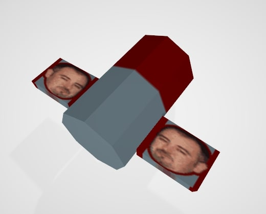

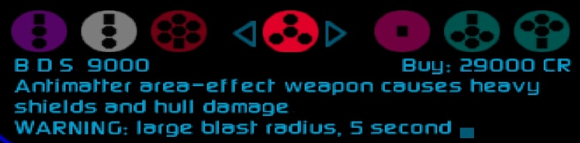

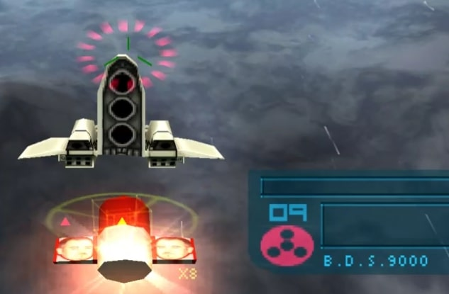

I contacted one of the devs behind **Red Sun**, **Julian Gold**, wondering who's the portrayed person is. I was told it's **Dave Semmens**, which clicked instantly: **BDS**: **Big Dave Semmens**, and you even have that in credits!

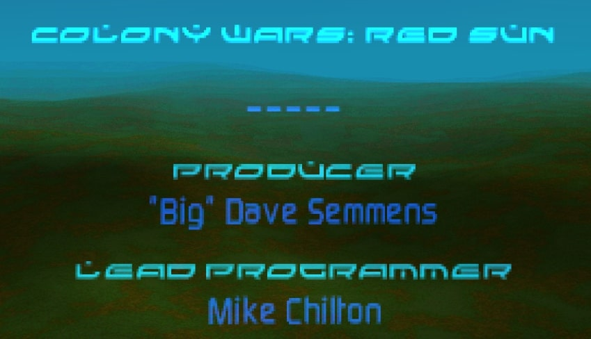

## **Unused models**

### **PIRMED**

**Pirate medium ship?** Compared to other pirate ships, I find this design weird, mostly due to these fins at front.

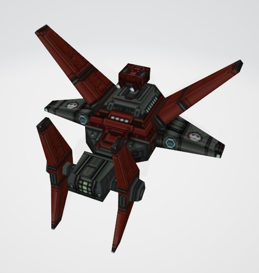

### **RSUN4**

One of the stages of **Red Sun**. Maybe there could be more missions including it. This particular model has weird floating rock. It's similar higher quality model is featured in one of the FMVs.

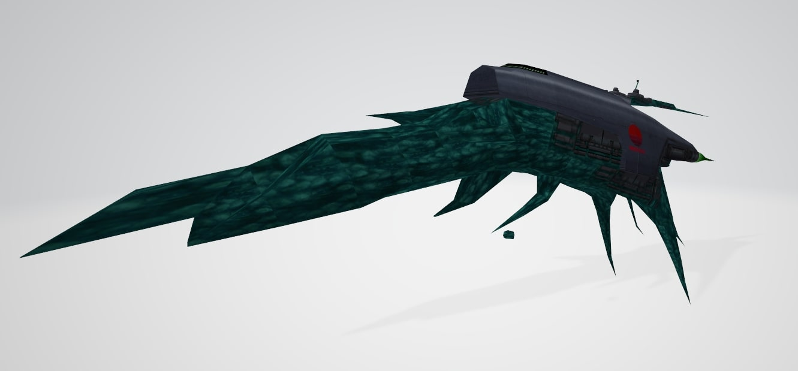

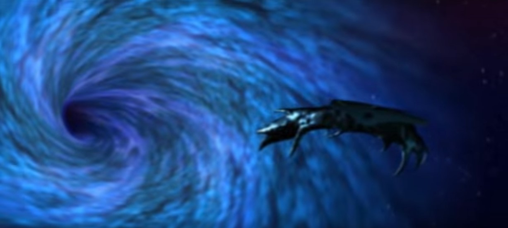

### **ROOK**

It's hard to say if this is some kind of lifeform that was weaponized (similar to **Tolrasaurs**), a weird ship design for some faction, or something from **Sha'Har** which doesn't really follow their overall design.

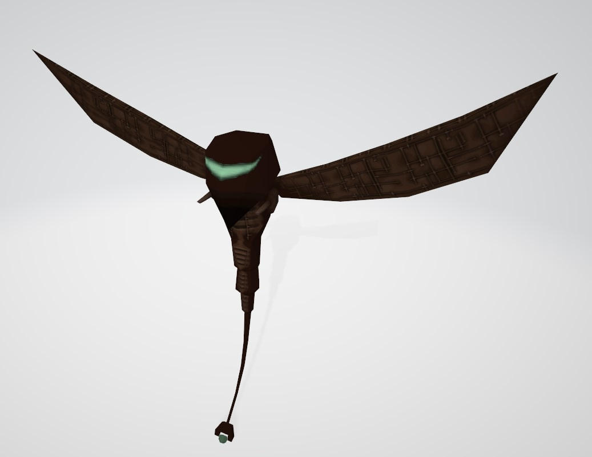

### **BDOOR**

Rather detailed blast door?

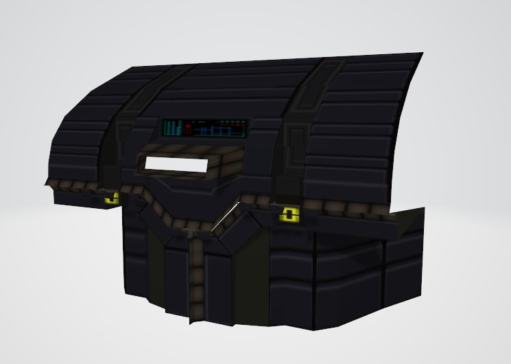

### **CALDE2**

Some kind of guarded outpost, file name implies it belongs to **Calderas**.

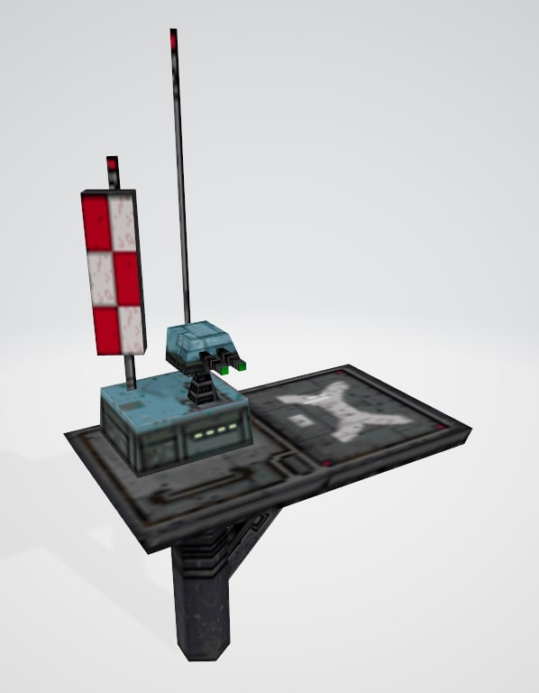

### **Dropships**

Several unused dropships, based on file names I assume these are for **Dirt Warriors**, **Pirates** and **Rebels**, the latter having unique carrier.

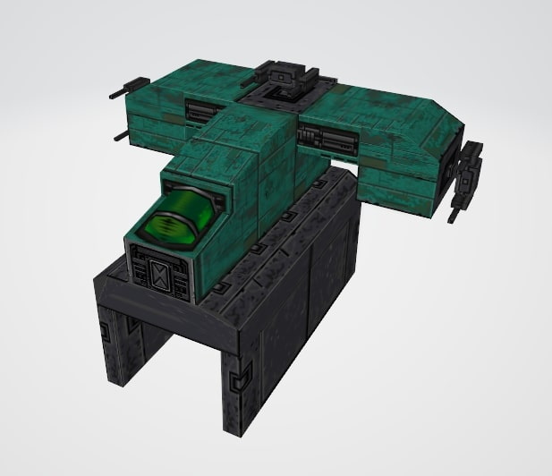

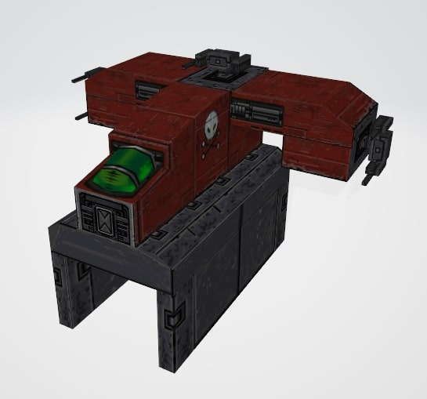

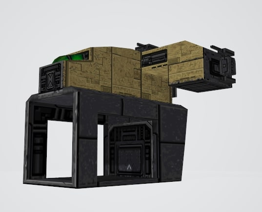

### **Empiret ship with a searchlight**

Could be a part of some stealth based mission, or maybe just looking for something on the ground level.

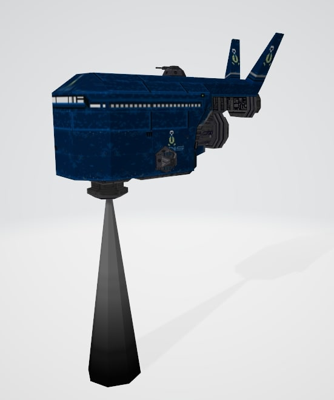

### **SENSOR**

Kinda resembles a satellite, since it's called sensor, could also be a part of stealth mission?

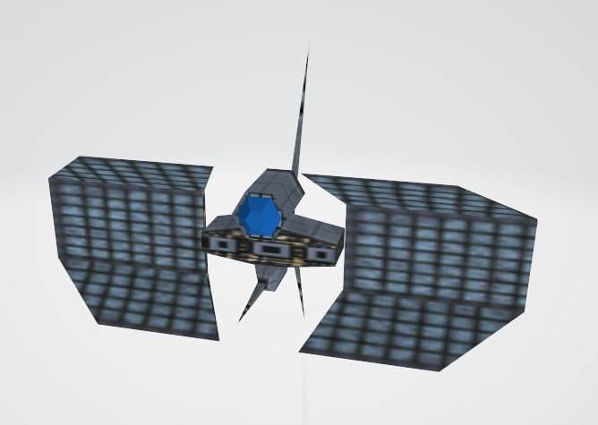

### **MINRO1**

If it's indeed mining robot, I'd say it looks weird. Maybe it's supposed to be a ground mining outpost.

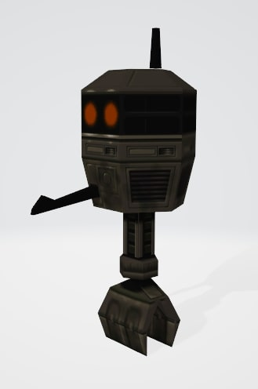

### **REFSML**

Something related to the refineries? Ship design is similar to one the pirates have.

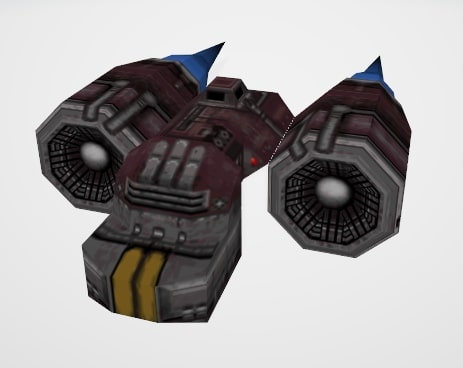

### **Ground units**

**Red Sun** has several ground units, **Navy** in **The Necessity** mission, and **Sha'Har** in the credits (watch the ground). But there's also **League** ground unit and **Refinery worker** (if **REFGND** actually means it) not used anywhere.

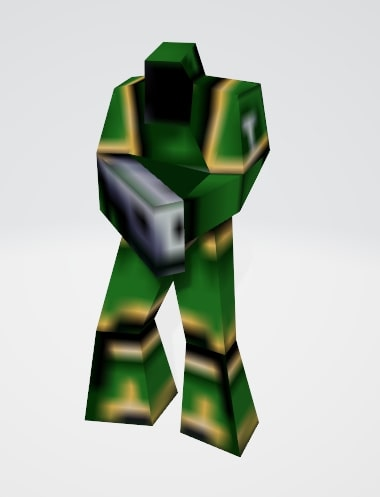

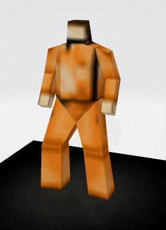

## **Rushed models**

What's remarkable about **Colony Wars Red Sun** is that **it was developed only in a span of six months**, while still being rather unique and improved entry in the series. This could explain some of the model issues that most players won't notice.

### **DIRFLT**

This insanely huge ship only makes a short appearance in *one* mission. The moment you approach the ship - *it's gone in explosion*. Due to that you probably won't notice the fact that one of it's turrets is flipped by 90 degrees. The model also has incorrect texture applied on one of the jet flames, but since the ship is stationary in this mission, player will never see these jet flames.

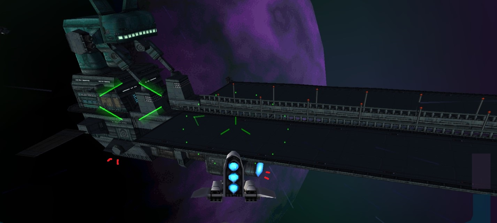

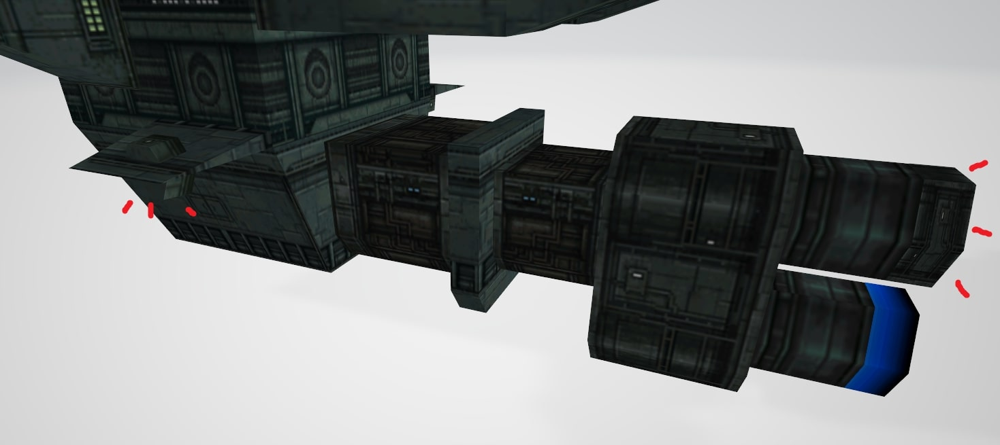

### **Rushed UV**

When I initially ripped playable ships, I immediately noticed they have rushed UV mapping, like on screenshot below. Simply flipping a half of this thruster UV fixes it, but it's not like anyone's gonna notice this in-game.

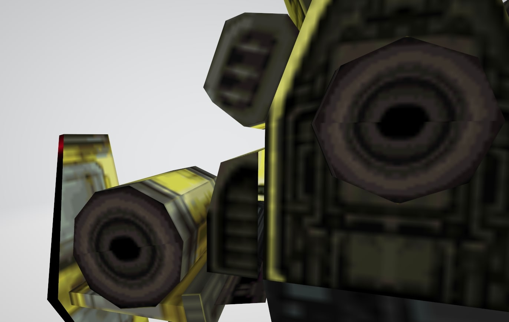

**Navy dropship** has much severe problem and I couldn't believe it's actually like that in-game.

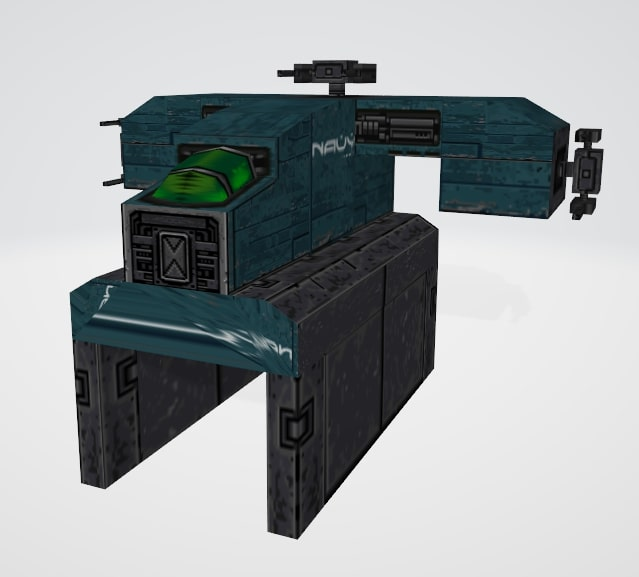

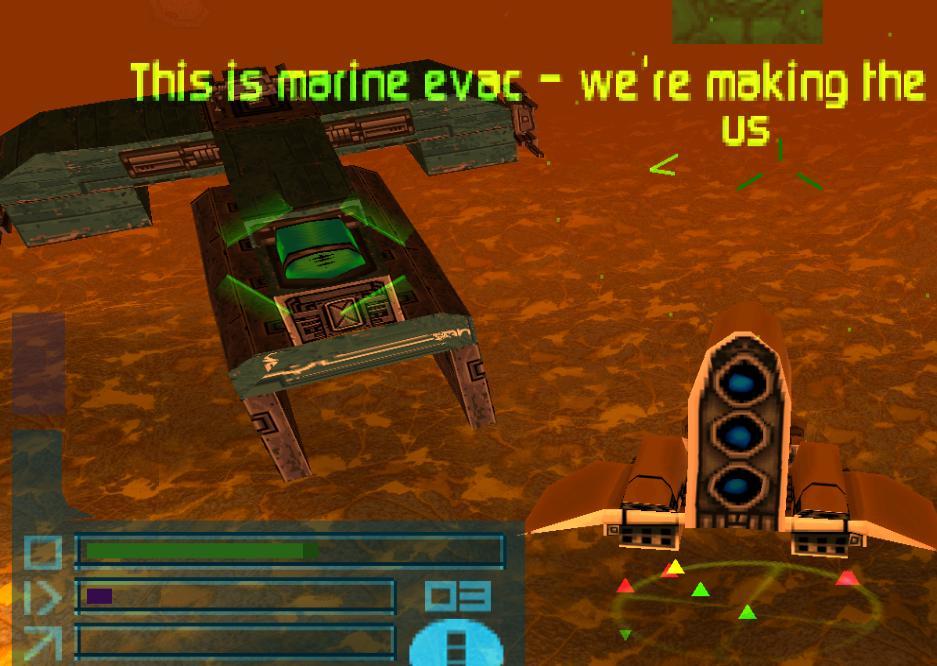

Here's rather amusing **Navy research ship** with label reflected. It's applied correctly on the other side.

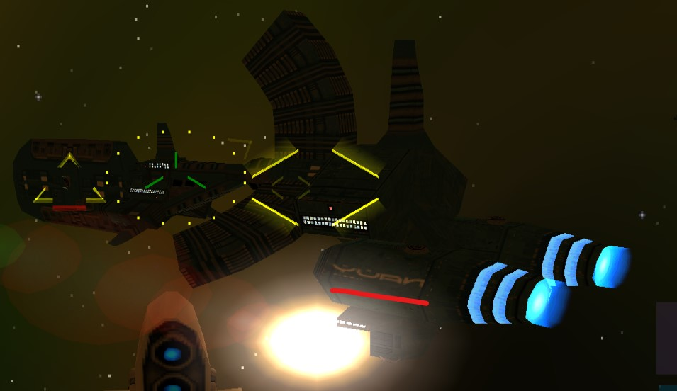

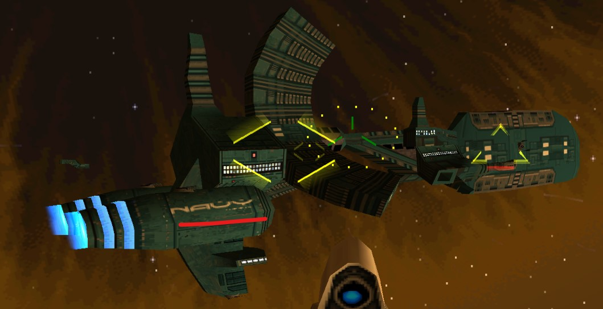

## **Amusing text**

### **Mission names**

Each mission is accompanied by script that has info on entities, what these entities are supposed to do and how it has to play out. The script starts with a mission title that doesn't always follow the original mission name, here are some of interesting ones:

|In-game name|In-script name|Note|
|:--|:--|:---|
|Covert Insertion|Pretzel Power|*mission focusing on destroying power plants*
|Valdemar...|Rescue the General|
|Retrieval|"Raiders of the Low Stark"|*subspace mission with idol treasure retrieval*
|Hunting|Jelly Hunting|*mission focusing on hunting Protoshelp cows, who are also called jellies*
|Protection|Protect The Love Boat, Baby !|*the protected ship literally looks like a boat*
|Gang Warfare|'Diamonds are for Heather'|
|Templecruiser|The Templecruiser's Doomed|
|Rescue Team|Extraterrestrials|
|Clear Path|Kill 'Em All|
|Protect Cult|Cult vs. Scavenger|
|Kidnap Queen|Ping-pong|
|Escape|Crazy Calamari|
|Hostage Release|Turret's Syndrome|*mission is focused on destroying all turrets on a capital ship*
|Roadblock|Deviant Stompers|
|Capture Sha'Har|Sha'Harness|
|Sabotage|Navy Has Sha Har Shjp|*typo!*

### **Mission briefings**

Some missions have two parts, player can see the full briefing only for the first part. Below are some hidden text from second parts of these missions:

**Escaping subspace**
```
[title] Escape Subspace
[reward] 0
[start]
This is the second part of a 2 part mission.

There is no briefing.

Objectives.
1.
2.
3.
[end]
[start]
HilachMerc//845.2...

Carry on from before.
[end]
```

**Retrieving Diva's escape pod**
```
[title] Rescue Diva
[itemlock] 46
[reward] 0
[start]
Objectives.
1. Find Diva's escape capsule.
2. Grapple Diva's escape capsule.
3. Exit through Jumpgate with Diva's Escape Capsule in tow.

continue...
|
Diva is still alive, but adrift in Hostile Space.
Valdemar, you must rescue her.

A grapple is necessary.
[end]
[start]
![Engram Link]
Save the wee lassie.

A Grapple will be needed.
[end]
```

**Final mission - destroy Red Sun**
```
[Engram Link]
bmp_brfmentor
This is your
Destiny.
[title] Destroy Red Sun pt2
[reward] 0
[start]
![Engram Link]
Irrelevant.
[end]
[start]
Also Irrelevant.
[end]
[start]
Now that's torn it!
[rating]
[end]
[start]
You saved the entire Human race.

How does that feel?
```

## **Additional info**

* [**Game Developer Magazine, AUG 2000**](https://archive.org/stream/GDM_August_2000#page/n31/mode/2up): programmer **Julian Gold** recaps **Red Sun** development, what went right and what went wrong. The article also includes some neat concept art.
* [There was a demo of the game on **Official UK Playstation Magazine #56**](https://youtu.be/Qdrln1_2xzU?t=54): featuring very annoying short music loop that resembles original release music and also nauseating external camera. Unfortunately external camera is not shown on this video.
* [There's a **cloak device**](https://www.youtube.com/watch?v=tltNeMoNQHE&feature=youtu.be) that can be purchased if you activate **Armoury** cheat code. For some reason I never noticed it when I was playing the game long time ago and at first assumed that cloak device was cut. It makes you invincible and you can also fly through other ships.
* It's possible to hack yourself weapons that are only exclusive to **NPCs**, they have names like **Anti-Hull missile weak**, **SAAD laser**, **Orbital strike**. Attempting to launch a mission with these will result in game crash. There's also **Distress flare** available that works fine, it functions similar to regular **Flares** and looks like the ones that are shot by **General**.
* Among text strings, ***View models*** was found, I wonder if it's leftover or there's actual model viewer that can be activated.